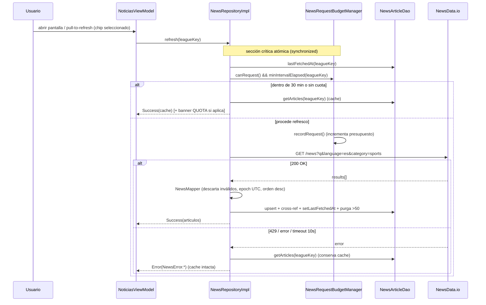

# Documento de Diseño: football-news-feed

## Overview

Esta feature convierte el `NoticiasFragment` (hoy un placeholder con un `TextView`) en una pantalla real de noticias de fútbol filtradas por liga mediante chips, con búsqueda por texto, caché offline agresiva y una política de cuota sostenible contra el plan gratuito de NewsData.io.

El diseño reutiliza estrictamente los patrones ya establecidos en el proyecto (Clean Architecture + MVVM + Hilt + Room + Retrofit + OkHttp) y **no duplica** la fuente de verdad de ligas: los chips se derivan de `FixtureMapper.TARGET_LEAGUE_IDS` y sus constantes `LEAGUE_*` (las mismas que consume el fragment de Partidos).

### Objetivos

- Mostrar noticias por liga usando la misma lista de ligas que Partidos (R1).
- Ocultar el proveedor concreto (NewsData.io) tras la interfaz de dominio `NewsRepository` (R4).
- Mantener la `API_Key_Noticias` fuera de control de versiones, replicando el patrón de `API_FOOTBALL_KEY` (R5).
- Frescura de hasta 30 min por liga con presupuesto diario ≤180 créditos y reset 00:00 UTC (R6).
- Estado observable compuesto (`Estado_UI`) que permita "contenido + banner" simultáneos para offline/cuota (R9, R10).
- Estética oscura coherente y accesibilidad TalkBack (R12, R13).

### No objetivos (heredados de requirements)

- Cuerpo completo del artículo (el plan gratuito no lo entrega; se abre la URL externa).
- Otros fragments, predicciones, autenticación.

---

## 1. Spike de validación del contrato de NewsData.io (tarea previa/paralela)

**Naturaleza:** tarea de investigación acotada, ejecutable en paralelo al inicio de la implementación. Su salida **puede refinar constantes y criterios** del diseño (R3.7, R3.11, R6.4, R6.10) antes de cerrar los DTOs, el `NewsMapper` y el `NewsRequestBudgetManager`. Mientras el spike no concluya, el diseño asume los valores por defecto documentados más abajo y los marca como "a confirmar por spike".

### Objetivo

Validar con **una llamada real al plan gratuito** los supuestos que hoy son inferencias de la documentación, y dejar registrados los hallazgos para ajustar el diseño.

### Preguntas a responder (y criterios que impactan)

| # | Pregunta a validar | Impacta |
|---|---|---|
| a | Contrato exacto del DTO de `/news` (o `/latest`): nombres y nulabilidad de `title`, `description`, `link`, `image_url`, `source_id`/`source_name`, `pubDate`. | R3.7 (campos a mapear), R4.3/R4.5 (nulabilidad → descarte) |
| b | Formato y zona de `pubDate` (p. ej. `"2024-01-15 09:30:00"` en UTC vs ISO-8601 con offset). | R3.11 (normalización a epoch UTC) |
| c | Cómo se consume el crédito: ¿1 petición = 1 crédito?, ¿paginación (`page`/`nextPage`)?, tamaño de página, cabeceras/campos de rate limit (`X-RateLimit-*`, `remaining`, `totalResults`). | R6.4 (incremento de presupuesto), tamaño de retención |
| d | Comportamiento y forma del error de cuota agotada: código HTTP (esperado 429) y cuerpo (`status`, `results.code` p. ej. `RateLimitExceeded`). | R6.10 (modo solo-caché forzado) |
| e | ¿`/news` acepta `category=sports` **y** `language=es` simultáneamente con `q`? ¿Alguno es mutuamente excluyente en el plan gratuito? | R3.4, R3.2/R3.5 (construcción de `q`) |

### Hallazgos esperados (hipótesis a confirmar)

- **DTO:** raíz `{ "status": "success", "totalResults": N, "results": [ {...} ], "nextPage": "..." }`; cada artículo con `title` (string), `description` (string|null), `link` (string), `image_url` (string|null), `source_id` (string), `source_name` (string|null), `pubDate` (string). `title` y `link` son los campos obligatorios para no descartar (R3.8/R4.5).
- **`pubDate`:** cadena `"yyyy-MM-dd HH:mm:ss"` interpretada como **UTC**. El `NewsMapper` la parsea con `SimpleDateFormat`/`DateTimeFormatter` fijando `ZoneOffset.UTC`; si no parsea → descarte del artículo (R3.11).
- **Crédito:** 1 petición HTTP = 1 crédito; se solicita **una sola página** por refresco (sin paginar) para no multiplicar el consumo. `nextPage` se ignora en este spec.
- **Cuota agotada:** HTTP 429 (o `status="error"` con código de rate limit en cuerpo) → `NewsError.QuotaExceeded` → modo solo-caché hasta reset, con independencia del contador local (R6.10).
- **Filtros:** `q` + `language=es` + `category=sports` son combinables en `/news`.

### Ajustes que el spike podría forzar

- Cambiar el patrón de fecha o la zona asumida en `NewsMapper` (R3.11).
- Ajustar el conjunto de campos obligatorios si `link` viniera bajo otro nombre (R3.7/R4.5).
- Recalibrar el coste por refresco si el proveedor cobra por página o por artículo (R6.4) y, en consecuencia, el límite operativo efectivo.
- Fijar el mapeo exacto del error de cuota (código/cuerpo) para R6.10.

> Nota de cumplimiento: los valores del plan gratuito (≈200 créditos/día, `q` ≤100 caracteres) provienen de la documentación pública de NewsData.io y han sido reformulados por cumplimiento de licencia. El spike confirma su vigencia.

---

## 2. Tabla inicial de LeagueNewsQuery

`LeagueNewsQuery` es el **puente** entre el identificador numérico de liga usado por Partidos (`FixtureMapper.LEAGUE_*`) y los términos textuales de consulta (`q`) del proveedor. Es la fuente de verdad complementaria exigida por R1.6.

### Ubicación y forma

- **Clase:** `domain/news/LeagueNewsQuery.java` (capa de dominio, sin dependencias del proveedor ni de Android). Es un artefacto de dominio porque expresa "qué buscar por liga", independiente de la sintaxis del proveedor (esa vive en `NewsDataQueryBuilder`, R4.6).
- **Estructura:** mapa estático inmutable `Map<Integer, List<String>>` (leagueId → términos priorizados, orden descendente de prioridad). En este spec cada entrada contiene principalmente el nombre de la liga.
- **API:**
  - `List<String> termsFor(int leagueId)` → términos de una liga (lista no vacía o excepción/valor por defecto controlado).
  - `List<String> aggregatedTerms()` → términos del `Chip_Todos`.
  - `boolean hasTermsFor(int leagueId)` → para el test de cobertura de R1.6.

### Tabla inicial

| `LEAGUE_*` id | Liga | Términos priorizados |
|---|---|---|
| 39 | Premier League | `["Premier League"]` |
| 140 | LaLiga / Primera División | `["LaLiga", "Primera División"]` |
| 135 | Serie A | `["Serie A"]` |
| 78 | Bundesliga | `["Bundesliga"]` |
| 61 | Ligue 1 | `["Ligue 1"]` |
| 239 | Colombia Primera A | `["Liga BetPlay", "Primera A Colombia"]` |
| 2 | UEFA Champions League | `["Champions League"]` |
| 5 | UEFA Nations League | `["Nations League"]` |
| Eliminatorias (32,34,29,30,31,33,37) | Clasificación al Mundial (chip único) | `["Eliminatorias Mundial", "clasificación Mundial"]` |
| Chip_Todos | Feed agregado | `["fútbol"]` (o consulta agregada equivalente ≤100 chars) |

### Relación con TARGET_LEAGUE_IDS y Chip_Eliminatorias

- **Cobertura (R1.6):** todo id de `FixtureMapper.TARGET_LEAGUE_IDS` debe tener término no vacío. Los siete ids de clasificación al Mundial se cubren de forma agregada mediante una **clave de eliminatorias** (ver más abajo). Un test unitario itera `TARGET_LEAGUE_IDS` y verifica que cada id resuelve a términos no vacíos (directamente o vía la clave de eliminatorias).
- **Chip_Eliminatorias (R1.2/R1.3):** el conjunto `{32,34,29,30,31,33,37}` se define como una constante `WC_QUALIFICATION_IDS`. La construcción de chips (en el ViewModel) agrupa esos siete ids en un único `ChipLiga` con `leagueKey = "wc_qualification"` y etiqueta "Eliminatorias". `LeagueNewsQuery` expone `termsFor` de esa clave agregada. El resto de ids no-eliminatorias genera un chip por id.
- **`leagueKey`:** el modelo `ChipLiga` usa una **clave textual estable** (`String leagueKey`) — el id numérico para ligas individuales (`"39"`, `"140"`, ...), `"wc_qualification"` para eliminatorias y `"all"` para el `Chip_Todos`. Esta clave es la que se persiste en la caché como `leagueKey` (relación N:M y `lastFetchedAt`), evitando colisiones entre chips agregados e individuales.

---

## 3. Elección de librería de imágenes + NFR de rendimiento cuantificable

### Librería: Glide (R13.1)

**Recomendación: Glide**, que **ya es dependencia del proyecto** (`libs.glide` + `libs.glide.compiler` en `app/build.gradle`) y ya se usa en `MatchesAdapter` para los logos de equipos. Reutilizarla mantiene coherencia y evita añadir peso.

- **Alternativas descartadas:** *Coil* es Kotlin-first (el proyecto es Java, añadiría fricción); *Picasso* está menos mantenido y sin caché en disco tan configurable. Glide ofrece caché en memoria + disco lista para usar (satisface R13.1: no re-descargar al hacer scroll).
- **Dependencia:** ninguna nueva; ya presente. (Si no lo estuviera, se añadiría `implementation libs.glide` + `annotationProcessor libs.glide.compiler`.)
- **Uso en el ViewHolder del `Adaptador_Noticias`:**

```java
Glide.with(imageView.getContext())
     .load(article.getImageUrl())          // null-safe: Glide muestra placeholder si es null
     .placeholder(R.drawable.bg_news_placeholder)   // paleta oscura (R12.6)
     .error(R.drawable.bg_news_placeholder)         // mismo placeholder ante fallo (R7.4)
     .timeout(10_000)                       // R7.4: >10s → placeholder
     .transition(DrawableTransitionOptions.withCrossFade(200))
     .diskCacheStrategy(DiskCacheStrategy.AUTOMATIC)
     .into(imageView);
```

- **Promoción a HTTPS (R13.3):** antes de pasar la URL a Glide, `imageUrl`/`articleUrl` con esquema `http://` se promueven a `https://` (en el mapper/`ImageUrlPolicy`); si no es posible, la imagen se trata como no cargable → placeholder.

### NFRs de rendimiento cuantificables (objetivos verificables)

Los requisitos actuales (R13.1) hablan de "no re-descargar" pero sin cifras. Se añaden objetivos medibles:

| NFR | Objetivo | Cómo se verifica |
|---|---|---|
| NFR-P1 Scroll fluido | Sin jank perceptible en gama media: **frames < 16 ms** (60 fps) durante el desplazamiento de la lista. | Perfilado con `Choreographer`/`FrameMetrics` o `adb shell dumpsys gfxinfo`; objetivo: <1% de frames >16 ms. |
| NFR-P2 Reuso de caché | Una imagen ya vista **no se vuelve a descargar** al re-scroll (hit de caché memoria/disco de Glide). | Inspección de `RequestListener` de Glide (`onResourceReady` con `DataSource != REMOTE`) en scroll de ida y vuelta. |
| NFR-P3 Primer render con caché | Tiempo objetivo de primer render de la lista con datos ya cacheados en Room: **< 300 ms** desde `onViewCreated` hasta `submitList` renderizado. | Traza `Trace.beginSection`/`FrameMetrics`; medición en gama media. |
| NFR-P4 Diff en background | El cálculo de `DiffUtil` no bloquea el hilo principal (usa `ListAdapter`/`AsyncListDiffer`). | Revisión + ausencia de jank en NFR-P1. |

Estos objetivos se marcan como **verificables** pero no como criterios de aceptación duros; sirven de guía de implementación y de checklist de QA de rendimiento.

---

## Architecture

Capas (idénticas al resto del proyecto):

- **presentation:** `NoticiasFragment`, `NoticiasViewModel` (`@HiltViewModel`, `LiveData<Estado_UI>`), `NewsAdapter` (`ListAdapter` + `DiffUtil`), modelos de UI (`ArticleUiModel`, `ChipLiga`, `Estado_UI`).
- **domain:** modelo `ArticuloNoticia`, `NewsRepository` (interfaz), casos de uso, `domain/news/LeagueNewsQuery`, `domain/common/Result`, errores tipados (`error/NewsError`).
- **data:** `remote/api/NewsDataApiService`, `remote/dto/*`, `remote/interceptor/NewsApiKeyInterceptor`, `remote/NewsDataQueryBuilder`, `mapper/NewsMapper`, `repository/NewsRepositoryImpl`, `local/dao/NewsArticleDao`, `local/entity/NewsArticleEntity` + `NewsLeagueCrossRefEntity` (+ `NewsLeagueMetaEntity`).
- **di:** `NetworkModule` ampliado con el stack `@Named("newsdata")` (o `NewsNetworkModule` dedicado) + binding en `RepositoryModule`.
- **util:** `SearchTextNormalizer` (reutilizado), `NewsRequestBudgetManager`, `CanonicalUrl`.

### Diagrama de componentes

```mermaid
flowchart TD
    F[NoticiasFragment] -->|observa LiveData<Estado_UI>| VM[NoticiasViewModel @HiltViewModel]
    VM --> UC1[GetNewsUseCase]
    VM --> UC2[RefreshNewsUseCase]
    VM -. filtrado en VM .-> SEARCH[SearchTextNormalizer]
    UC1 --> REPO[NewsRepository - interfaz dominio]
    UC2 --> REPO
    REPO --> IMPL[NewsRepositoryImpl - data]
    IMPL --> QB[NewsDataQueryBuilder]
    IMPL --> API[NewsDataApiService - Retrofit]
    IMPL --> MAP[NewsMapper DTO->dominio]
    IMPL --> DAO[NewsArticleDao - Room]
    IMPL --> BUDGET[NewsRequestBudgetManager @Singleton]
    IMPL --> LNQ[LeagueNewsQuery dominio]
    API -->|@Named newsdata OkHttp + NewsApiKeyInterceptor| NEWSDATA[(NewsData.io)]
    DAO --> DB[(GolIADatabase v4: news_article, news_league_cross_ref, news_league_meta)]
    F -.deriva chips.-> TARGET[FixtureMapper.TARGET_LEAGUE_IDS]
```

### Flujo de refresco (apertura de pantalla / pull-to-refresh)



### Flujo offline

```mermaid
flowchart TD
    A[Abrir pantalla sin red] --> B{Cache tiene datos del chip?}
    B -- sí --> C[Estado_UI: items=cache, banner=OFFLINE]
    B -- no --> D[Estado_UI: items=[], banner=OFFLINE, reintentar visible]
```

---

## Components and Interfaces

### NoticiasFragment (presentation/ui/noticias)
- Observa `LiveData<Estado_UI>` y renderiza sin retener referencias fuera del ciclo de vida de la vista (R11.1).
- Deriva los `ChipLiga` de `FixtureMapper.TARGET_LEAGUE_IDS` (a través del ViewModel, no declara lista propia) (R1.1). Selecciona `Chip_Todos` por defecto (R2.3), selección única (R2.2).
- No invoca API ni repositorio directamente (R4.2). Delega clicks (selección de chip, pull-to-refresh, icono de búsqueda, tap en artículo) al ViewModel.
- Abre la URL del artículo en navegador externo vía `Intent.ACTION_VIEW` (R7.7); si no hay navegador, muestra mensaje y no cambia la pantalla (R7.8).
- `contentDescription` no vacía en búsqueda, cada chip y cada tarjeta (R13.2).

### NoticiasViewModel (`@HiltViewModel`)
- Expone `LiveData<Estado_UI>` (R11.6). Consume solo casos de uso del dominio (R4.1, R11.2).
- Construye la lista de `ChipLiga` a partir de `TARGET_LEAGUE_IDS` + agrupación de eliminatorias + `Chip_Todos` (R1.2). Si `TARGET_LEAGUE_IDS` está vacío/irresoluble → solo `Chip_Todos`, sin error (R1.5).
- Gestiona la selección de chip: reemplaza el feed y reposiciona al primer elemento (R2.5).
- **Búsqueda:** debounce 300 ms (R8.3), corta a 256 chars (R8.6), filtra por subcadena sobre título/descripción normalizados con `SearchTextNormalizer` (R8.2, R8.4); vacío/whitespace → lista completa (R8.5); sin coincidencias → `empty=SEARCH` (R8.7).
- Guarda de reintento: ignora reintentos mientras `loading=true` (R9.6).
- Chequea `BuildConfig.NEWSDATA_API_KEY`: si ausente/vacía → `banner=ERROR` en ≤1s y sin peticiones (R5.5).

### Estado_UI (clase compuesta)
```java
public final class EstadoUi {
    public final List<ArticleUiModel> items;
    public final boolean loading;
    public final Banner banner;   // NINGUNO, OFFLINE, QUOTA, ERROR
    public final EmptyKind empty; // NINGUNO, LEAGUE, SEARCH
    // constructor + equals/hashCode para observación eficiente
}
```
Permite representar "contenido + banner" simultáneos (items cacheados + OFFLINE/QUOTA) sin ocultar contenido (R10.1, R10.3).

### Casos de uso (domain/usecase)
- `GetNewsUseCase(leagueKey)` → lee de caché (fuente inmediata para mostrar cacheado, R6.7).
- `RefreshNewsUseCase(leagueKey)` → dispara el refresco remoto respetando presupuesto/intervalo.
- `SearchNewsUseCase` **o** filtrado en el VM: se opta por **filtrado en el VM** porque el filtro opera sobre la lista ya cargada del chip (R8.2), es puro y se testea aislado con `SearchTextNormalizer`. (Decisión: mantener la búsqueda como transformación en memoria, no un caso de uso de I/O.)
- Todos devuelven `Result<...>` tipado y ejecutan I/O en `@IoExecutor` (R11.4, R11.5).

### NewsRepository (interfaz dominio) + NewsRepositoryImpl (data)
- Interfaz expone solo tipos de dominio (`ArticuloNoticia`, `String leagueKey`, `Result`) — nunca DTOs del proveedor (R4.4).
```java
public interface NewsRepository {
    Result<List<ArticuloNoticia>> getCachedNews(String leagueKey);
    Result<List<ArticuloNoticia>> refreshNews(String leagueKey);
}
```
- `NewsRepositoryImpl`: orquesta `LeagueNewsQuery` → `NewsDataQueryBuilder` → `NewsDataApiService` → `NewsMapper` → `NewsArticleDao`, con `NewsRequestBudgetManager`. Ejecuta en `@IoExecutor` (R11.4). Traduce fallos a `NewsError` tipado (R11.5). Conserva la caché ante fallo (R3.6, R6.8).

### NewsDataApiService (Retrofit)
```java
public interface NewsDataApiService {
    @GET("news")
    Call<NewsResponseDto> getNews(
        @Query("q") String query,
        @Query("language") String language,   // "es"
        @Query("category") String category);   // "sports"
    // apikey lo añade NewsApiKeyInterceptor (R5.3/R5.4)
}
```

### DTOs (data/remote/dto)
- `NewsResponseDto { String status; int totalResults; List<NewsArticleDto> results; String nextPage; }`
- `NewsArticleDto { String title; String description; String link; String image_url; String source_id; String source_name; String pubDate; }`
- Solo referenciados en capas remote/mapper (R4.3). Nombres exactos **a confirmar por el spike**.

### NewsMapper (DTO → dominio)
- Mapea a `ArticuloNoticia` conservando título, descripción, imageUrl, sourceName, articleUrl, fecha (R3.7).
- Descarta artículos sin título o sin URL (R3.8, R4.5) y los de fecha no parseable (R3.11).
- Normaliza `pubDate` a **epoch UTC** (`long publishedAtEpochUtc`) (R3.11).
- Promueve `http://`→`https://` en imageUrl/articleUrl o marca no cargable (R13.3).

### NewsDataQueryBuilder (data/remote)
- Traduce la lista priorizada de términos a la sintaxis del proveedor (operador `OR`, comillas de frase para multi-palabra, codificación) (R3.2, R4.6).
- Mide longitud del parámetro `q` **antes** de URL-encoding; mientras `>100`, elimina el término de menor prioridad (ante empate, el de mayor índice) hasta `≤100`, conservando siempre el de mayor prioridad (R3.2).
- Aísla la sintaxis del proveedor de la capa de dominio (R4.6).

### NewsArticleDao (Room)
- CRUD de artículos + cross-ref N:M + `lastFetchedAt` por `leagueKey`.
- Query de listado por `leagueKey` ordenado por `published_at_epoch_utc DESC` (R3.10).
- Purga: mantener máx. 50 por `leagueKey`, eliminando los más antiguos por fecha (R6.11).

### NewsRequestBudgetManager (util, `@Singleton`)
Análogo a `RequestBudgetManager` pero con:
- **Reset a 00:00 UTC** (no día local): `today()` calcula el día usando `Calendar`/`Instant` en `ZoneOffset.UTC` (p. ej. `epochDay = currentTimeMillis()/86_400_000L`).
- **Límite operativo 180** (margen sobre 200 del proveedor) → constante `OPERATIONAL_LIMIT = 180` (R6.4).
- **Intervalo mínimo POR (chip, consulta) de 30 min (1800 s)**, no global: `isMinIntervalElapsed(String leagueKey, long lastFetchedAt)` recibe el `lastFetchedAt` de esa liga (persistido en Room, no en SharedPreferences).
- **Persistencia:** el contador diario + día UTC siguen en `PreferencesManager` (SharedPreferences no cifradas: son contadores, no secretos, igual que hoy). El `lastFetchedAt` **por liga** vive en la `Cache_Noticias` (Room, `news_league_meta`), porque es un dato por-liga que acompaña a la caché.
- `currentTimeMillis()` y `today()` `protected`/overridables para tests con reloj inyectable.
- **Modo forzado por 429 (R6.10):** flag `quotaExhaustedUntilResetUtc` que fuerza solo-caché aunque el contador local no haya llegado a 180.

### ChipLiga (modelo de presentación)
`{ String leagueKey; String label; boolean selected; }` — `leagueKey` estable (id numérico, `"wc_qualification"`, `"all"`).

### NewsAdapter (presentation/adapter)
- `ListAdapter<ArticleUiModel, VH>` + `NewsDiffCallback` (R11.3, NFR-P4). Igual patrón que `MatchesAdapter`.
- Bind: título ≤2 líneas con elipsis, descripción ≤3 líneas, fuente ≤1 línea, fecha (R7.1); oculta campos ausentes sin dejar hueco (R7.2); badge de liga/categoría (R7.5); imagen con Glide + placeholder (R7.3, R7.4, R12.6); fecha en formato corto de `Zona_Local` (R7.6).

### SearchTextNormalizer (util, reutilizado)
Se **reutiliza** el existente (`util/SearchTextNormalizer`): lowercase + NFD + strip de diacríticos, idempotente. Cubre R8.4 sin código nuevo.

### Módulos DI
- **NetworkModule ampliado** con un tercer stack `@Named("newsdata")`: `OkHttpClient` propio con `NewsApiKeyInterceptor` + logging, `Retrofit` con `baseUrl = https://newsdata.io/api/1/`, y `provideNewsDataApiService`. Separar el cliente evita filtrar la `API_Key_Noticias` a los backends GolIA/Football (misma justificación que hoy separa la key de fútbol). Puede extraerse a un `NewsNetworkModule` dedicado si se prefiere aislar.
- **RepositoryModule:** `@Binds NewsRepository bindNewsRepository(NewsRepositoryImpl impl)`.

### NewsApiKeyInterceptor (data/remote/interceptor)
Replica `ApiKeyInterceptor` pero adjunta la key como **parámetro de consulta** `apikey` (formato de NewsData.io), leída de `BuildConfig.NEWSDATA_API_KEY` (R5.3, R5.4):
```java
HttpUrl url = chain.request().url().newBuilder()
    .addQueryParameter("apikey", BuildConfig.NEWSDATA_API_KEY).build();
```

### app/build.gradle (descrito, no ejecutado)
```groovy
// junto a apiFootballKey:
def newsDataKey = localProperties.getProperty("NEWSDATA_API_KEY", "")
// dentro de defaultConfig:
buildConfigField "String", "NEWSDATA_API_KEY", "\"${newsDataKey}\""
```
El valor vive en `local.properties` (no versionado) (R5.1, R5.2). Glide ya está declarado; no se añaden dependencias nuevas.

---

## Data Models

### Dominio: ArticuloNoticia
```java
public final class ArticuloNoticia {
    private final String articleId;          // hash de URL canónica
    private final String title;              // obligatorio
    private final String description;        // opcional (nullable)
    private final String imageUrl;           // opcional (nullable, https)
    private final String sourceName;         // opcional
    private final String articleUrl;         // obligatorio (https)
    private final long publishedAtEpochUtc;  // epoch UTC
}
```

### Room: NewsArticleEntity (tabla `news_article`)
| Columna | Tipo | Notas |
|---|---|---|
| `article_id` (PK) | TEXT | hash de la URL canónica |
| `title` | TEXT | |
| `description` | TEXT | nullable |
| `image_url` | TEXT | nullable |
| `source_name` | TEXT | nullable |
| `article_url` | TEXT | |
| `published_at_epoch_utc` | INTEGER | orden desc, purga |

### Room: NewsLeagueCrossRefEntity (tabla `news_league_cross_ref`)
Relación N:M artículo–liga (un mismo artículo puede pertenecer a varias ligas y al feed `all`).
| Columna | Tipo | Notas |
|---|---|---|
| `article_id` | TEXT | PK compuesta, FK a `news_article` |
| `league_key` | TEXT | PK compuesta ("39", "wc_qualification", "all") |

Índice por `league_key` para el listado y la purga por liga.

### Room: NewsLeagueMetaEntity (tabla `news_league_meta`)
`lastFetchedAt` por liga (R6.1/R6.2/R6.3).
| Columna | Tipo | Notas |
|---|---|---|
| `league_key` (PK) | TEXT | |
| `last_fetched_at_epoch_ms` | INTEGER | |

### Algoritmo de URL canónica (identidad del artículo)
1. Trim y lowercase de esquema y host.
2. Promover `http`→`https` cuando sea posible (coherente con R13.3).
3. Eliminar parámetros de tracking: `utm_*` (`utm_source`, `utm_medium`, `utm_campaign`, `utm_term`, `utm_content`), `fbclid`, `gclid`, `mc_cid`, `mc_eid`, `ref`, `igshid`.
4. Eliminar fragmento (`#...`).
5. Reordenar los query params restantes alfabéticamente y quitar barra final redundante.
6. `articleId = SHA-256(canonicalUrl)` en hex (estable y sin colisiones prácticas). Se documenta SHA-256 como elección; `String.hashCode()` se descarta por riesgo de colisión.

Implementado en `util/CanonicalUrl` (Java puro, unit-testable, sin Android).

### DTOs
Ya descritos en Components. Nombres/nulabilidad exactos **a confirmar por el spike**.

---

## Migración Room v3 → v4

`GolIADatabase` sube a `version = 4` y añade las tres entidades de noticias al array `entities`.

```java
public static final Migration MIGRATION_3_4 = new Migration(3, 4) {
    @Override public void migrate(@NonNull SupportSQLiteDatabase db) {
        db.execSQL("CREATE TABLE IF NOT EXISTS `news_article` ("
            + "`article_id` TEXT NOT NULL, `title` TEXT, `description` TEXT, "
            + "`image_url` TEXT, `source_name` TEXT, `article_url` TEXT, "
            + "`published_at_epoch_utc` INTEGER NOT NULL, "
            + "PRIMARY KEY(`article_id`))");
        db.execSQL("CREATE TABLE IF NOT EXISTS `news_league_cross_ref` ("
            + "`article_id` TEXT NOT NULL, `league_key` TEXT NOT NULL, "
            + "PRIMARY KEY(`article_id`, `league_key`))");
        db.execSQL("CREATE INDEX IF NOT EXISTS `index_news_league_cross_ref_league_key` "
            + "ON `news_league_cross_ref` (`league_key`)");
        db.execSQL("CREATE TABLE IF NOT EXISTS `news_league_meta` ("
            + "`league_key` TEXT NOT NULL, `last_fetched_at_epoch_ms` INTEGER NOT NULL, "
            + "PRIMARY KEY(`league_key`))");
    }
};
```

- Registrar `MIGRATION_3_4` en el builder (DatabaseModule).
- **Exportar el schema v4** (`app/schemas/...GolIADatabase/4.json`) — `exportSchema=true` ya está activo.
- **Test de migración** análogo a `MatchMigrationTest`: `NewsMigrationTest` que crea la DB en v3, corre `MIGRATION_3_4`, valida con `runMigrationsAndValidate(..., 4, true, MIGRATION_3_4)` que existen las tres tablas y sus columnas, y que los datos de `matches` preexistentes se conservan.

---

## Error Handling

### Errores tipados de dominio (`domain/error/NewsError` — subclases de `Exception`)
| NewsError | Origen | Banner en Estado_UI |
|---|---|---|
| `NetworkError` | sin red / `IOException` | `OFFLINE` (R10.1/R10.2) |
| `ProviderError` | 4xx/5xx no-429, cuerpo inválido | `ERROR` (R9.4/R10.3) |
| `QuotaExceededError` | 429 o presupuesto ≥180 | `QUOTA` (R6.5/R6.10/R10.3) |
| `PersistenceError` | fallo Room | `ERROR` |
| `TimeoutError` | >10s (R2.7/R3.6) | `ERROR` |

- El repositorio nunca lanza excepciones no controladas: devuelve `Result.Error(NewsError.*)` (R11.5).
- El ViewModel traduce `Result` a `Estado_UI`: con caché no vacía → items de caché + banner (contenido + aviso); con caché vacía → items vacíos + banner + reintentar (R9.4, R10.2, R10.4).

### Concurrencia (R6.9)
El **chequeo-e-incremento del presupuesto y la evaluación del intervalo** forman una **sección crítica atómica** en `NewsRequestBudgetManager`, protegida con `synchronized` (o `ReentrantLock`):
```java
public synchronized RefreshDecision decide(String leagueKey, long lastFetchedAt) {
    resetIfNewDayUtc();
    if (isQuotaExhausted()) return RefreshDecision.SERVE_CACHE_QUOTA;
    if (!isMinIntervalElapsed(lastFetchedAt)) return RefreshDecision.SERVE_CACHE;
    if (!canRequest()) return RefreshDecision.SERVE_CACHE_QUOTA;
    recordRequest();               // incremento dentro del lock
    return RefreshDecision.PROCEED;
}
```
Así, un pull-to-refresh y la apertura de pantalla simultáneos no producen peticiones duplicadas ni doble consumo de crédito para la misma (chip, consulta).

---

## Correctness Properties

*Una propiedad es una característica o comportamiento que debe cumplirse en todas las ejecuciones válidas del sistema; es una afirmación formal sobre lo que el sistema debe hacer. Las propiedades son el puente entre la especificación legible por humanos y las garantías de correctitud verificables por máquina.*

Estas propiedades cubren la **lógica pura** de la feature (builder de consulta, normalización de URL, mapper, filtro de búsqueda, composición de chips y retención), donde el espacio de entrada es amplio y el testing basado en propiedades aporta valor. Los aspectos de infraestructura (migración Room, configuración de BuildConfig), UI/formato regional y presupuesto con reloj (que se testean con ejemplos/instrumentación) quedan fuera de las propiedades y se cubren en la Estrategia de Testing.

### Property 1: Composición y conteo de chips

*Para cualquier* subconjunto de identificadores de liga tomado del universo de `FixtureMapper.TARGET_LEAGUE_IDS`, la lista de `ChipLiga` generada por el ViewModel SHALL contener exactamente un `Chip_Todos`, un único `Chip_Eliminatorias` si el subconjunto incluye al menos uno de `{32,34,29,30,31,33,37}` (y ninguno si no incluye ninguno), y exactamente un chip por cada identificador que no pertenezca a ese conjunto de clasificación al Mundial.

**Validates: Requirements 1.2, 1.3**

### Property 2: Cobertura de términos de LeagueNewsQuery

*Para cualquier* identificador incluido en `FixtureMapper.TARGET_LEAGUE_IDS`, `LeagueNewsQuery` SHALL resolver (directamente o a través de la clave agregada de eliminatorias) a una lista de términos de consulta con al menos un término no vacío.

**Validates: Requirements 1.6**

### Property 3: Longitud de la consulta q

*Para cualquier* lista priorizada de términos de consulta, la cadena `q` producida por `NewsDataQueryBuilder` SHALL tener una longitud (medida en caracteres antes de la codificación URL) menor o igual a 100.

**Validates: Requirements 3.2, 3.5**

### Property 4: Conservación del término de mayor prioridad

*Para cualquier* lista no vacía de términos de consulta, la cadena `q` producida por `NewsDataQueryBuilder` SHALL contener siempre el término de mayor prioridad (el primero de la lista).

**Validates: Requirements 3.2**

### Property 5: Determinismo e idempotencia del builder

*Para cualquier* lista de términos, invocar `NewsDataQueryBuilder` dos veces con la misma entrada SHALL producir exactamente la misma cadena `q` (determinismo, incluido el desempate por mayor índice), y truncar una cadena ya truncada SHALL dejarla inalterada (idempotencia del truncado).

**Validates: Requirements 3.2**

### Property 6: El mapper solo emite artículos válidos con fecha parseable

*Para cualquier* lista de DTOs del proveedor, la lista de `ArticuloNoticia` producida por `NewsMapper` SHALL contener únicamente artículos con título y URL de artículo presentes y con fecha de publicación parseable a epoch UTC, descartando el resto y conservando los campos disponibles de los válidos.

**Validates: Requirements 3.7, 3.8, 3.11, 4.5**

### Property 7: Orden por fecha de publicación descendente

*Para cualquier* lista de `ArticuloNoticia` entregada por el repositorio, los elementos SHALL estar ordenados por fecha de publicación de forma no creciente (descendente).

**Validates: Requirements 3.10**

### Property 8: Estabilidad de la URL canónica frente a parámetros de tracking

*Para cualquier* URL de artículo, añadirle cualquier combinación de parámetros de tracking (`utm_*`, `fbclid`, `gclid`, etc.) o un fragmento SHALL producir el mismo `articleId` (hash de la URL canónica) que la URL sin esos parámetros.

**Validates: Requirements 6.6, 6.11**

### Property 9: Retención máxima por liga

*Para cualquier* cantidad de artículos insertados en la `Cache_Noticias` para una misma `leagueKey`, tras aplicar la política de retención el número de artículos conservados para esa liga SHALL ser como máximo 50, y los conservados SHALL ser los de fecha de publicación más reciente.

**Validates: Requirements 6.11**

### Property 10: Correctitud del filtro de búsqueda

*Para cualquier* lista de artículos y cualquier texto de búsqueda no vacío, la lista filtrada por el ViewModel SHALL contener exactamente aquellos artículos cuyo título o descripción, tras la normalización (minúsculas y sin diacríticos), contengan como subcadena el texto de búsqueda normalizado.

**Validates: Requirements 8.2, 8.4**

### Property 11: Límite de longitud del texto de búsqueda

*Para cualquier* texto de búsqueda, el ViewModel SHALL considerar como máximo sus primeros 256 caracteres, de modo que dos textos que coincidan en los primeros 256 caracteres produzcan el mismo resultado de filtrado.

**Validates: Requirements 8.6**

---

## Testing Strategy

### Enfoque dual
- **Tests unitarios (JVM):** ejemplos concretos, casos límite y errores. Se prioriza la lógica pura (builder, mapper, URL canónica, filtro, presupuesto con reloj inyectable).
- **Tests de propiedades:** verifican las 11 propiedades anteriores sobre entradas generadas aleatoriamente.
- **Tests instrumentados (androidTest):** migración Room y DAO real.

### Librería de property-based testing
Se adopta **jqwik** (property-based testing para JVM/JUnit 5), sin implementar PBT desde cero. Cada test de propiedad:
- Ejecuta **mínimo 100 iteraciones** (`@Property(tries = 100)` o superior).
- Se etiqueta con un comentario que referencia la propiedad del diseño, con formato:
  `// Feature: football-news-feed, Property {n}: {texto de la propiedad}`
- Implementa cada propiedad con **un único** test de propiedad.

> Nota: jqwik convive con JUnit4 (usado hoy en instrumentados) al ejecutarse en el source set `test` (JVM). Si se prefiere no añadir jqwik, la alternativa es generación manual con `java.util.Random` sembrado y ≥100 iteraciones por test; se recomienda jqwik por reducir boilerplate y por su reducción (shrinking) de contraejemplos.

### Cobertura por componente
- **NewsDataQueryBuilder:** Propiedades 3, 4, 5 (longitud ≤100, conserva prioridad, determinismo/idempotencia) + ejemplos de frases con comillas y operador OR.
- **CanonicalUrl:** Propiedad 8 (estabilidad frente a tracking) + ejemplos de `http`→`https` y fragmentos.
- **NewsMapper:** Propiedades 6 y 7 (descarte de inválidos/fecha, orden) + ejemplos de `pubDate` en el formato confirmado por el spike.
- **Filtro de búsqueda (ViewModel):** Propiedades 10 y 11 + ejemplos de acentos/mayúsculas y de "sin resultados" (`empty=SEARCH`).
- **Composición de chips / LeagueNewsQuery:** Propiedades 1 y 2 (conteo/agrupación y cobertura de `TARGET_LEAGUE_IDS`).
- **NewsArticleDao (retención):** Propiedad 9 (Room in-memory, androidTest o Robolectric) + ejemplos de purga.

### Ejemplos y tests dirigidos (no PBT)
- **NewsRequestBudgetManager (reloj inyectable):** no exceder 180; reset al cruzar 00:00 UTC; descarte de refresco antes de 1800 s por liga; `QuotaExceeded` por 429 fuerza solo-caché (R6.4, R6.5, R6.10, R6.3).
- **Atomicidad (R6.9):** test dirigido de concurrencia: dos hilos invocan `decide()` para la misma liga simultáneamente y se verifica que solo uno obtiene `PROCEED` (un único incremento).
- **NewsDiffCallback (R11.3):** ejemplos de inserción/borrado/cambio.
- **Formato de fecha (R7.6):** ejemplo con locale/zona fijos.
- **Migración v3→v4:** `NewsMigrationTest` instrumentado (1 ejecución) con `MigrationTestHelper`.
- **Config de key (R5.1/R5.2):** verificación de que `BuildConfig.NEWSDATA_API_KEY` existe y de que el valor no aparece en archivos versionados (revisión + `.gitignore` de `local.properties`).

### Por qué PBT no aplica a todo
La migración Room, la configuración de BuildConfig, el formato regional de fecha y la verificación de red/proveedor no varían de forma significativa con la entrada (o son I/O externo), por lo que se cubren con ejemplos, smoke e integración, no con propiedades.

---

## Trazabilidad (requisito → diseño)

| Requisito | Cubierto por |
|---|---|
| R1 Fuente de verdad de ligas | Sección 2 (LeagueNewsQuery, `WC_QUALIFICATION_IDS`), NoticiasViewModel (composición de chips), Prop. 1, 2 |
| R2 Filtro por chips | NoticiasFragment/ViewModel, ChipLiga, Estado_UI (loading/empty) |
| R3 Consulta por palabras clave | LeagueNewsQuery, NewsDataQueryBuilder, NewsDataApiService, NewsMapper, Prop. 3–7 |
| R4 Abstracción del proveedor | NewsRepository (interfaz), DTOs aislados, NewsMapper, NewsDataQueryBuilder, RepositoryModule |
| R5 Seguridad de API key | NewsApiKeyInterceptor, `@Named("newsdata")`, build.gradle (BuildConfig.NEWSDATA_API_KEY), R5.5 en ViewModel |
| R6 Refresco y cuota | NewsRequestBudgetManager (180/00:00 UTC/1800s por liga), news_league_meta, sección crítica atómica, retención (Prop. 9), Spike (sección 1) |
| R7 Tarjeta de noticia | NewsAdapter, Glide + placeholder (sección 3), formato de fecha, apertura de URL externa |
| R8 Búsqueda por texto | Filtrado en ViewModel + SearchTextNormalizer (reutilizado), debounce 300ms, Prop. 10, 11 |
| R9 Estados de UI | Estado_UI (compuesto), NewsError→Banner, guarda de reintento |
| R10 Offline y errores | Estado_UI (items+banner), Error Handling (NetworkError/QUOTA/ERROR) |
| R11 Arquitectura | Capas Clean, @HiltViewModel, casos de uso, @IoExecutor, Result tipado, DiffUtil |
| R12 Estilo visual | NoticiasFragment/NewsAdapter (paleta blue_dark/start/end), placeholder oscuro |
| R13 No funcionales | Sección 3 (Glide caché, NFR-P1..P4), contentDescription (R13.2), HTTPS (R13.3, CanonicalUrl/ImageUrlPolicy), lang=es (R13.4) |

---

## Iteración

Si durante la revisión se detectan huecos en los requisitos (p. ej. el spike revela un contrato de NewsData.io distinto al asumido), se ofrecerá volver a la fase de aclaración de requisitos antes de continuar a tareas. Este diseño alimenta directamente el desglose de tareas de implementación.
