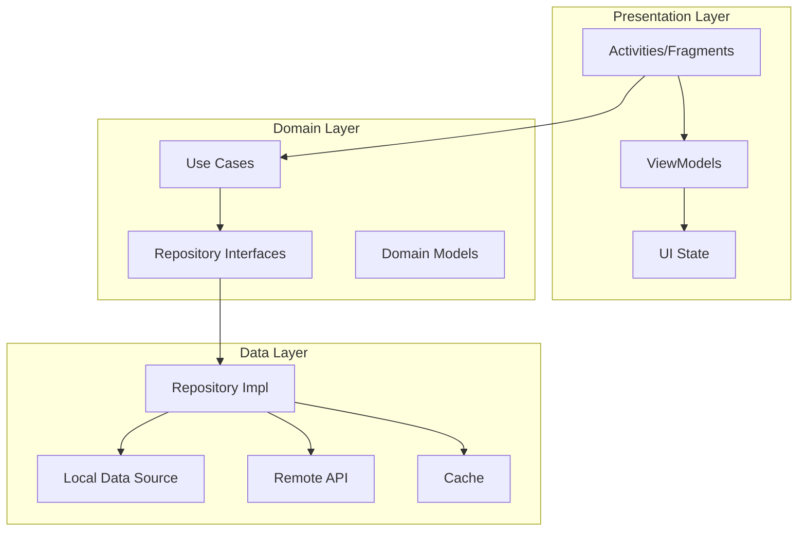
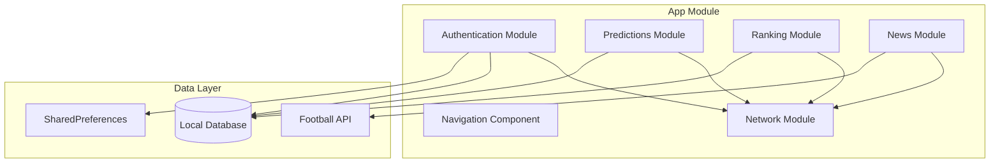
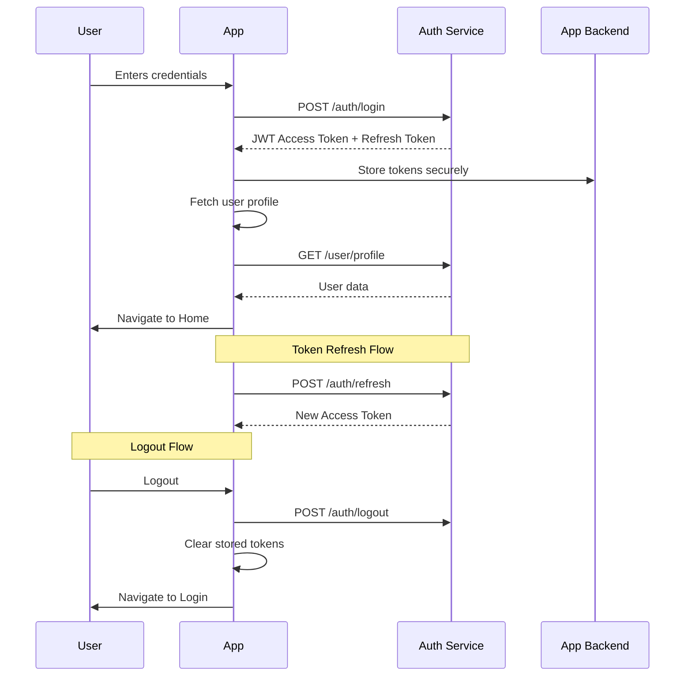

# Design Document: Football Prediction App (GolIA)

## Overview

The Football Prediction App is an Android-native mobile application that allows users to predict football match outcomes, compete in leaderboards, and stay updated with football news. The app features a modern, dark-themed UI with gold accent colors, following Material Design 3 guidelines. Core functionality includes user authentication, match predictions with points-based scoring, real-time rankings, and news integration. The application targets football enthusiasts who want to engage with matches through predictions while competing with friends and other users globally.

## Architecture

The application follows a Clean Architecture pattern with distinct layers ensuring separation of concerns, testability, and maintainability. The architecture comprises three primary layers: the Presentation Layer handling UI and user interactions, the Domain Layer encapsulating business logic and use cases, and the Data Layer managing data sources and repositories. This layered approach enables independent evolution of each layer without affecting others, facilitates unit testing by allowing mocking of dependencies, and supports multiple data sources seamlessly integrated through repository patterns.

The app employs the MVVM (Model-View-ViewModel) pattern within the Presentation Layer, leveraging Android's lifecycle-aware components to manage UI state and handle configuration changes gracefully. Activities and Fragments serve as View components, observing state from ViewModels and updating the UI accordingly. The Domain Layer contains Use Cases that encapsulate business rules, operating independently of Android framework dependencies for testability. The Data Layer implements Repository interfaces defined in the domain layer, providing concrete implementations that abstract data sources such as local database, remote API, and caching mechanisms.



### Component Diagram

The application consists of core components organized by functionality. The Authentication component manages user registration, login, logout, and session persistence. The Predictions component handles match display, prediction submission, and results tracking. The Rankings component processes user scores, maintains leaderboards, and calculates point standings. The News component fetches and displays football-related articles. Each feature module operates as a cohesive unit with its own data management, business logic, and UI components, communicating through well-defined interfaces.



### Data Flow

Data flows through the application following a unidirectional pattern. User interactions trigger events that flow to ViewModels, which invoke Use Cases from the domain layer. Use Cases interact with repositories to fetch or persist data. The data layer abstracts the underlying data sources, implementing caching strategies for performance optimization. Results flow back through the chain to update UI state, which triggers UI refreshes. This pattern ensures predictable data flow, easier debugging, and consistent state management across the application.

## Components and Interfaces

### Authentication Component

**Purpose**: Manages user registration, login, logout, and session persistence.

**Interface**:
```pascal
STRUCTURE AuthRepository
  FUNCTION login(email, password): Result[AuthTokens]
  FUNCTION register(user_data): Result[User]
  FUNCTION logout(): Result[Void]
  FUNCTION refreshToken(token): Result[AuthTokens]
  FUNCTION getCurrentUser(): Result[User]
  FUNCTION updateProfile(user_data): Result[User]
END STRUCTURE

STRUCTURE AuthViewModel
  FUNCTION login(email, password): Flow[LoginState]
  FUNCTION register(user_data): Flow[RegistrationState]
  FUNCTION logout(): Flow[Void]
  FUNCTION observeAuthState(): Flow[AuthState]
END STRUCTURE
```

**Responsibilities**:
- Handle user credentials securely
- Manage token storage and refresh lifecycle
- Provide authentication state to presentation layer
- Enforce session timeout policies

### Predictions Component

**Purpose**: Handles match display, prediction submission, and results tracking.

**Interface**:
```pascal
STRUCTURE PredictionRepository
  FUNCTION getUpcomingMatches(date_range): Result[Array[Match]]
  FUNCTION submitPrediction(match_id, prediction): Result[Prediction]
  FUNCTION getUserPredictions(user_id): Result[Array[Prediction]]
  FUNCTION getPredictionHistory(match_id): Result[Array[Prediction]]
END STRUCTURE

STRUCTURE PredictionViewModel
  FUNCTION loadMatches(): Flow[MatchListState]
  FUNCTION submitPrediction(match_id, outcome): Flow[PredictionState]
  FUNCTION getPredictionsForMatch(match_id): Flow[Array[Prediction]]
END STRUCTURE
```

**Responsibilities**:
- Fetch and cache match data from API
- Validate prediction constraints
- Calculate points based on match results
- Track prediction accuracy over time

### Rankings Component

**Purpose**: Processes user scores, maintains leaderboards, and calculates point standings.

**Interface**:
```pascal
STRUCTURE RankingRepository
  FUNCTION getLeaderboard(period, limit): Result[Array[RankingEntry]]
  FUNCTION getUserRank(user_id, period): Result[RankingEntry]
  FUNCTION getUserStats(user_id): Result[UserStats]
END STRUCTURE

STRUCTURE RankingViewModel
  FUNCTION loadLeaderboard(): Flow[LeaderboardState]
  FUNCTION loadUserStats(): Flow[UserStats]
  FUNCTION observeRankChange(): Flow[RankingChange]
END STRUCTURE
```

**Responsibilities**:
- Calculate and sort user rankings
- Track rank changes over time
- Aggregate statistics for display
- Support multiple ranking periods (daily, weekly, monthly, all-time)

### News Component

**Purpose**: Fetches and displays football-related articles.

**Interface**:
```pascal
STRUCTURE NewsRepository
  FUNCTION getNewsArticles(category, limit): Result[Array[NewsArticle]]
  FUNCTION getArticleDetails(article_id): Result[NewsArticle]
  FUNCTION toggleBookmark(article_id): Result[Void]
  FUNCTION getBookmarkedArticles(): Result[Array[NewsArticle]]
END STRUCTURE

STRUCTURE NewsViewModel
  FUNCTION loadNews(): Flow[NewsListState]
  FUNCTION loadArticleDetails(article_id): Flow[NewsDetailState]
  FUNCTION toggleBookmark(article_id): Flow[Void]
END STRUCTURE
```

**Responsibilities**:
- Fetch news from external sources
- Cache articles for offline access
- Manage user bookmarks
- Filter news by category and teams

## UI Design Specifications

### Screen 1: Splash/Login Screen (163606.png)

The splash/login screen serves as the application's entry point, featuring a dark gradient background transitioning from deep navy to black. The screen displays the "GolIA" branding prominently in the center using a bold, modern typography with gold accent coloring on specific letters. The design incorporates a football-related visual element—likely a stylized football graphic or pattern—positioned behind the main content to provide visual interest without overwhelming the primary call-to-action.

The login form occupies the lower portion of the screen with two input fields arranged vertically. The email/username field appears first with a subtle placeholder prompting user input. Below it, the password field follows the same visual treatment. Both fields feature rounded corners with dark gray backgrounds matching the dark theme. A "Log In" button spans the full width below the input fields, colored in gold with text styled in bold white. An optional "Forgot Password?" link appears beneath the button for password recovery functionality.

The navigation structure directs unauthenticated users to either complete the login form or navigate to registration. The splash screen automatically transitions to the login view after a brief animation, or immediately if a valid session exists. Touching any input field triggers appropriate keyboard display, with return key on the keyboard configured to move focus to the next field or submit the form.

### Screen 2: Registration Screen (163607.png)

The registration screen maintains visual consistency with the login screen while accommodating additional input fields. The header section displays a "Create Account" or similar heading in white typography against the dark background. The form fields arrange vertically in a scrollable layout to accommodate the additional required information without cramping elements.

The registration form includes the following fields based on typical app requirements: full name field for user identification, email field for account recovery and communication, password field with strength indicator, and confirmation password field. Each field follows the same design language—rounded rectangles with dark gray backgrounds and light text. Field labels or placeholders provide clear guidance on expected input. The "Sign Up" button appears at the bottom in gold styling matching the login button, enabling form submission only when all required fields contain valid input.

The screen also includes a link back to the login screen for users who already have an account, maintaining a simple navigation path. An optional terms and conditions checkbox may appear before the submit button for legal compliance. Validation occurs both during input (inline error messages) and on submission attempt.

### Screen 3: Home Screen (163608.png)

The home screen presents the primary prediction interface with a tabbed navigation structure. A bottom navigation bar provides access to four main sections: "Inicio" (Home), "Partidos" (Matches), "Pronósticos" (Predictions), and "Perfil" (Profile). The active tab is visually distinguished through gold coloring of the icon and optional text label.

The home screen content displays upcoming matches in a vertical scrollable list. Each match card represents a single game with team logos on either side of the matchup visualization, team names displayed below each logo, and the scheduled match time prominently featured. The cards feature a dark background that may have a slight gradient or subtle border to define their boundaries. An "Apostar" (Bet/Bet Now) button on each card enables users to create predictions for upcoming matches.

The header area includes the user's name greeting on the left and potentially an icon for notifications or settings on the right. A search or filter bar at the top of the content area allows users to find specific teams or competitions. Match cards include competition indicators (such as league names or tournament logos) to help users identify relevant matches quickly.

### Screen 4: Match Detail Screen (163609.png)

The match detail screen displays comprehensive information about a specific match, serving as the primary prediction creation interface. The screen header features the competition name at the top, followed by a large match visualization showing home team logo on the left, away team logo on the right, and match time in the center. Both team names appear below their respective logos in bold typography.

Below the match header, prediction options are presented in a horizontal or grid layout. Users can select from outcome predictions: Home Win (local victory), Draw (tie), or Away Win (visitor victory). Each option is represented by a button or card with appropriate iconography—a home icon for home win, equal sign for draw, and away icon for away win. Selected options are highlighted with gold border or background coloring.

Additional information sections may include: recent head-to-head results between the teams, current league standings for both teams, and recent form indicators showing each team's last five match results. A "Confirm Prediction" button appears at the bottom, enabled only after a selection is made. Upon submission, a success confirmation appears, and the user is returned to the previous screen or shown the confirmed prediction status.

### Screen 5-8: Additional Prediction Screens (163611-163614.png)

These screens represent various prediction scenarios and selection interfaces. Screen 163611 appears to show a match selection interface with team logos on either side and a central element for time or action buttons. The "Pronosticar" (Predict) button indicates the prediction workflow. Screen 163612 features a simpler match display with team names, a time indicator, and prominent prediction action buttons.

Screen 163613 presents a prediction summary or confirmation view, showing the user's selected outcome with a clear visual indication of which option was chosen. The layout emphasizes the selected prediction while allowing easy modification. Screen 163614 includes what appears to be additional match information or statistics, presenting detailed data about team performance, historical results, or comparative metrics that inform prediction decisions.

The design pattern across these screens emphasizes clarity and action-oriented layouts. Prediction buttons are consistently positioned and styled, enabling users to quickly complete the prediction workflow. Team identification through logos and names remains prominent, with competition context provided through header elements. Each screen provides intuitive navigation back to the previous view.

### Screen 9: Rankings/Leaderboard Screen (163615.png)

The rankings screen displays a competitive leaderboard showing user standings based on prediction accuracy and accumulated points. The screen header features a "Ranking" or "Clasificación" title with navigation or filter options for different time periods (daily, weekly, all-time). The top three positions receive special visual treatment with gold, silver, and bronze accents or medal icons.

Each ranking entry displays: user avatar or profile image, username, total points accumulated, and rank position. The list scrolls vertically to show rankings beyond the top positions. The currently logged-in user's entry is highlighted or positioned prominently for easy reference. The bottom navigation bar provides consistent access to other sections of the app.

An optional "See my position" or similar quick-jump feature enables users to immediately locate themselves in the standings. Filter options allow viewing rankings within friends, country, or global scope. The design creates a competitive atmosphere through visual hierarchy emphasizing top performers while maintaining accessibility for all users.

### Screen 10: Profile Screen (163616.png)

The profile screen presents the authenticated user's account information and statistics. The header displays a large profile picture with the username below and optional tagline or bio. Below the profile header, a statistics section shows key metrics: total predictions made, prediction accuracy percentage, total points earned, and current global rank.

Navigation options within the profile section include: account settings, notification preferences, prediction history, achievements or badges earned, and friends/followers management. A "Edit Profile" button enables updating profile picture, username, or other account details. The settings gear icon provides access to app-wide configuration options.

The screen maintains the consistent dark theme with gold accents, using card-based layouts to group related information. Statistics use large typography for emphasis, with smaller labels providing context. Achievement badges may appear in a grid format below main statistics, gamifying the experience and encouraging continued engagement.

### Screen 11-12: Additional Screens (163617-163618.png)

Screen 163617 appears to show a detail or confirmation view with a large success indicator (checkmark) and navigation options. The screen likely represents a confirmation state after completing an important action such as completing a profile setup, achieving a milestone, or successfully completing a prediction. The button options suggest navigation forward or backward through the flow.

Screen 163618 presents another detailed view, potentially showing specific prediction results or a detailed match summary with predictions displayed. The layout includes what appears to be a list or grid of predictions with their outcomes, dates, and point values. This screen enables users to review their prediction history and understand how their choices performed.

## Data Models

### User Model

The User model represents authenticated application users with comprehensive profile and statistics data. The model includes unique identifier fields for database correlation, profile information for display purposes, and tracking statistics for ranking calculations. All fields maintain appropriate types for efficient storage and transmission.

```pascal
STRUCTURE User
  id: UUID
  username: String
  email: String
  password_hash: String
  avatar_url: String
  country: String
  created_at: DateTime
  total_points: Integer
  predictions_made: Integer
  predictions_correct: Integer
  current_rank: Integer
  streak_days: Integer
  is_active: Boolean
END STRUCTURE
```

**Validation Rules:**
- `username` must be 3-20 characters, alphanumeric with underscores permitted
- `email` must conform to standard email format validation
- `password_hash` must be securely hashed using bcrypt or Argon2
- `total_points` cannot be negative
- `predictions_made` ≥ `predictions_correct` (accuracy constraint)

### Match/Prediction Model

The Match model encapsulates football match information from the external API, while the Prediction model stores user predictions. These models interact to determine prediction correctness and award points. Match data originates from the football data provider, while prediction data is user-generated.

```pascal
STRUCTURE Match
  id: UUID
  external_id: String
  competition_id: String
  competition_name: String
  matchday: Integer
  home_team_id: UUID
  home_team_name: String
  home_team_logo_url: String
  away_team_id: UUID
  away_team_name: String
  away_team_logo_url: String
  scheduled_datetime: DateTime
  status: String  (* "SCHEDULED", "LIVE", "FINISHED", "POSTPONED", "CANCELLED" *)
  home_score: Integer
  away_score: Integer
  home_odds: Real
  draw_odds: Real
  away_odds: Real
END STRUCTURE

STRUCTURE Prediction
  id: UUID
  user_id: UUID
  match_id: UUID
  predicted_outcome: String  (* "HOME_WIN", "DRAW", "AWAY_WIN" *)
  predicted_home_score: Integer
  predicted_away_score: Integer
  points_earned: Integer
  is_correct: Boolean
  created_at: DateTime
  finalized_at: DateTime
END STRUCTURE
```

**Validation Rules:**
- `predicted_outcome` must be one of three valid options
- `predicted_home_score` and `predicted_away_score` must be non-negative integers
- `points_earned` cannot exceed maximum available for the match
- Prediction must be submitted before scheduled match time

### News Model

The News model represents football news articles from external sources or integrated news feeds. Articles include metadata for display and categorization, enabling filtering and personalized content delivery based on user preferences.

```pascal
STRUCTURE NewsArticle
  id: UUID
  external_id: String
  title: String
  summary: String
  content: String
  author: String
  source: String
  image_url: String
  article_url: String
  published_at: DateTime
  category: String  (* "TRANSFER", "MATCH_REPORT", "INTERVIEW", "GENERAL" *)
  teams_mentioned: Array[UUID]
  competitions_mentioned: Array[String]
  is_bookmarked: Boolean
END STRUCTURE
```

**Validation Rules:**
- `title` and `content` must be non-empty strings
- `article_url` must be valid URL format
- `published_at` cannot be in the future for published articles
- `source` must reference an allowed news provider

### Ranking Model

The Ranking model represents user standings for leaderboard display. Rankings are calculated based on prediction performance over various time periods and may include additional tiebreaker criteria for users with identical point totals.

```pascal
STRUCTURE RankingEntry
  user_id: UUID
  username: String
  avatar_url: String
  total_points: Integer
  rank_position: Integer
  period_type: String  (* "DAILY", "WEEKLY", "MONTHLY", "ALL_TIME" *)
  period_start: DateTime
  period_end: DateTime
  predictions_count: Integer
  accuracy_percentage: Real
  rank_change: Integer  (* Positive = improved, Negative = dropped, 0 = unchanged *)
END STRUCTURE

STRUCTURE UserStats
  user_id: UUID
  total_predictions: Integer
  correct_predictions: Integer
  accuracy_rate: Real
  total_points: Integer
  average_points_per_prediction: Real
  longest_streak: Integer
  current_streak: Integer
  rank_all_time: Integer
  rank_weekly: Integer
  rank_daily: Integer
END STRUCTURE
```

**Validation Rules:**
- `accuracy_percentage` must be between 0 and 100
- `total_predictions` ≥ `correct_predictions`
- `rank_position` must be positive integer starting from 1

## API Integrations

### Football API Integration

The application integrates with a football data API to fetch match schedules, results, team information, and competition data. The API integration follows a repository pattern, abstracting the remote data source behind a consistent interface used by the domain layer. The implementation handles authentication, request formatting, response parsing, and error management.

**API Endpoints Required:**

```pascal
FUNCTION getCompetitions()
  OUTPUT: Array[Competition]
  HTTP_METHOD: GET
  ENDPOINT: /competitions
END FUNCTION

FUNCTION getMatchesByCompetition(competition_id, date_range)
  OUTPUT: Array[Match]
  HTTP_METHOD: GET
  ENDPOINT: /competitions/{id}/matches
END FUNCTION

FUNCTION getMatchesByDate(date)
  OUTPUT: Array[Match]
  HTTP_METHOD: GET
  ENDPOINT: /matches
END_FUNCTION

FUNCTION getMatchDetails(match_id)
  OUTPUT: Match
  HTTP_METHOD: GET
  ENDPOINT: /matches/{id}
END_FUNCTION

FUNCTION getTeamDetails(team_id)
  OUTPUT: Team
  HTTP_METHOD: GET
  ENDPOINT: /teams/{id}
END_FUNCTION

FUNCTION getTeamMatches(team_id, season)
  OUTPUT: Array[Match]
  HTTP_METHOD: GET
  ENDPOINT: /teams/{id}/matches
END_FUNCTION
```

**Response Handling:**
- Successful responses return status 200 with JSON payload
- Rate limiting responses (429) trigger exponential backoff retry
- Authentication failures (401) trigger token refresh attempt
- Client errors (4xx) display user-friendly error messages
- Server errors (5xx) log for monitoring and retry on next session

### Authentication Flow

Authentication integrates with a backend authentication service supporting registration, login, session management, and profile management. The flow leverages secure token-based authentication with refresh capabilities for maintaining sessions across app launches.



**Token Management:**
- Access tokens expire after 15-30 minutes for security
- Refresh tokens expire after 7-30 days depending on configuration
- Tokens stored securely using Android Keystore for encryption
- Biometric confirmation required for sensitive operations

## Component Design

### Match Card Component

The Match Card component displays individual match information in a consistent, reusable format across screens. The component renders team logos, names, match time, and action buttons based on the match state. The component supports click interactions for navigating to detail views or triggering prediction flows.

```pascal
STRUCTURE MatchCardProps
  match: Match
  user_prediction: Prediction
  on_card_click: Function
  on_bet_click: Function
  is_selected: Boolean
END STRUCTURE

PROCEDURE renderMatchCard(props)
  SEQUENCE
    IF props.match.status = "FINISHED" THEN
      renderFinalizedMatch(props.match)
    ELSIF props.match.status = "LIVE" THEN
      renderLiveMatch(props.match)
    ELSE
      renderUpcomingMatch(props.match)
    END IF
  END SEQUENCE
END PROCEDURE

PROCEDURE renderUpcomingMatch(match)
  SEQUENCE
    (* Render team logos and names *)
    displayImage(match.home_team_logo_url)
    displayText(match.home_team_name)
    displayTime(match.scheduled_datetime)
    displayText(match.away_team_name)
    displayImage(match.away_team_logo_url)
    
    (* Render competition badge *)
    displayBadge(match.competition_name)
    
    (* Render action button *)
    button <- CREATEButton("Apostar")
    button.onClick <- props.on_bet_click
    button.isEnabled <- match.scheduled_datetime > NOW()
  END SEQUENCE
END PROCEDURE
```

**Visual Specifications:**
- Card dimensions: width matches parent, height adjusts to content (minimum 80dp)
- Corner radius: 12dp for rounded appearance
- Background: Dark gray (#1E1E1E) with optional elevation for depth
- Team logos: 48x48dp with circular or rounded square clipping
- Typography: Body1 for team names (14sp), Caption for time (12sp)
- Accent color: Gold (#FFD700) for interactive elements

### Prediction Input Component

The Prediction Input component captures user predictions for upcoming matches through an intuitive interface. Users select from three possible outcomes with clear visual feedback on selection state. The component validates input and provides confirmation before submission.

```pascal
STRUCTURE PredictionInputProps
  match: Match
  on_prediction_confirm: Function
  on_cancel: Function
END_STRUCTURE

PROCEDURE renderPredictionInput(props)
  SEQUENCE
    (* Display match information header *)
    displayMatchHeader(props.match)
    
    (* Render outcome options as selectable cards *)
    option_home <- createOutcomeCard("Home Win", props.match.home_odds)
    option_draw <- createOutcomeCard("Draw", props.match.draw_odds)
    option_away <- createOutcomeCard("Away Win", props.match.away_odds)
    
    (* Handle selection state *)
    selected_option <- NULL
    FOR each option IN [option_home, option_draw, option_away] DO
      option.onSelect <- FUNCTION
        selected_option <- option
        updateSelectionVisuals()
      END FUNCTION
    END FOR
    
    (* Confirm button enabled only when selection made *)
    confirm_button <- CREATEButton("Confirm Prediction")
    confirm_button.isEnabled <- selected_option ≠ NULL
    confirm_button.onClick <- FUNCTION
      prediction <- createPrediction(props.match.id, selected_option.value)
      props.on_prediction_confirm(prediction)
    END FUNCTION
    
    cancel_button <- CREATEButton("Cancel")
    cancel_button.onClick <- props.on_cancel
  END SEQUENCE
END PROCEDURE
```

**Visual Specifications:**
- Outcome cards: 100dp width, 80dp height each arranged horizontally
- Selected state: Gold border (2dp) with subtle background tint
- Unselected state: Gray background with white text
- Odds displayed in smaller text below outcome label
- Button height: 48dp with 8dp corner radius

### News Card Component

The News Card component displays football news articles in a consistent, scannable format. The component supports thumbnail images, headlines, source attribution, and bookmarking functionality. Cards adapt to different screen sizes while maintaining visual hierarchy.

```pascal
STRUCTURE NewsCardProps
  article: NewsArticle
  on_click: Function
  on_bookmark: Function
END_STRUCTURE

PROCEDURE renderNewsCard(props)
  SEQUENCE
    (* Thumbnail image with aspect ratio preservation *)
    IF props.article.image_url ≠ NULL THEN
      displayImage(props.article.image_url, aspect_ratio_16_9)
    END IF
    
    (* Title headline *)
    displayText(props.article.title, style: headline6)
    
    (* Source and timestamp row *)
    displayText(props.article.source, style: caption, color: secondary)
    displaySpacer(horizontal: 8dp)
    displayText(formatTimeAgo(props.article.published_at), style: caption, color: secondary)
    
    (* Category badge *)
    displayBadge(props.article.category)
    
    (* Bookmark action *)
    bookmark_button <- CREATEIconButton("bookmark")
    bookmark_button.isFilled <- props.article.is_bookmarked
    bookmark_button.onClick <- props.on_bookmark
  END SEQUENCE
END PROCEDURE
```

**Visual Specifications:**
- Card width: Matches parent with 16dp margin
- Image height: 180dp for hero images
- Padding: 16dp on all sides
- Typography: Headline6 for titles (20sp), Caption for metadata (12sp)
- Category badge: Colored background with contrasting text

### Ranking List Item Component

The Ranking List Item component displays individual user standings in the leaderboard with appropriate visual treatment for different rank positions. Top three ranks receive special highlighting with medal or color distinctions. The component supports click interactions for viewing other users' profiles.

```pascal
STRUCTURE RankingItemProps
  entry: RankingEntry
  is_current_user: Boolean
  on_click: Function
END_STRUCTURE

PROCEDURE renderRankingItem(props)
  SEQUENCE
    (* Rank position with special styling for top 3 *)
    rank_view <- CREATE rank_display
    rank_view.rank <- props.entry.rank_position
    rank_view.special_style <- props.entry.rank_position ≤ 3
    
    (* User avatar *)
    avatar <- CREATEImageView(props.entry.avatar_url, shape: circle)
    
    (* Username *)
    displayText(props.entry.username, style: subtitle1)
    
    (* Points *)
    displayText(formatPoints(props.entry.total_points), style: subtitle2, color: gold)
    
    (* Change indicator if available *)
    IF props.entry.rank_change ≠ 0 THEN
      change_icon ← props.entry.rank_change > 0 ? "arrow_up" : "arrow_down"
      displayIcon(change_icon)
    END IF
    
    (* Highlight current user entry *)
    IF props.is_current_user THEN
      background_color ← gold_with_opacity
    END IF
  END SEQUENCE
END PROCEDURE
```

**Visual Specifications:**
- List item height: 64dp for standard entries
- Avatar size: 48dp diameter for top entries, 40dp for standard
- Rank display: Large typography for positions 1-3 (24sp), standard for others (16sp)
- Gold coloring: #FFD700 for points and top 3 highlights
- Spacing: 16dp horizontal padding, 8dp vertical padding

## Correctness Properties

The following properties define the expected behavior of core application features:

### Property 1: Authentication Invariants

**Theorem**: `auth_correctness`
```pascal
FORALL user IN users WHERE user.is_active = true:
  user.login_count ≥ 0 AND
  user.total_points ≥ 0 AND
  user.predictions_correct ≤ user.predictions_made
```

**Description**: Ensures that authenticated user statistics maintain logical consistency across all tracked metrics.

### Property 2: Prediction Validity

**Theorem**: `prediction_validity`
```pascal
FORALL prediction IN predictions:
  prediction.created_at < prediction.match.scheduled_datetime AND
  prediction.predicted_outcome ∈ {"HOME_WIN", "DRAW", "AWAY_WIN"} AND
  (prediction.is_correct = true) ⟺ 
    (prediction.predicted_outcome = actual_outcome(prediction.match))
```

**Description**: Guarantees that predictions are submitted before match time, use valid outcomes, and correctly determine accuracy.

### Property 3: Points Calculation

**Theorem**: `points_calculation`
```pascal
FORALL prediction IN predictions WHERE prediction.match.status = "FINISHED":
  prediction.points_earned = calculatePoints(
    prediction.predicted_outcome,
    prediction.match.actual_outcome,
    prediction.match.odds
  ) AND
  0 ≤ prediction.points_earned ≤ MAX_POINTS
```

**Description**: Ensures that awarded points match the calculation formula and remain within valid bounds.

### Property 4: Ranking Order

**Theorem**: `ranking_order`
```pascal
FORALL i, j IN rankings WHERE i.rank_position < j.rank_position:
  i.total_points ≥ j.total_points OR
  (i.total_points = j.total_points AND i.accuracy_percentage ≥ j.accuracy_percentage)
```

**Description**: Maintains correct ranking order where higher-ranked users have equal or better metrics than lower-ranked users.

### Property 5: Match Status Consistency

**Theorem**: `match_status_consistency`
```pascal
FORALL match IN matches:
  (match.status = "FINISHED") ⟹ 
    (match.home_score ≠ NULL AND match.away_score ≠ NULL) AND
  (match.status = "SCHEDULED") ⟹ 
    (match.home_score = NULL AND match.away_score = NULL)
```

**Description**: Ensures that match scores are only populated when the match has concluded.

## Error Handling

### Authentication Errors

**Scenario 1: Invalid Credentials**
- **Condition**: User enters incorrect email or password
- **Response**: Display "Invalid email or password" message, clear password field, keep email for retry
- **Recovery**: User corrects credentials and attempts again, with optional "Forgot Password" flow

**Scenario 2: Network Timeout During Login**
- **Condition**: Authentication request times out due to network issues
- **Response**: Display "Connection error. Please check your network and try again." with retry button
- **Recovery**: User verifies network connection, taps retry, or tries again later

**Scenario 3: Session Expired**
- **Condition**: Access token expires during active usage
- **Response**: Redirect to login screen with "Session expired. Please log in again." message
- **Recovery**: User logs in again, maintaining any unsaved data

### Prediction Errors

**Scenario 1: Prediction Window Closed**
- **Condition**: User attempts to predict a match that has already started
- **Response**: Display "Predictions are closed for this match" message, disable submit button
- **Recovery**: User cannot submit; redirected to matches list or informed of deadline

**Scenario 2: Duplicate Prediction**
- **Condition**: User attempts to submit a second prediction for the same match
- **Response**: Display "You have already predicted this match" message, show existing prediction
- **Recovery**: User can view their existing prediction or modify it if within time window

**Scenario 3: Network Failure During Submission**
- **Condition**: Prediction submission fails due to network issues
- **Response**: Store prediction locally, show "Retry" button, attempt background sync
- **Recovery**: App retries automatically when network available, notifies user of success

### Data Loading Errors

**Scenario 1: Match Data Unavailable**
- **Condition**: API returns error fetching match data
- **Response**: Display placeholder "Matches unavailable" with error icon, show retry button
- **Recovery**: User taps retry or returns when network stabilizes

**Scenario 2: Ranking Data Stale**
- **Condition**: User views ranking after extended period without refresh
- **Response**: Display cached data with "Last updated [timestamp]" indicator, auto-refresh
- **Recovery**: Background refresh updates display, user can manually pull to refresh

## Performance Considerations

- **Lazy Loading**: Match cards and news articles load on-demand as users scroll through lists
- **Image Caching**: Team logos and news thumbnails are cached locally using Glide/Picasso
- **Pagination**: API responses limit to 20-50 items per request with cursor-based pagination
- **Offline Support**: Critical data (recent matches, user predictions) cached locally for offline access
- **Background Sync**: Match scores and rankings refresh in background every 30 seconds during active use
- **Memory Management**: Image loading uses appropriate sizing to prevent memory bloat on various screen densities
- **Start-up Time**: Splash screen display time minimized by loading authentication state asynchronously

## Security Considerations

- **Token Storage**: Authentication tokens encrypted using Android Keystore, not shared preferences
- **Certificate Pinning**: API communications use certificate pinning to prevent MITM attacks
- **Input Validation**: All user inputs validated client-side and sanitized server-side
- **Session Timeout**: Automatic logout after 30 minutes of inactivity
- **Secure Communication**: All API calls use HTTPS with TLS 1.2 minimum
- **Dependency Updates**: Regular scanning for vulnerable dependencies in build configuration
- **Proguard/R8**: Code obfuscation enabled in release builds to prevent reverse engineering

## Testing Strategy

### Unit Testing Approach

Unit tests cover individual components in isolation, verifying correctness of business logic, data transformations, and state management. The test strategy focuses on testing use cases, repositories, and view models without Android framework dependencies.

**Key Test Cases:**
- User authentication with valid and invalid credentials
- Prediction submission validation and point calculation
- Leaderboard sorting and rank computation
- News article filtering and bookmarking operations
- Data model validation and transformation functions

**Coverage Goals:**
- Domain layer: 90% code coverage
- Data layer: 80% code coverage
- ViewModels: 85% code coverage

### Property-Based Testing Approach

Property-based testing verifies invariants and correct behavior across a wide range of inputs, catching edge cases that unit tests might miss. This approach is particularly valuable for prediction logic, ranking algorithms, and data validation.

**Property Test Library**: fast-check (JavaScript/TypeScript) or Hypothesis (Python)

**Key Properties to Test:**
- Prediction points calculation produces valid results for all outcome combinations
- Ranking order maintains consistency regardless of input ordering
- User statistics remain within valid bounds after any sequence of operations
- Match status transitions follow the defined state machine

### Integration Testing Approach

Integration tests verify interactions between components and with external dependencies. These tests run on Android devices or emulators to ensure proper integration with Android framework.

**Integration Test Scenarios:**
- Authentication flow with backend API
- Match data fetching and caching through repository pattern
- ViewModel and UI state management through lifecycle changes
- Database persistence and retrieval operations

### Testing Tools

**Unit Testing:**
- JUnit 4.13+ for test framework
- Mockito 5.7+ for dependency mocking
- Coroutines Test for suspended function testing

**UI Testing:**
- Espresso 3.5+ for view interaction testing
- Barista for simplified Android UI testing
- MockWebServer for network response simulation

**Continuous Integration:**
- GitHub Actions for automated test runs
- Lint checks for code quality
- Dependency vulnerability scanning

## Dependencies

**Network Layer:**
- Retrofit 2.9.0+ for REST API integration
- OkHttp 4.12.0+ for HTTP client with interceptors
- Gson 2.10+ for JSON serialization

**Image Loading:**
- Glide 4.16+ for image caching and transformation
- Coil 2.5+ as alternative if Kotlin-first preferred

**Local Storage:**
- Room 2.6+ for SQLite abstraction
- SharedPreferences for simple key-value pairs (encrypted on API 23+)
- DataStore 1.0+ for modern preferences

**Architecture:**
- Lifecycle 2.7+ for ViewModel and LiveData
- Navigation 2.7+ for fragment navigation
- Fragment KTX 1.6+ for Kotlin extensions

**Testing:**
- JUnit 4.13+ for unit testing
- Mockito 5.7+ for mocking
- Espresso 3.5+ for UI testing
- Coroutines Test for async testing

**DI (Recommended):**
- Hilt 2.48+ for dependency injection

**Build Configuration:**
- Gradle 8.2+ with Android Gradle Plugin 8.1+
- Kotlin 1.9+
- Target SDK 34, Minimum SDK 24