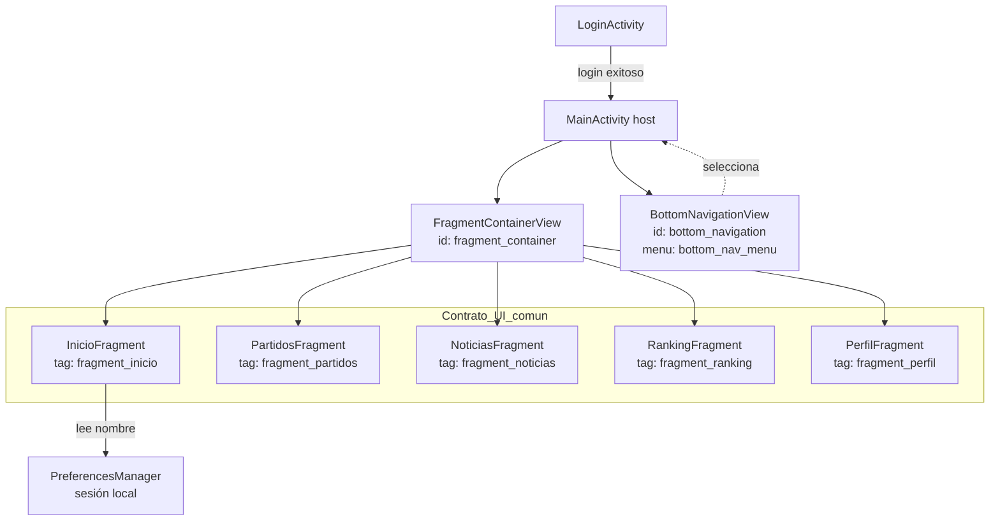
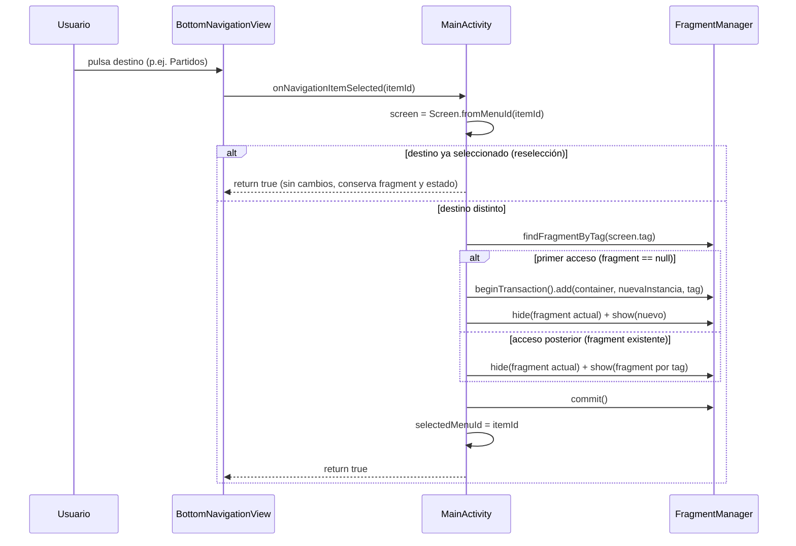
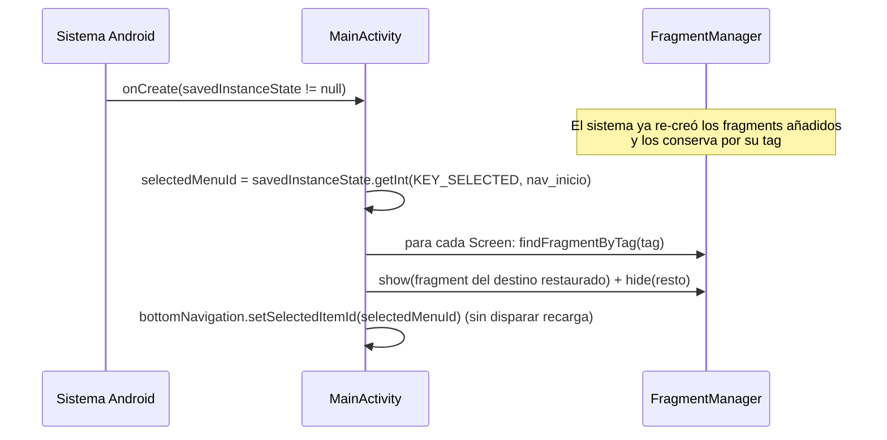
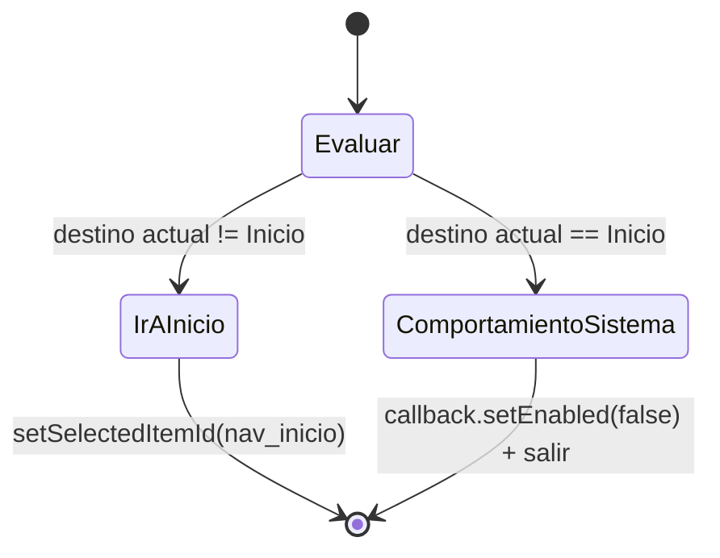

# Documento de Diseño: Home con Bottom Navigation

## Overview

Esta funcionalidad convierte `MainActivity` en el host único de navegación tras el login. `MainActivity` aloja un `FragmentContainerView` (Fragment_Container) y una `BottomNavigationView` de Material (Bottom_Navigation) con **cinco** destinos: Inicio, Partidos, Noticias, Ranking y Perfil. La pantalla adopta la paleta azul/oscura del login (Paleta_Login) y reutiliza los fragments ya existentes en el paquete raíz `com.diyebure.golia`.

El proyecto **ya contiene** una primera implementación de bottom navigation, pero está desalineada con el spec y debe reescribirse. Los puntos clave a corregir se detallan abajo.

### Decisiones clave de diseño

1. **Estrategia show/hide por etiqueta (tag) en lugar de `replace()`** (Estrategia_Fragmentos, R2.7/R2.8/R9.1).
   La implementación actual usa `transaction.replace(...)` + `addToBackStack(null)`, lo que **recrea** el fragment en cada selección y acumula back stack. Se sustituye por: añadir cada fragment una sola vez con un tag estable, y alternar visibilidad con `hide()`/`show()`. Esto preserva el estado de vista de cada sección y garantiza reutilización de instancias.
   *Rationale:* es el patrón recomendado para bottom navigation con pocas secciones donde se quiere conservar el estado de cada pestaña sin recrearla.

2. **`Screen` enum reescrito a 5 destinos con tags estables** (R1.2).
   El enum actual tiene 4 valores, mapea `PREDICTIONS -> RankingFragment` (incorrecto) y omite Noticias. Se reescribe con los 5 destinos correctos, cada uno con su id de menú, su tag estable y un proveedor de instancia de fragment. Los tags estables (`"fragment_inicio"`, etc.) permiten localizar los fragments por `findFragmentByTag` tras la recreación de la actividad (R6.1).

3. **`OnBackPressedCallback` en lugar de `onBackPressed()` deprecado** (R9.2/R9.3/R9.4).

4. **Tint con la Paleta_Login mediante ColorStateList** (R4, R10.2).
   Se elimina el uso de `R.color.gold` y se aplica `blue_end` (activo) / `text_gray` (inactivo) a `itemIconTint` e `itemTextColor` vía un `ColorStateList` de recurso (no en código).

5. **El nombre de usuario proviene solo de la sesión local** (R11).
   `LoginViewModel` guardará también `user.getFullName()` en `PreferencesManager`; `InicioFragment` lo lee desde ahí, sin tocar base de datos ni repositorios.

6. **Contrato de UI común `bindPlaceholderData()`** (R8).
   Se introduce una clase base `BasePlaceholderFragment` (o interfaz) con el método de poblado, invocado desde `onViewCreated`, para homogeneizar la futura conexión de ViewModels.

### Mapa de archivos: NUEVOS / MODIFICADOS / OBSOLETOS

| Estado | Archivo | Acción |
|---|---|---|
| **MODIFICADO (reescribir)** | `MainActivity.java` | Reescritura completa: 5 destinos, show/hide por tag, `OnBackPressedCallback`, tint Paleta_Login, restauración por tag. |
| **MODIFICADO (reescribir)** | `presentation/ui/common/Screen.java` | Reescribir a 5 destinos con id de menú, tag estable y proveedor de fragment. |
| **MODIFICADO (reescribir)** | `res/menu/bottom_nav_menu.xml` | 5 items con ids nuevos coherentes (`nav_inicio`, `nav_partidos`, `nav_noticias`, `nav_ranking`, `nav_perfil`), íconos e `@string/...`. |
| **MODIFICADO (ajustar)** | `res/layout/activity_main.xml` | Fondo Paleta_Login, `FragmentContainerView` id `fragment_container`, Bottom_Navigation con `blue_dark` y ColorStateList correcto. |
| **MODIFICADO (rediseñar)** | `res/layout/fragment_inicio.xml` | Rediseño conforme al mockup (encabezado, tarjeta bienvenida, 4 estadísticas independientes, "Partidos próximos" + "Ver todos", tarjetas de partido). Fondo transparente. |
| **MODIFICADO (reescribir)** | `res/color/nav_item_color.xml` | `state_checked=blue_end`, default=`text_gray` (hoy usa `gold`/`text_white`). Se renombra conceptualmente a `bottom_nav_item_color` (ver nota). |
| **MODIFICADO** | `InicioFragment.java` | Extiende `BasePlaceholderFragment`; `bindPlaceholderData()` lee nombre de sesión con fallback, puebla 4 estadísticas y tarjetas placeholder; campana clickable sin acción. |
| **MODIFICADO** | `PartidosFragment.java`, `NoticiasFragment.java`, `RankingFragment.java`, `PerfilFragment.java` | Extienden `BasePlaceholderFragment` e implementan `bindPlaceholderData()` (mantienen placeholder). |
| **MODIFICADO** | `data/local/PreferencesManager.java` | Añadir `saveUserName(String)` / `getUserName()` (cifrados como los demás). |
| **MODIFICADO** | `ui/auth/LoginViewModel.java` | Al éxito, guardar también `user.getFullName()` en `PreferencesManager`. |
| **MODIFICADO** | `LoginActivity.java` | `navigateToHome()` debe apuntar a `MainActivity` (hoy apunta a `HomeActivity`). |
| **NUEVO** | `presentation/ui/common/BasePlaceholderFragment.java` | Clase base con `bindPlaceholderData()`. |
| **NUEVO** | `res/drawable/ic_noticias.xml` | Ícono vectorial periódico (falta; los demás ya existen). |
| **NUEVO (opcional)** | `res/drawable/ic_inicio.xml` | Casa. Puede reutilizarse `ic_home.xml` existente (decisión: reutilizar `ic_home`). |
| **OBSOLETO (eliminar)** | `HomeActivity.java` | Reemplazada por `MainActivity`. Eliminar y quitar su `<activity>` del manifest. |
| **OBSOLETO (eliminar)** | `res/layout/activity_home.xml` | Layout de la Activity obsoleta. Eliminar. |

**Notas sobre recursos existentes:**
- Drawables vectoriales presentes: `ic_home.xml`, `ic_partidos.xml`, `ic_ranking.xml`, `ic_perfil.xml`. **Falta** `ic_noticias.xml` (crear). Existen PNGs (`inicio_ic.png`, etc.) que quedan sin uso; no es necesario eliminarlos, pero se prefieren los vectoriales.
- `purple_backgraund` es un archivo `.jpeg` (bitmap), no un drawable XML. Se referencia como `@drawable/purple_backgraund` para el fondo, o alternativamente el color `blue_dark`. El diseño usa `blue_dark` como color base de fondo para evitar dependencias de recorte del bitmap, y deja `purple_backgraund` como opción.
- El `ColorStateList` actual se llama `nav_item_color.xml`. Para minimizar cambios de referencias se puede **reutilizar el mismo nombre** actualizando sus colores, o crear `bottom_nav_item_color.xml`. El diseño recomienda **reescribir `nav_item_color.xml`** (menos churn) y documentarlo; el nombre lógico en el spec es "ColorStateList de navegación".

---

## Architecture

### Estructura de la pantalla



Todos los fragments extienden `BasePlaceholderFragment` (contrato `bindPlaceholderData()`), lo que deja la puerta abierta a ViewModels sin tocar `MainActivity`.

### Secuencia: selección de pestaña (show/hide por tag)



### Secuencia: restauración tras rotación



### Manejo del botón atrás (OnBackPressedCallback)



---

## Estrategia de FragmentManager (show/hide por tag)

### Añadido inicial con tag estable

La primera vez que se selecciona un destino (o al crear la actividad con Inicio por defecto), se busca el fragment por su tag. Si no existe (`findFragmentByTag(tag) == null`), se crea la instancia mediante el proveedor del enum y se añade con `add(R.id.fragment_container, instancia, tag)`. El tag es estable y único por destino (`"fragment_inicio"`, `"fragment_partidos"`, `"fragment_noticias"`, `"fragment_ranking"`, `"fragment_perfil"`).

### Alternar visibilidad

Al cambiar de destino se ejecuta, en una sola transacción: `hide(fragmentActual)` seguido de `show(fragmentDestino)`. Si el destino aún no se añadió, se hace `add(...tag)` y luego `show(...)`. Nunca se usa `replace()`.

### Restauración tras recreación de la actividad

Cuando el sistema recrea `MainActivity`, el `FragmentManager` **ya vuelve a crear** los fragments que estaban añadidos y los conserva bajo sus tags. En `onCreate` con `savedInstanceState != null`:
1. Se lee `selectedMenuId` de `savedInstanceState` (fallback `nav_inicio` si falta, R6.5).
2. Se recorren los `Screen` y se localiza cada fragment con `findFragmentByTag(tag)`; se hace `show` del destino restaurado y `hide` de los demás encontrados. Si un fragment esperado no aparece (caso defensivo), se re-crea con `add`.
3. Se marca el ítem del menú con `setSelectedItemId(selectedMenuId)`.

### Persistencia del estado seleccionado

`onSaveInstanceState` guarda **únicamente** el id del destino seleccionado (`outState.putInt(KEY_SELECTED, selectedMenuId)`). El estado de vista de cada fragment lo preserva el propio `FragmentManager` (R6.3). No se serializa el fragment ni su contenido.

### Por qué NO `replace()` ni `addToBackStack()`

- `replace()` destruye la vista del fragment saliente y crea de nuevo el entrante, perdiendo el estado de scroll/entrada y violando R2.7/R2.8 (reutilización de instancias).
- `addToBackStack(null)` acumula entradas de back stack por cada cambio de pestaña, generando un comportamiento de "atrás" impredecible que contradice R9 (el spec define un back explícito: si no es Inicio, ir a Inicio; si es Inicio, comportamiento del sistema). Con show/hide no hay back stack de fragments.

---

## Components and Interfaces

### `Screen` enum (MODIFICADO — reescribir)

```java
package com.diyebure.golia.presentation.ui.common;

import androidx.fragment.app.Fragment;
import com.diyebure.golia.InicioFragment;
import com.diyebure.golia.NoticiasFragment;
import com.diyebure.golia.PartidosFragment;
import com.diyebure.golia.PerfilFragment;
import com.diyebure.golia.R;
import com.diyebure.golia.RankingFragment;

/** Destinos de la barra de navegación inferior. */
public enum Screen {
    INICIO(R.id.nav_inicio,     "fragment_inicio",    InicioFragment::new),
    PARTIDOS(R.id.nav_partidos, "fragment_partidos",  PartidosFragment::new),
    NOTICIAS(R.id.nav_noticias, "fragment_noticias",  NoticiasFragment::new),
    RANKING(R.id.nav_ranking,   "fragment_ranking",   RankingFragment::new),
    PERFIL(R.id.nav_perfil,     "fragment_perfil",    PerfilFragment::new);

    /** Fábrica de instancias del fragment (evita reflexión). */
    public interface FragmentFactory { Fragment create(); }

    private final int menuItemId;
    private final String tag;
    private final FragmentFactory factory;

    Screen(int menuItemId, String tag, FragmentFactory factory) {
        this.menuItemId = menuItemId;
        this.tag = tag;
        this.factory = factory;
    }

    public int getMenuItemId() { return menuItemId; }
    public String getTag() { return tag; }
    public Fragment newFragment() { return factory.create(); }

    /** Devuelve el Screen para un id de menú, o null si no corresponde. */
    public static Screen fromMenuId(int menuItemId) {
        for (Screen s : values()) {
            if (s.menuItemId == menuItemId) return s;
        }
        return null;
    }

    /** Destino por defecto. */
    public static Screen defaultScreen() { return INICIO; }
}
```

*Rationale:* proveedor de instancia (`FragmentFactory`) en lugar de reflexión (`newInstance()`), que es frágil y está deprecada.

### `MainActivity` (MODIFICADO — reescribir)

```java
package com.diyebure.golia;

public class MainActivity extends AppCompatActivity {

    private static final String KEY_SELECTED = "selected_menu_id";

    private BottomNavigationView bottomNavigation;
    private int selectedMenuId = R.id.nav_inicio;

    @Override
    protected void onCreate(Bundle savedInstanceState) {
        super.onCreate(savedInstanceState);
        setContentView(R.layout.activity_main);
        bottomNavigation = findViewById(R.id.bottom_navigation);
        // El ColorStateList se aplica desde el XML (itemIconTint/itemTextColor);
        // no se fija tint en código.

        bottomNavigation.setOnItemSelectedListener(this::onDestinationSelected);

        if (savedInstanceState == null) {
            selectedMenuId = R.id.nav_inicio;          // Inicio por defecto (R3)
            selectDestination(Screen.INICIO, /*commitNow*/ false);
            bottomNavigation.setSelectedItemId(R.id.nav_inicio);
        } else {
            selectedMenuId = savedInstanceState.getInt(KEY_SELECTED, R.id.nav_inicio); // R6.3/R6.5
            restoreVisibleFragment(selectedMenuId);    // localiza por tag (R6.1)
            bottomNavigation.setSelectedItemId(selectedMenuId); // R6.2
        }

        setupBackCallback();
    }

    /** Listener del menú: cambia de destino aplicando show/hide. */
    private boolean onDestinationSelected(@NonNull MenuItem item) {
        int id = item.getItemId();
        if (id == selectedMenuId) {
            return true; // reselección: conservar fragment y estado (R2.7/R9.1)
        }
        Screen target = Screen.fromMenuId(id);
        if (target == null) return false;
        selectDestination(target, false);
        selectedMenuId = id; // R2.6: exactamente uno seleccionado
        return true;
    }

    /** Añade (si falta) el fragment por tag y alterna visibilidad. */
    private void selectDestination(Screen target, boolean commitNow) {
        FragmentManager fm = getSupportFragmentManager();
        FragmentTransaction tx = fm.beginTransaction();
        // Oculta el visible actual (si lo hay).
        Fragment current = fm.findFragmentByTag(screenTagFromMenuId(selectedMenuId));
        if (current != null && current != fm.findFragmentByTag(target.getTag())) {
            tx.hide(current);
        }
        // Muestra o crea el destino.
        Fragment dest = fm.findFragmentByTag(target.getTag());
        if (dest == null) {
            tx.add(R.id.fragment_container, target.newFragment(), target.getTag()); // primer acceso
        } else {
            tx.show(dest); // acceso posterior: reutiliza instancia (R2.8)
        }
        tx.commit();
    }

    /** Restaura el fragment visible tras recreación, buscando por tag. */
    private void restoreVisibleFragment(int menuId) {
        FragmentManager fm = getSupportFragmentManager();
        Screen visible = Screen.fromMenuId(menuId);
        FragmentTransaction tx = fm.beginTransaction();
        for (Screen s : Screen.values()) {
            Fragment f = fm.findFragmentByTag(s.getTag());
            if (s == visible) {
                if (f == null) {
                    tx.add(R.id.fragment_container, s.newFragment(), s.getTag()); // defensivo
                } else {
                    tx.show(f);
                }
            } else if (f != null) {
                tx.hide(f);
            }
        }
        tx.commit();
    }

    private String screenTagFromMenuId(int menuId) {
        Screen s = Screen.fromMenuId(menuId);
        return s != null ? s.getTag() : Screen.INICIO.getTag();
    }

    private void setupBackCallback() {
        getOnBackPressedDispatcher().addCallback(this, new OnBackPressedCallback(true) {
            @Override public void handleOnBackPressed() {
                if (selectedMenuId != R.id.nav_inicio) {
                    bottomNavigation.setSelectedItemId(R.id.nav_inicio); // R9.3
                } else {
                    setEnabled(false);
                    getOnBackPressedDispatcher().onBackPressed(); // salida por defecto (R9.4)
                }
            }
        });
    }

    @Override
    protected void onSaveInstanceState(@NonNull Bundle outState) {
        super.onSaveInstanceState(outState);
        outState.putInt(KEY_SELECTED, selectedMenuId); // R6.3
    }
}
```

### `BasePlaceholderFragment` (NUEVO — contrato de UI común, R8)

```java
package com.diyebure.golia.presentation.ui.common;

import android.os.Bundle;
import android.view.View;
import androidx.annotation.NonNull;
import androidx.annotation.Nullable;
import androidx.fragment.app.Fragment;

/**
 * Contrato común de poblado de UI. Cada fragment centraliza el llenado de su
 * vista en {@link #bindPlaceholderData()}, invocado desde onViewCreated. En el
 * futuro, este método será el punto donde se observe un ViewModel sin alterar
 * la navegación de MainActivity (R8.1/R8.2/R8.4).
 */
public abstract class BasePlaceholderFragment extends Fragment {

    @Override
    public void onViewCreated(@NonNull View view, @Nullable Bundle savedInstanceState) {
        super.onViewCreated(view, savedInstanceState);
        bindPlaceholderData();
    }

    /** Puebla la UI con datos placeholder (o, en el futuro, del ViewModel). */
    protected abstract void bindPlaceholderData();
}
```

Los cinco fragments extienden `BasePlaceholderFragment`. `PartidosFragment`, `NoticiasFragment`, `RankingFragment`, `PerfilFragment` implementan `bindPlaceholderData()` conservando su placeholder actual (pueden dejar el cuerpo vacío o poblar sus vistas estáticas).

### `InicioFragment` (MODIFICADO)

```java
package com.diyebure.golia;

public class InicioFragment extends BasePlaceholderFragment {

    private static final String DEFAULT_NAME = "Invitado"; // fallback (R7.2/R11.3)

    @Nullable @Override
    public View onCreateView(@NonNull LayoutInflater inflater,
                             @Nullable ViewGroup container,
                             @Nullable Bundle savedInstanceState) {
        return inflater.inflate(R.layout.fragment_inicio, container, false);
    }

    @Override
    protected void bindPlaceholderData() {
        View v = requireView();

        // Nombre desde sesión local con fallback (R7.2, R11.2, R11.3)
        String name = readSessionName();
        TextView welcome = v.findViewById(R.id.text_welcome);
        welcome.setText(getString(R.string.inicio_bienvenida_formato, resolveName(name)));

        // 4 estadísticas independientes placeholder (R7.3)
        ((TextView) v.findViewById(R.id.text_stat_pronosticos_value)).setText("48");
        ((TextView) v.findViewById(R.id.text_stat_aciertos_value)).setText("67%");
        ((TextView) v.findViewById(R.id.text_stat_puntos_value)).setText("1 250");
        ((TextView) v.findViewById(R.id.text_stat_ranking_value)).setText("#142");

        // Campana clickable sin acción (R7.1)
        v.findViewById(R.id.icon_notifications).setOnClickListener(view -> { /* sin acción */ });

        // Tarjetas de partido placeholder ya definidas en el layout (R7.5)
    }

    /** Resuelve el nombre a mostrar aplicando el fallback. */
    static String resolveName(String sessionName) {
        return (sessionName == null || sessionName.trim().isEmpty()) ? DEFAULT_NAME : sessionName;
    }

    /** Lee el nombre desde PreferencesManager (solo sesión local, R11.2). */
    private String readSessionName() {
        // Acceso a PreferencesManager: vía Hilt (@AndroidEntryPoint + @Inject) o
        // construyéndolo con el ApplicationContext. Ver "Acceso a sesión" abajo.
        return SessionAccess.getUserName(requireContext());
    }
}
```

**Acceso a la sesión desde `InicioFragment`:** `PreferencesManager` es `@Singleton` con constructor `@Inject`. Dos opciones:
- **(Recomendada)** Anotar `InicioFragment` con `@AndroidEntryPoint` e inyectar `PreferencesManager` con `@Inject`. Requiere que el fragment sea gestionado por Hilt (lo es, al vivir en una Activity que usa el grafo de Hilt).
- Alternativa simple sin Hilt en el fragment: un pequeño helper `SessionAccess.getUserName(context)` que instancia `PreferencesManager` con `context.getApplicationContext()`. El método `resolveName(String)` es estático y puro para poder testearse en JVM sin Android.

`resolveName` se extrae como método estático **puro** precisamente para permitir un unit test JVM del fallback (R11.3) sin instrumentación.

### `PreferencesManager` (MODIFICADO — añadir nombre)

```java
// Nuevas constantes y métodos, cifrando igual que los demás valores sensibles.
private static final String KEY_USER_NAME = "user_name";

/** Guarda el nombre del usuario (cifrado). R11.1 */
public void saveUserName(String userName) {
    String encrypted = encrypt(userName);
    sharedPreferences.edit().putString(KEY_USER_NAME, encrypted).apply();
}

/** Devuelve el nombre del usuario o null si no hay. R11.2/R11.3 */
public String getUserName() {
    String encrypted = sharedPreferences.getString(KEY_USER_NAME, null);
    return decrypt(encrypted);
}
```

`clearTokens()` debe añadir `.remove(KEY_USER_NAME)` para no dejar nombre residual tras logout.

### `LoginViewModel` (MODIFICADO)

En el callback de éxito, tras `saveUserId`, guardar el nombre:

```java
if (user != null) {
    preferencesManager.saveUserId(user.getId());
    preferencesManager.saveUserName(user.getFullName()); // R11.1
}
```

### `LoginActivity` (MODIFICADO)

```java
private void navigateToHome() {
    Intent intent = new Intent(LoginActivity.this, MainActivity.class); // antes: HomeActivity
    intent.setFlags(Intent.FLAG_ACTIVITY_NEW_TASK | Intent.FLAG_ACTIVITY_CLEAR_TASK);
    startActivity(intent);
    finish();
}
```

---

## Data Models

Este spec no introduce entidades de dominio nuevas; los "modelos" relevantes son recursos de Android y el estado en memoria de `MainActivity`.

### Estado de navegación en memoria

| Campo | Tipo | Descripción |
|---|---|---|
| `selectedMenuId` | `int` | Id del ítem de menú del destino visible (Estado_Seleccionado). Persistido en `onSaveInstanceState` bajo `KEY_SELECTED`. |

### `res/menu/bottom_nav_menu.xml` (MODIFICADO — 5 items)

```xml
<?xml version="1.0" encoding="utf-8"?>
<menu xmlns:android="http://schemas.android.com/apk/res/android">
    <item android:id="@+id/nav_inicio"   android:icon="@drawable/ic_home"     android:title="@string/inicio" />
    <item android:id="@+id/nav_partidos" android:icon="@drawable/ic_partidos" android:title="@string/partidos" />
    <item android:id="@+id/nav_noticias" android:icon="@drawable/ic_noticias" android:title="@string/noticias" />
    <item android:id="@+id/nav_ranking"  android:icon="@drawable/ic_ranking"  android:title="@string/ranking" />
    <item android:id="@+id/nav_perfil"   android:icon="@drawable/ic_perfil"   android:title="@string/perfil" />
</menu>
```

Se reutiliza `ic_home` para Inicio. Los `title` usan `@string/...` (R1.4). El propio `title` de cada item sirve como etiqueta accesible/`contentDescription` (R10.1/R10.2).

### Íconos vectoriales

- Reutilizar: `ic_home.xml` (casa, Inicio), `ic_partidos.xml` (calendario), `ic_ranking.xml` (trofeo), `ic_perfil.xml` (persona).
- **Crear**: `res/drawable/ic_noticias.xml` (periódico), como `VectorDrawable` monocromo `#FFFFFFFF` tintable por el `ColorStateList`.

### `res/color/nav_item_color.xml` (MODIFICADO)

```xml
<?xml version="1.0" encoding="utf-8"?>
<selector xmlns:android="http://schemas.android.com/apk/res/android">
    <item android:color="@color/blue_end"  android:state_checked="true" /> <!-- Color_Activo (R4.3) -->
    <item android:color="@color/text_gray" />                             <!-- Color_Inactivo -->
</selector>
```

### `res/layout/activity_main.xml` (MODIFICADO)

```xml
<?xml version="1.0" encoding="utf-8"?>
<androidx.coordinatorlayout.widget.CoordinatorLayout
    xmlns:android="http://schemas.android.com/apk/res/android"
    xmlns:app="http://schemas.android.com/apk/res-auto"
    android:layout_width="match_parent"
    android:layout_height="match_parent"
    android:background="@color/blue_dark">                    <!-- Paleta_Login (R5.1) -->

    <androidx.fragment.app.FragmentContainerView
        android:id="@+id/fragment_container"
        android:layout_width="match_parent"
        android:layout_height="match_parent"
        android:layout_marginBottom="?attr/actionBarSize"
        android:background="@color/blue_dark" />              <!-- fondo Paleta_Login (R5.2) -->

    <com.google.android.material.bottomnavigation.BottomNavigationView
        android:id="@+id/bottom_navigation"
        android:layout_width="match_parent"
        android:layout_height="wrap_content"
        android:layout_gravity="bottom"
        android:background="@color/blue_dark"                 <!-- R5.3 -->
        app:itemIconTint="@color/nav_item_color"              <!-- R4/R10.2 -->
        app:itemTextColor="@color/nav_item_color"
        app:labelVisibilityMode="labeled"
        app:menu="@menu/bottom_nav_menu" />
</androidx.coordinatorlayout.widget.CoordinatorLayout>
```

Nota: se sustituye `FrameLayout` por `FragmentContainerView` (id `fragment_container`) por robustez de restauración; el fondo pasa de `background_dark`/`primary_blue` a `blue_dark` (Paleta_Login).

### `res/layout/fragment_inicio.xml` (MODIFICADO — rediseño según mockup)

Estructura (fondo **transparente** para heredar el del contenedor, R5.2):
- **Encabezado**: logo/título "GOL‑IA" a la izquierda; `ImageView` `icon_notifications` (campana) a la derecha, `clickable=true`, con `contentDescription`.
- **Tarjeta de bienvenida**: `TextView` `text_welcome` que muestra el nombre de sesión (con fallback).
- **Cuatro estadísticas independientes** (R7.3), cada una con etiqueta fija y valor propio:
  - `text_stat_pronosticos_value` (etiqueta "Pronóst.")
  - `text_stat_aciertos_value` (etiqueta "Aciertos")
  - `text_stat_puntos_value` (etiqueta "Puntos")
  - `text_stat_ranking_value` (etiqueta "Ranking")
- **Sección "Partidos próximos"** con título y enlace "Ver todos" visible (R7.4).
- **Tarjetas de partido** independientes (1..10, R7.5), cada una con dos equipos y sus cuotas (placeholder). En el rediseño se mantienen `card_match_1` y `card_match_2` como ejemplo.

Se **reemplaza** el TextView único de estadísticas concatenadas (`text_stats`) por cuatro bloques independientes, cumpliendo R7.7.

### Cadenas nuevas sugeridas (`strings.xml`)

```xml
<string name="inicio_bienvenida_formato">BIENVENIDO %1$s</string>
<string name="ver_todos">Ver todos</string>
<string name="partidos_proximos">Partidos próximos</string>
<string name="cd_notificaciones">Notificaciones</string>
<string name="stat_pronosticos">Pronóst.</string>
<string name="stat_aciertos">Aciertos</string>
<string name="stat_puntos">Puntos</string>
<string name="stat_ranking">Ranking</string>
```

---

## Correctness Properties

*Una propiedad es una característica o comportamiento que debe cumplirse en todas las ejecuciones válidas del sistema — esencialmente, una afirmación formal sobre lo que el sistema debe hacer. Las propiedades sirven de puente entre las especificaciones legibles por humanos y las garantías de corrección verificables por máquina.*

Tras el análisis de prework y su reflexión de consolidación, las propiedades verificables son las siguientes. La visibilidad real de fragments requiere ejecución instrumentada, pero la lógica de mapeo/selección/estado y las funciones puras son testeables como propiedades.

### Property 1: Selección de destino muestra el fragment correcto y exactamente uno visible

*Para cualquier* destino seleccionado en la Bottom_Navigation, tras la selección el fragment visible en el Fragment_Container es exactamente el asociado a ese destino (por su tag) y todos los demás fragments añadidos quedan ocultos (exactamente uno visible).

**Validates: Requirements 2.1, 2.2, 2.3, 2.4, 2.5, 2.6, 4.4**

### Property 2: Idempotencia de reselección

*Para cualquier* destino que ya sea el Estado_Seleccionado actual, reseleccionarlo deja el mismo fragment visible, con la misma instancia (identidad de objeto) y sin crear una nueva ni recrear su vista.

**Validates: Requirements 2.7, 9.1**

### Property 3: Reutilización de instancia por etiqueta

*Para cualquier* secuencia de selecciones que regrese a un destino visitado previamente durante la misma sesión de MainActivity, la instancia de fragment obtenida al regresar es la misma que la creada en la primera visita (localizada por su tag), sin instanciar una nueva.

**Validates: Requirements 2.8**

### Property 4: Round-trip de rotación preserva el destino

*Para cualquier* destino seleccionado, si MainActivity se recrea por un cambio de configuración, el destino restaurado (fragment visible y `selectedItemId` de la Bottom_Navigation) es idéntico al destino previo, localizándolo por su tag; en particular, un destino distinto de Inicio no se reinicia a Inicio.

**Validates: Requirements 6.1, 6.2, 6.3, 6.4**

### Property 5: Resolución del nombre con fallback

*Para cualquier* cadena de nombre de sesión, `resolveName` devuelve esa cadena si no es nula ni compuesta solo por espacios en blanco, y devuelve el valor por defecto en caso contrario.

**Validates: Requirements 7.2, 11.3**

### Property 6: Round-trip de persistencia del nombre

*Para cualquier* nombre de usuario, guardarlo con `saveUserName` y luego leerlo con `getUserName` devuelve un valor equivalente al guardado.

**Validates: Requirements 11.1**

### Property 7: El botón atrás desde un destino distinto de Inicio lleva a Inicio

*Para cualquier* destino que sea el Estado_Seleccionado y sea distinto de Inicio, al invocar el botón atrás el Estado_Seleccionado pasa a Inicio y se muestra InicioFragment.

**Validates: Requirements 9.3**

### Property 8: El contrato de poblado se invoca una vez por creación de vista

*Para cualquier* subclase de `BasePlaceholderFragment`, tras completarse `onViewCreated` se invoca `bindPlaceholderData()` exactamente una vez.

**Validates: Requirements 8.1**

---

## Error Handling

- **Fragment no encontrado por tag tras restauración (R6.1):** en `restoreVisibleFragment`, si `findFragmentByTag(tag)` del destino a mostrar devuelve `null` (caso defensivo, p. ej. si el proceso fue recreado y el fragment no se re-adjuntó), se re-crea la instancia con `add(...tag)` y se hace `show`. Así nunca queda el contenedor vacío.
- **Id de destino desconocido en el menú (R2):** `Screen.fromMenuId` devuelve `null` para ids no mapeados; el listener retorna `false` para no marcar la selección, evitando estados inconsistentes.
- **Nombre de sesión nulo o vacío (R7.2/R11.3):** `resolveName` aplica el valor por defecto (`"Invitado"`), evitando mostrar cadenas vacías o "null".
- **`user` nulo tras login (R11.1):** `LoginViewModel` solo guarda id/nombre si `user != null`; si es nulo, no se persiste nombre y `InicioFragment` mostrará el fallback.
- **Fallo de cifrado en PreferencesManager:** `encrypt`/`decrypt` ya degradan a texto plano si el Keystore no está disponible; `getUserName` devolverá el valor almacenado o `null`, y aguas abajo se aplica el fallback.
- **Ícono/etiqueta faltante en el menú (R1.3/R1.4):** el build fallará en compilación si `@drawable/ic_noticias` o `@string/...` no existen; por eso el diseño exige crear `ic_noticias.xml`. Se trata como error de construcción, no en runtime.
- **`selectedMenuId` ausente en el bundle (R6.5):** `getInt(KEY_SELECTED, R.id.nav_inicio)` usa Inicio como valor por defecto.

---

## Testing Strategy

Gran parte de esta funcionalidad es UI, por lo que predomina la prueba **instrumentada** (Espresso / ActivityScenario). Aun así, se aísla lógica pura para poder probarla en la JVM.

### Qué se prueba en JVM (unitario, sin Android)
- **Property 5 (resolución de nombre):** `InicioFragment.resolveName(String)` es estático y puro. Test de propiedad con generador de cadenas (incluyendo `null`, vacías, solo espacios, con contenido).
- **Lógica de mapeo del enum `Screen`:** para todo `Screen s`, `Screen.fromMenuId(s.getMenuItemId()) == s`; tags únicos y no nulos; `values().length == 5`. Base de la Property 1.
- **Contraste WCAG (R10.3):** función pura que calcula el ratio de contraste entre dos colores hex; comprobar `ratio(blue_end, blue_dark) >= 3.0` y `ratio(texto activo, blue_dark) >= 4.5` (ejemplo, valores fijos).

### Qué se prueba instrumentado (Espresso / Robolectric)
- **Property 1 (selección única):** para cada destino, seleccionar y verificar que el fragment por tag está `isVisible()` y los demás `isHidden()`; exactamente uno visible.
- **Property 2 (idempotencia):** reseleccionar el destino actual y comprobar identidad de instancia (misma referencia por tag) y que no se añadió una nueva.
- **Property 3 (reutilización por tag):** secuencia A→B→A y verificar que `findFragmentByTag("fragment_inicio")` devuelve la misma instancia.
- **Property 4 (round-trip de rotación):** `ActivityScenario.recreate()` para cada destino y verificar destino visible y `selectedItemId` preservados.
- **Property 7 (back a Inicio):** para cada destino != Inicio, `pressBack()` y verificar Inicio visible y seleccionado; en Inicio, `pressBack()` finaliza.
- **Property 8 (contrato):** un fragment de prueba que extiende `BasePlaceholderFragment` verifica que `bindPlaceholderData()` se invocó una vez tras `onViewCreated` (contador). Ejecutable con Robolectric o `FragmentScenario`.
- **Ejemplos R1/R3/R7:** presencia de contenedor y bottom nav; 5 items con títulos correctos; arranque por defecto en Inicio; encabezado con campana clickable; 4 estadísticas; sección "Partidos próximos" + "Ver todos"; 1..10 tarjetas.

### Property 6 (persistencia del nombre)
`saveUserName`/`getUserName` dependen de `SharedPreferences` + Keystore. Se prueba como **round-trip instrumentado** (o con un doble/fake de `PreferencesManager` en JVM que implemente la misma interfaz de almacenamiento). Para cualquier nombre generado, guardar y leer devuelve el mismo valor.

### Configuración de las pruebas de propiedad
- Biblioteca de PBT para JVM/Java: **jqwik** (no implementar PBT desde cero).
- Mínimo **100 iteraciones** por prueba de propiedad.
- Cada test de propiedad se anota con un comentario referenciando su propiedad de diseño, con el formato:
  `// Feature: home-bottom-navigation, Property {n}: {texto de la propiedad}`
- Cada propiedad se implementa con **una sola** prueba de propiedad.

### Notas
- Las propiedades 1, 2, 3, 4, 7 se ejecutan como pruebas instrumentadas de propiedad (parametrizadas sobre el conjunto de destinos) porque requieren `FragmentManager` real; el conjunto de destinos es pequeño y finito, por lo que se recorren exhaustivamente.
- Las verificaciones de estilo visual (R5) y de configuración (R1.3, R4.3, R9.2, R10.2) se cubren con smoke tests / aserciones de recursos, no con PBT.

---

## Nota de integración y limpieza

- **HomeActivity / activity_home.xml (OBSOLETOS):** `MainActivity` es el host único de navegación tras login. Se debe **eliminar** `HomeActivity.java` y `res/layout/activity_home.xml`, y quitar la entrada `<activity android:name=".HomeActivity" ... />` del `AndroidManifest.xml`. Si por prudencia no se eliminan de inmediato, deben quedar sin uso (ninguna Activity navega a `HomeActivity`).
- **LoginActivity:** cambiar `navigateToHome()` para lanzar `MainActivity` (hoy lanza `HomeActivity`).
- **AndroidManifest.xml:** `MainActivity` ya está declarada (con `intent-filter` de `MAIN/DEFAULT`, no LAUNCHER). El **launcher no cambia**: `SplashActivity` mantiene `MAIN/LAUNCHER` y el flujo de arranque (Splash → Login) permanece igual. El único cambio de navegación es post-login (Login → MainActivity). Tras eliminar `HomeActivity`, retirar su declaración del manifest.
- **Consistencia de ids del menú:** al pasar de `nav_home/nav_matches/nav_predictions/nav_profile` a `nav_inicio/nav_partidos/nav_noticias/nav_ranking/nav_perfil`, deben actualizarse todas las referencias (menú, `Screen`, `MainActivity`, cualquier layout/color que las use).
- **Recursos legado sin uso:** los PNG `inicio_ic.png`, `partidos_ic.png`, `noticias_ic.png`, `ranking_ic.png`, `perfil_ic_.png` quedan sin uso al preferir los vectoriales; no es obligatorio eliminarlos.

---

## Trazabilidad de requisitos

| Requisito | Cubierto por |
|---|---|
| R1 (estructura, 5 destinos, íconos, strings) | activity_main.xml, bottom_nav_menu.xml, ic_noticias.xml |
| R2 (navegación, uno visible, reutilización) | MainActivity.selectDestination, Screen, Prop 1/2/3 |
| R3 (Inicio por defecto) | MainActivity.onCreate (savedInstanceState==null) |
| R4 (resaltado) | nav_item_color.xml (blue_end/text_gray), Prop 1 |
| R5 (estilo Paleta_Login) | activity_main.xml, fragment_inicio.xml (fondo transparente) |
| R6 (persistencia de destino) | onSaveInstanceState, restoreVisibleFragment, Prop 4 |
| R7 (contenido Inicio) | fragment_inicio.xml, InicioFragment.bindPlaceholderData, Prop 5 |
| R8 (preparación datos futuros) | BasePlaceholderFragment, Prop 8 |
| R9 (atrás/reselección) | OnBackPressedCallback, Prop 2/7 |
| R10 (accesibilidad) | titles del menú, ColorStateList, test de contraste |
| R11 (nombre en sesión) | PreferencesManager.saveUserName/getUserName, LoginViewModel, Prop 5/6 |
