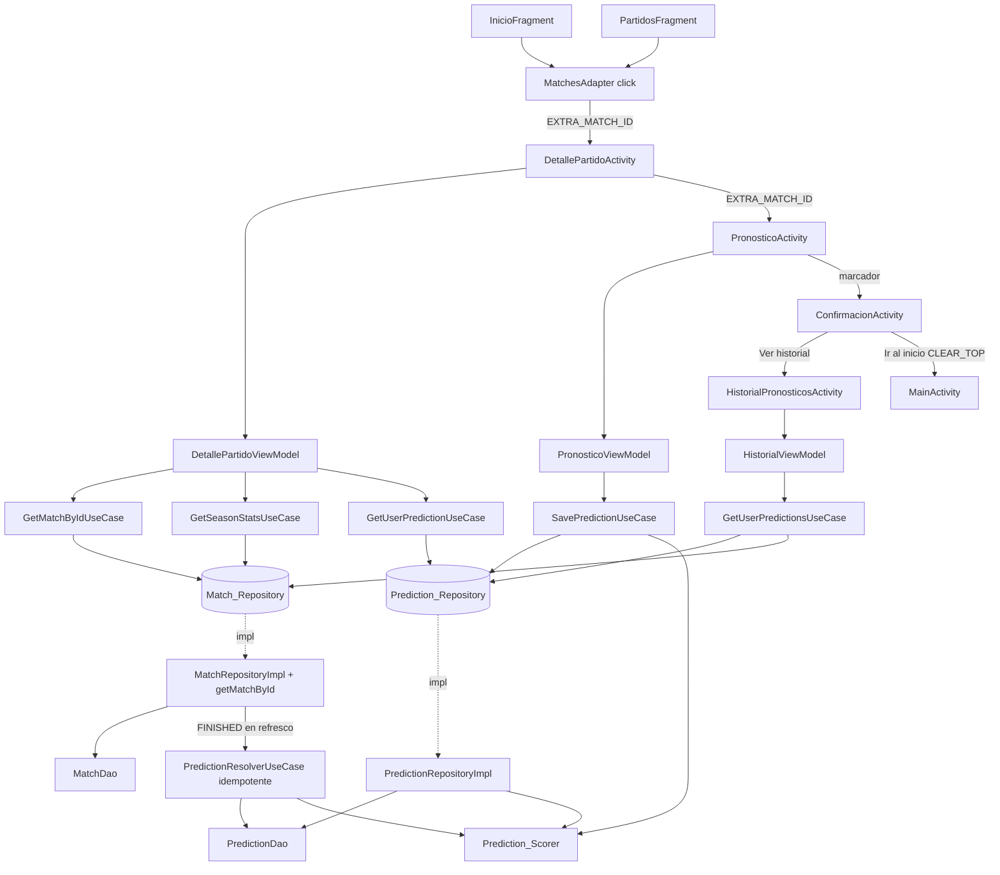

# Design Document — Detalle del Partido y Pronóstico (match-detail-prediction)

## Overview

Esta funcionalidad añade un flujo de cuatro Activities para ver el detalle de un partido y registrar un pronóstico de marcador exacto en GolIA (Android nativo, Java, Clean Architecture + MVVM + Hilt + Room, sin backend remoto activo). Al tocar un partido en la lista (`InicioFragment` o `PartidosFragment`) se abre `DetallePartidoActivity`; desde ahí el usuario navega a `PronosticoActivity`, luego a `ConfirmacionActivity` y puede consultar `HistorialPronosticosActivity`.

El diseño se ancla a la arquitectura real verificada leyendo el código: reutiliza `domain.common.Result<T>` + `Callback<T>`, el despacho al `@IoExecutor` (`ExecutorModule`), los bindings `@Binds @Singleton` de `RepositoryModule`, `presentation.viewmodel.BaseViewModel` (LiveData `isLoading`/`errorMessage`/`isSuccess`), la estrategia cache-first de `MatchRepositoryImpl`, el `MatchDao` (`getMatchById`), el `PredictionDao` (`getUserPredictionForMatch`, `getUserPredictionsSorted`, `insertPrediction` REPLACE, `getPredictionsByMatch`), la entidad `PredictionEntity` (columnas String `id`/`user_id`/`match_id`), el patrón de navegación por Activities con Intents (constantes `EXTRA_*` en `Constants`) y el `RequestBudgetManager`.

### Mapeo a los 11 requisitos

| Área de diseño | Requisitos |
|---|---|
| Navegación al detalle desde la lista | R1 |
| Carga del detalle desde caché (sin red) | R2 |
| Estadísticas de temporada derivadas de caché | R3 |
| Botón/estado de pronóstico y bloqueo de 10 min | R4 |
| Registro de marcador exacto y upsert | R5 |
| Unicidad e índice único + migración | R6 |
| Confirmación y navegación de retorno | R7 |
| Historial con resolución de partido | R8 |
| Puntuación y resolución al finalizar | R9 |
| Estados de UI, errores tipados, concurrencia | R10 |
| Verificación / pruebas | R11 |

### Decisiones de diseño y su justificación

- **Cuatro Activities con Intents** (no fragments en `MainActivity`): el host de la sesión usa show/hide sin `replace`/`addToBackStack`; abrir el flujo como Activities apiladas encaja con el patrón existente (Login/Registro/Main) y evita romper la política del bottom nav. El id del partido viaja como `EXTRA_MATCH_ID` (String).
- **Un ViewModel por Activity** extendiendo `BaseViewModel`; los use cases despachan al `@IoExecutor` y entregan por `Callback`; el ViewModel publica con `postValue` y expone eventos de un solo consumo (`Event<T>`) para navegación/errores.
- **`Match_Repository` gana un método de lectura por id** (cache-first, sin red), coherente con `getMatches`.
- **`Prediction_Repository` nuevo** (interfaz de dominio + impl de datos con `@Binds @Singleton`), que encapsula el upsert por (`user_id`, `match_id`) y las lecturas del historial, replicando el patrón de `LocalAuthRepositoryImpl`.
- **`PredictionResolverUseCase` idempotente**, invocado desde el flujo de refresco de `MatchRepositoryImpl` cuando aparecen partidos `FINISHED`. No hace peticiones a la API por sí mismo.
- **Identidad String de extremo a extremo**: `Match.id` (UUID) se serializa a String para `EXTRA_MATCH_ID` y para `predictions.match_id`; `user_id` es exactamente `PreferencesManager.getUserId()`. Se centraliza la conversión y las consultas de `PredictionDao` operan con String, sin depender de que los ids sean UUID válidos.

---

## Architecture

Cada Activity observa su ViewModel; el ViewModel invoca use cases; cada use case ejecuta el trabajo bloqueante en el `@IoExecutor` y devuelve `Result` por `Callback`. Los use cases dependen solo de interfaces de dominio. La resolución de puntos se engancha en la capa de datos de partidos.



Notas de flujo:
- **Detalle (R2/R3/R4):** `DetallePartidoViewModel.load(matchId)` valida sesión, obtiene el `Match` por id (cache-first, sin red), calcula `Season_Stats` desde la caché y consulta el pronóstico existente del usuario para decidir el estado del botón (habilitado / editar / solo lectura) según el `Prediction_Lock_Threshold`.
- **Resolución (R9):** `MatchRepositoryImpl` ya acumula los `Match` del refresco (incluidos los que pasan a `FINISHED` con marcador). Tras el upsert de partidos, invoca `PredictionResolverUseCase` para esos partidos finalizados. El resolver es idempotente: solo toca pronósticos con `isCorrect == null`.
---

## Components and Interfaces

### Presentation (Activities + ViewModels)

Todas las Activities se anotan `@AndroidEntryPoint`; todos los ViewModels `@HiltViewModel` con `@Inject` y extienden `BaseViewModel`. Reciben el `EXTRA_MATCH_ID` del Intent y validan la sesión con `PreferencesManager.isLoggedIn()`/`getUserId()`.

#### `DetallePartidoActivity` + `DetallePartidoViewModel` (R1, R2, R3, R4)
Layout según el mock: encabezado con botón atrás y título "Detalle del Partido", barra "LIGA — JORNADA", sección "Estadísticas de temporada" (tres barras comparativas local/visitante), y botón inferior "Hacer Pronóstico". NO muestra sección de cuotas.

Estado expuesto por el ViewModel:
- `LiveData<MatchDetailUiModel>` (liga, jornada, equipos, logos, fecha/hora local, representación por `MatchStatus`).
- `LiveData<SeasonStatsUiModel>` (victorias, goles promedio y forma reciente de local y visitante, más las proporciones de barra normalizadas).
- `LiveData<PredictButtonState>` enum: `ENABLED_NEW`, `ENABLED_EDIT`, `VIEW_ONLY`, `CLOSED` (según `Prediction_Lock_Threshold` y si existe pronóstico).
- Heredados: `isLoading`, `errorMessage`. `LiveData<Event<NavTarget>>` para navegar a login o a `Pronostico_UI`.

Lógica: `load(matchId)` valida sesión, ejecuta `GetMatchByIdUseCase` (si `MATCH_NOT_FOUND` → mensaje y salir), `GetSeasonStatsUseCase` y `GetUserPredictionUseCase` en paralelo (todos en `@IoExecutor`). En `onResume` reevalúa el `Prediction_Lock_Threshold` para actualizar `PredictButtonState` (R4.3).

#### `PronosticoActivity` + `PronosticoViewModel` (R5)
Layout: cabecera con ambos equipos y fecha, y sección "Marcador exacto" con dos campos numéricos (local y visitante). (El mock muestra 1X2 con cuotas; se adapta a solo marcador exacto, sin cuotas.)

Estado: `LiveData<ScoreFormState>` (valores y errores por campo), `isLoading`, `LiveData<Event<Prediction_Error>>` para error tipado, `LiveData<Event<PredictionConfirmedArgs>>` para navegar a confirmación.

Lógica: precarga el pronóstico existente (`GetUserPredictionUseCase`). Al enviar: valida (0..99, requeridos), deriva `predictedOutcome` del marcador, y ejecuta `SavePredictionUseCase` que re-valida el `Prediction_Lock_Threshold` (autoritativo, R5.7), hace upsert y devuelve `Result`. Anti-doble-submit deshabilitando el botón mientras `isLoading`.

#### `ConfirmacionActivity` (R7)
Recibe por Intent los datos ya calculados (equipos, marcador, fecha, puntos posibles = 19). No accede a la BD. Botones "Ver historial" (abre `Historial_UI`) e "Ir al inicio" (`MainActivity` con `FLAG_ACTIVITY_CLEAR_TOP | FLAG_ACTIVITY_SINGLE_TOP`). No necesita ViewModel propio (pantalla estática).

#### `HistorialPronosticosActivity` + `HistorialViewModel` (R8)
Lista (RecyclerView + `PredictionHistoryAdapter`) de `PredictionHistoryUiModel` (equipos o placeholder "Partido no disponible", marcador pronosticado, estado pendiente/acertado/fallido, puntos si resuelto). Estado vacío informativo. Requiere sesión.

Lógica: `load()` valida sesión y ejecuta `GetUserPredictionsUseCase`, que lee los pronósticos y resuelve cada `Match` por su `match_id` (vía `Match_Repository.getMatchById`); si el partido no está en caché, produce el placeholder (R8.3).

#### `Event<T>` (single-use)
Se reutiliza el patrón de evento de un solo consumo del proyecto (`presentation/util/Event`) para navegación y errores, evitando re-disparos ante cambios de configuración.

### Domain

#### `Match_Repository` — método nuevo (R2, R8)
```java
// añadido a la interfaz existente MatchRepository
void getMatchById(String matchId, Callback<Result<Match>> callback);
```
Impl en `MatchRepositoryImpl`: ejecuta en `@IoExecutor`, lee `matchDao.getMatchById(matchId)` (por PK String), mapea a dominio; si es `null` devuelve `Result.Error(PredictionException(MATCH_NOT_FOUND))`; nunca toca red ni `RequestBudgetManager`.

#### `Prediction_Repository` (interfaz nueva) (R5, R6, R8)
```java
public interface PredictionRepository {
    Result<Prediction> getUserPrediction(String userId, String matchId);      // getUserPredictionForMatch
    Result<Prediction> savePrediction(String userId, String matchId,
                                       int homeScore, int awayScore);          // upsert por (userId, matchId)
    Result<List<Prediction>> getUserPredictions(String userId);               // getUserPredictionsSorted
    Result<List<Prediction>> getPredictionsForMatch(String matchId);          // getPredictionsByMatch
    Result<Void> resolveForMatch(Match finishedMatch);                        // usado por el resolver
}
```
Los métodos son síncronos y devuelven `Result` (patrón de `LocalAuthRepositoryImpl`); los use cases despachan al `@IoExecutor`. El upsert: consulta `getUserPredictionForMatch`; si existe, reutiliza su `id` (mantiene `created_at`) y hace `insertPrediction` (REPLACE por PK) — así respeta el índice único (`user_id`, `match_id`) sin crear duplicados; si no existe, genera un `id` UUID nuevo. Deriva `predictedOutcome` del marcador. `isCorrect=null`, `pointsEarned=0` al crear.

#### Use cases (despachan al `@IoExecutor`)
- `GetMatchByIdUseCase(matchId, Callback<Match>)`
- `GetSeasonStatsUseCase(match, Callback<SeasonStats>)` — usa `Season_Stats_Calculator` (dominio puro) sobre los partidos de caché de ambos equipos.
- `GetUserPredictionUseCase(userId, matchId, Callback<Prediction?>)`
- `SavePredictionUseCase(userId, match, homeScore, awayScore, Callback<Prediction>)` — valida `Prediction_Lock_Threshold` y delega el upsert.
- `GetUserPredictionsUseCase(userId, Callback<List<PredictionWithMatch>>)` — combina pronósticos con su `Match` resuelto.
- `PredictionResolverUseCase(finishedMatches, Callback<Void>)` — idempotente.

#### `Season_Stats_Calculator` (dominio puro, testeable en JVM) (R3, R11)
Funciones puras sobre `List<Match>`:
- `wins(teamId, matches)`: cuenta partidos `FINISHED` con marcador donde `teamId` metió más goles que el rival (como local o visitante).
- `goalsAverage(teamId, matches)`: goles a favor / número de partidos `FINISHED`, redondeado a 1 decimal; `0.0` si no hay partidos.
- `recentForm(teamId, matches)`: ordena por `scheduledDateTime` desc (desempate por `Match.id`), toma hasta 5, clasifica V/E/D y devuelve el conteo de V.
- `barRatio(valueA, valueB)`: `valueA / (valueA + valueB)`; `0` para ambos si la suma es 0.
Fuente de datos: se añade a `MatchDao` una consulta `getFinishedMatchesByTeam(teamId)` (`SELECT * FROM matches WHERE status = 'FINISHED' AND (home_team_id = :teamId OR away_team_id = :teamId)`), evitando cargar toda la tabla. La UI etiqueta las estadísticas como derivadas de los datos disponibles en caché.

#### `Prediction_Scorer` (dominio puro) (R9, R11)
`score(predictedHome, predictedAway, actualHome, actualAway)` implementa `Prediction_Scoring`: +5 si el ganador 1X2 coincide; +2 si `predictedHome == actualHome`; +2 si `predictedAway == actualAway`; +1 si `(predictedHome - predictedAway) == (actualHome - actualAway)`; +9 si el marcador es exacto en ambos. Máximo 19. `isCorrect = (score >= 1)`.

#### `Prediction_Error` y `PredictionException` (R10)
```java
public enum PredictionError { SESSION_UNAVAILABLE, PREDICTION_CLOSED, MATCH_NOT_FOUND, PERSISTENCE_ERROR, VALIDATION_ERROR }
public class PredictionException extends Exception { /* lleva un PredictionError */ }
```
Viaja dentro de `Result.Error` (mismo mecanismo que `AuthException`); la UI lo traduce a recursos de string.

### Data

#### `PredictionRepositoryImpl` (`@Singleton`, `@Inject`)
Depende de `PredictionDao`, `MatchDao`, `Prediction_Scorer`. Implementa el upsert y la resolución. Añade un mapper `PredictionEntityMapper` explícito (hoy solo existe `PredictionEntity.toDomainModel`/`fromDomainModel` con `UUID.fromString` silencioso): el repositorio trabaja con los `id` como String directamente para no perder valores en conversiones UUID fallidas, usando `toDomainModel` solo para exponer el modelo de dominio a la UI.

#### `PredictionResolverUseCase` — integración con el refresco (R9)
`MatchRepositoryImpl.refreshWindowInternal` ya acumula `accumulatedMatches`. Tras el `insertMatches`, se filtran los que tienen `status == FINISHED` con `homeScore`/`awayScore` no nulos y se pasan al resolver (inyectado en `MatchRepositoryImpl`). El resolver, por cada partido, obtiene `getPredictionsByMatch`, y para los pendientes (`isCorrect == null`) calcula el puntaje, fija `isCorrect`, `pointsEarned` y `finalizedAt`, y persiste con `updatePrediction`. Idempotencia: los ya resueltos se ignoran. No realiza llamadas de red.

#### `MatchDao` — consulta nueva
`getFinishedMatchesByTeam(String teamId)` para `Season_Stats`. `getMatchById` ya existe.

#### `PredictionEntity` — índice único + migración (R6)
Se añade `indices = { @Index(value = {"user_id", "match_id"}, unique = true) }` a la `@Entity`. Se sube la versión de `GolIADatabase` y se registra `MIGRATION_N_N+1` en `DatabaseModule` que:
1. Elimina duplicados conservando el más reciente por `created_at` (`DELETE FROM predictions WHERE id NOT IN (SELECT id FROM predictions p GROUP BY user_id, match_id HAVING MAX(created_at))` o equivalente seguro).
2. Crea el índice único: `CREATE UNIQUE INDEX IF NOT EXISTS index_predictions_user_id_match_id ON predictions(user_id, match_id)`.
Se mantiene `exportSchema = true` y se regenera el JSON de esquema.

### DI (Hilt)
- `RepositoryModule`: añadir `@Binds @Singleton PredictionRepository bindPredictionRepository(PredictionRepositoryImpl impl)`.
- `PredictionResolverUseCase`, `Prediction_Scorer`, `Season_Stats_Calculator` y los use cases usan `@Inject` constructor; `MatchRepositoryImpl` recibe el resolver por constructor.
- `Constants` añade `EXTRA_MATCH_ID`.

---

## Data Models

### `PredictionEntity` — índice único
Tabla `predictions` con índice único (`user_id`, `match_id`). Columnas sin cambios de tipo.

### UI models (presentación, inmutables)
| Modelo | Campos |
|---|---|
| `MatchDetailUiModel` | liga, jornada, homeName/awayName, homeLogo/awayLogo, kickoffLocal, statusLabel, scoreText (o null), elapsedText (o null) |
| `SeasonStatsUiModel` | homeWins/awayWins, homeAvg/awayAvg, homeFormV/awayFormV, ratios de barra por métrica |
| `ScoreFormState` | homeScore, awayScore, homeError, awayError |
| `PredictionHistoryUiModel` | matchLabel (o placeholder), scoreText, statusLabel, pointsText (o null) |

### `SeasonStats` (dominio)
Por equipo: `wins:int`, `goalsAverage:double`, `recentWins:int` (de últimos 5).
---

## Correctness Properties

Una propiedad es un enunciado que debe cumplirse en toda ejecución válida. Se implementarán con PBT en JVM (jqwik o junit-quickcheck), con al menos 100 iteraciones por propiedad. La migración de Room y la integración con el refresco se cubren con tests de integración/instrumentación (ver Testing Strategy).

### Property 1: La derivación del resultado 1X2 es total y coherente con el marcador
*Para todo* par `(home, away)` con `home, away` en `0..99`, `derive(home, away)` devuelve `HOME_WIN` si `home > away`, `DRAW` si `home == away` y `AWAY_WIN` si `home < away`; siempre devuelve exactamente uno de los tres.
**Validates: Requirements 5.5**

### Property 2: La puntuación es monótona y acotada, y el marcador exacto maximiza
*Para todo* pronóstico y marcador real, `Prediction_Scorer.score` está en `0..19`; cuando el pronóstico es igual al marcador real produce exactamente 19; y un pronóstico con marcador exacto nunca puntúa menos que uno que solo acierta un subconjunto de componentes.
**Validates: Requirements 9.3, 9.4**

### Property 3: isCorrect es consistente con la puntuación
*Para todo* pronóstico resuelto, `isCorrect == true` si y solo si `score >= 1`, e `isCorrect == false` si y solo si `score == 0`.
**Validates: Requirements 9.6**

### Property 4: El upsert preserva unicidad por (user_id, match_id)
*Para toda* secuencia de guardados del mismo `user_id` y `match_id`, tras aplicarlos existe exactamente un `Prediction` para esa pareja, cuyos marcadores son los del último guardado.
**Validates: Requirements 5.9, 6.1, 6.4**

### Property 5: El cálculo de victorias y promedio es correcto e independiente de la localía
*Para toda* lista de partidos `FINISHED` de un equipo, `wins` cuenta exactamente los partidos con más goles a favor que en contra (sea local o visitante), y `goalsAverage` es la media de goles a favor redondeada a 1 decimal (`0.0` con lista vacía).
**Validates: Requirements 3.3, 3.4**

### Property 6: La forma reciente toma como máximo 5 y respeta el orden temporal
*Para toda* lista de partidos `FINISHED`, `recentForm` considera a lo sumo los 5 más recientes por `scheduledDateTime` (desempate estable por `Match.id`) y su conteo de victorias nunca excede el número de partidos considerados.
**Validates: Requirements 3.5, 3.9**

### Property 7: La normalización de barras es proporcional y segura ante suma cero
*Para todo* par de valores no negativos `(a, b)`, `barRatio(a,b) + barRatio(b,a) == 1` cuando `a + b > 0`, y ambos son `0` cuando `a + b == 0`.
**Validates: Requirements 3.7, 3.8**

### Property 8: El resolver es idempotente
*Para todo* pronóstico ya resuelto (`isCorrect != null`), reprocesar su partido no cambia `pointsEarned` ni `isCorrect` ni `finalizedAt`.
**Validates: Requirements 9.7**

### Property 9: La validación del marcador acepta exactamente el rango permitido
*Para todo* par de entradas, la validación acepta si y solo si ambas son enteros en `0..99` y no vacías; en cualquier otro caso rechaza con error de campo.
**Validates: Requirements 5.3, 5.4**

---

## Error Handling

Los errores de dominio viajan como `PredictionError` dentro de `Result.Error` (transportados por `PredictionException`, mismo mecanismo que `AuthException`). La UI los extrae y traduce a recursos de string.

| PredictionError | Contexto | Recurso (ejemplo) |
|---|---|---|
| `MATCH_NOT_FOUND` | Partido ausente en caché | `R.string.error_match_not_found` |
| `SESSION_UNAVAILABLE` | Operar sin sesión válida | `R.string.error_session_unavailable` |
| `PREDICTION_CLOSED` | Partido bloqueado (10 min / no SCHEDULED) | `R.string.error_prediction_closed` |
| `VALIDATION_ERROR` | Marcador inválido | mensaje por campo con `TextInputLayout.setError` |
| `PERSISTENCE_ERROR` | Fallo técnico de lectura/escritura | `R.string.error_persistence` |

Reglas: ante error de guardado se conservan los valores del formulario para reintentar; los estados sin datos parciales; la lista de historial degrada por-item (placeholder de partido) sin fallar globalmente.

---

## Concurrency Strategy

Todas las operaciones de `Match_Repository` y `Prediction_Repository` corren en el `@IoExecutor` compartido y devuelven `Result` por `Callback`; los ViewModels publican con `postValue` a `LiveData`. El botón de envío se deshabilita mientras `isLoading` (anti-doble-submit). El `PredictionResolverUseCase` corre dentro del mismo hilo de I/O del refresco de partidos (no crea hilos nuevos ni peticiones de red).

---

## Testing Strategy

Mapea al Requisito 11:
- **JVM puro (unit)**: `Prediction_Scorer` (Props 1–3), `Season_Stats_Calculator` (Props 5–7, casos de 0 y <5 partidos), validación de marcador (Prop 9). Propiedades con jqwik/junit-quickcheck (>=100 iteraciones) más ejemplos de borde.
- **Room / DAO (instrumentado o Robolectric)**: upsert del `PredictionRepositoryImpl` (Prop 4: no duplicados por usuario+partido), e idempotencia del resolver (Prop 8).
- **Migración (androidTest, patrón `MatchMigrationTest`)**: crea el esquema previo, siembra pronósticos (incluido un duplicado por usuario+partido), corre la migración y verifica que queda una sola fila por pareja y que el índice único existe, preservando el resto.
- **Integración del resolver**: verifica que, al refrescar partidos que incluyen uno `FINISHED` con marcador, los pronósticos pendientes de ese partido quedan resueltos con el puntaje correcto y los ya resueltos no cambian.

---

## Requirements Traceability

| Requisito | Componentes de diseño |
|---|---|
| R1 Navegación | `MatchesAdapter` (click), `InicioFragment`/`PartidosFragment` cableados, `Constants.EXTRA_MATCH_ID`, `DetallePartidoActivity` |
| R2 Detalle | `MatchRepository.getMatchById`, `GetMatchByIdUseCase`, `DetallePartidoViewModel`/`Activity`, `MatchDetailUiModel` |
| R3 Season_Stats | `Season_Stats_Calculator`, `MatchDao.getFinishedMatchesByTeam`, `GetSeasonStatsUseCase`, `SeasonStatsUiModel` |
| R4 Botón/bloqueo | `PredictButtonState`, `Prediction_Lock_Threshold` en ViewModel (load + onResume), `GetUserPredictionUseCase` |
| R5 Registro | `PronosticoActivity`/`ViewModel`, `SavePredictionUseCase`, `PredictionRepositoryImpl` upsert, derivación de outcome |
| R6 Unicidad/migración | `@Index` único en `PredictionEntity`, `MIGRATION` en `DatabaseModule`, `exportSchema` |
| R7 Confirmación | `ConfirmacionActivity` (Intent args, flags de navegación) |
| R8 Historial | `HistorialPronosticosActivity`/`ViewModel`, `GetUserPredictionsUseCase` + resolución de `Match`, placeholder |
| R9 Puntuación/resolución | `Prediction_Scorer`, `PredictionResolverUseCase` integrado en `MatchRepositoryImpl`, idempotencia |
| R10 UI/errores/concurrencia | `BaseViewModel`, `@IoExecutor`, `PredictionError`/`PredictionException`, navegación por Intents |
| R11 Verificación | Tests JVM (scorer, stats, validación), DAO/upsert, migración, integración del resolver |