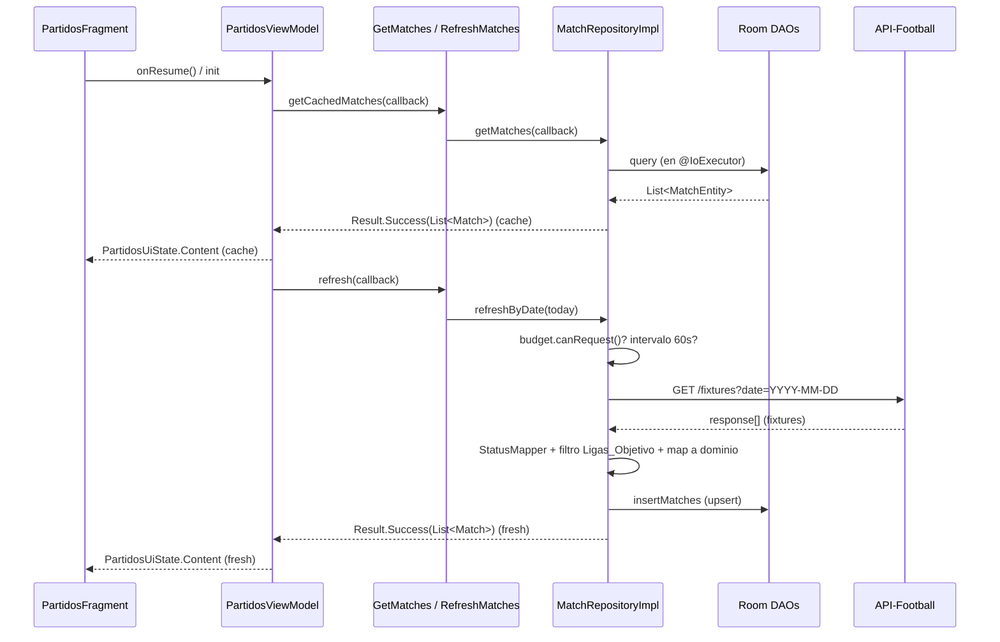
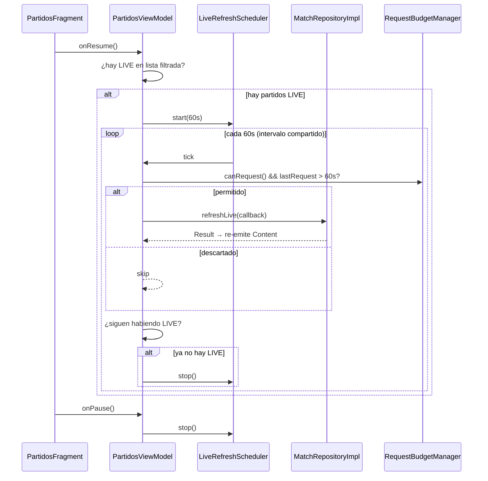

# Design Document

## Overview

Esta funcionalidad dota de contenido real a la Pantalla_Partidos (`PartidosFragment`) de GolIA, reemplazando los datos mock hardcodeados por fixtures reales de seis Ligas_Objetivo obtenidos de **API-Football (API-SPORTS)**. El diseño respeta la arquitectura existente del proyecto: Clean Architecture + MVVM + Hilt + Room + Retrofit, **100% en Java** (sin Kotlin ni coroutines), usando `ExecutorService` (`@IoExecutor`) para el threading de E/S y `LiveData` para exponer estado observable a la UI.

### Decisiones clave

1. **Migración de proveedor a API-Football.** El `FootballApiService` actual está modelado para football-data.org (`getCompetitions`, `getMatchesByDate` estilo distinto, `competitions/{id}/matches`, IDs de liga en cadena como `"PL"`). Se reescribe por completo al esquema de API-Football: endpoint `/fixtures`, IDs numéricos de liga, header `x-apisports-key` y respuesta JSON anidada (`response[].fixture/teams/goals/league`). Los métodos football-data.org se deprecan/eliminan. Cubre Requisitos 1 y 1B.

2. **Java + LiveData, sin coroutines.** Aunque el `build.gradle` incluye dependencias de coroutines (heredadas del scaffolding), el código de esta feature NO las usa. El repositorio ejecuta trabajo bloqueante en `@IoExecutor` y devuelve el resultado a través de `Callback<Result<T>>`; el ViewModel lo adapta a `LiveData<PartidosUiState>`. Cubre Requisito 12.

3. **Caché Room agresiva por límite de 100 peticiones/día.** El plan gratuito de API-Football permite 100 req/día. Se aplica una estrategia **cache-first**: la pantalla muestra primero lo cacheado y luego refresca. Un `RequestBudgetManager` persistente (SharedPreferences con reset diario) cuenta las peticiones y, al agotarse, degrada a modo solo-caché. El polling en vivo se acota a un intervalo mínimo **compartido** de 60 s y solo se ejecuta mientras haya partidos `LIVE` visibles y el fragment esté en primer plano. Cubre Requisitos 7 y 7B.

4. **Ampliación del esquema Room.** `Match` y `MatchEntity` actuales no tienen minuto de juego ni estadio. Se añaden `elapsedMinute` (Integer), `venueName` y `venueCity` (String), con una `Migration` explícita de Room (versión 2 → 3, `ALTER TABLE`). Cubre Requisitos 5 y 6.

5. **Cuotas fuera de alcance en la UI.** El modelo `Match`/`MatchEntity` conserva `homeOdds`/`drawOdds`/`awayOdds` (para no romper el esquema ni otras features), pero la tarjeta de partido **no las renderiza**. `item_match.xml` se rediseña para eliminar los `TextView` de cuotas y añadir logos, marcador, minuto en vivo y estadio.

### Secuenciación

El diseño respeta el orden recomendado en los requisitos para evitar retrabajo: (1) contrato del proveedor y reescritura del cliente; (2) política de cuota y polling en vivo; (3) contrato del repositorio y threading.

## Architecture

### Diagrama de capas

```mermaid
flowchart TD
    subgraph Presentation
        F[PartidosFragment<br/>ChipGroup · SwipeRefresh · SearchView]
        VM[PartidosViewModel<br/>@HiltViewModel · LiveData<PartidosUiState>]
        AD[MatchesAdapter<br/>ListAdapter + DiffUtil + Glide]
        F --> AD
        F <--> VM
    end
    subgraph Domain
        UC1[GetMatchesUseCase]
        UC2[RefreshMatchesUseCase]
        UC3[RefreshLiveMatchesUseCase]
        REPO[[MatchRepository<br/>interface]]
        RES[Result / Callback]
    end
    subgraph Data
        IMPL[MatchRepositoryImpl<br/>@IoExecutor]
        API[FootballApiService<br/>Retrofit · /fixtures]
        INT[ApiKeyInterceptor<br/>x-apisports-key]
        DAOs[(MatchDao · TeamDao · CompetitionDao)]
        MAP[Dto→Domain Mappers · StatusMapper]
    end
    subgraph Infra
        TR[TimeRangeCalculator]
        BUD[RequestBudgetManager]
        SCHED[LiveRefreshScheduler]
        NORM[SearchTextNormalizer]
    end

    VM --> UC1 & UC2 & UC3
    UC1 & UC2 & UC3 --> REPO
    REPO -.impl.- IMPL
    IMPL --> API --> INT
    IMPL --> DAOs
    IMPL --> MAP
    IMPL --> BUD
    VM --> TR
    VM --> NORM
    VM --> SCHED
```

El `PartidosFragment` nunca llama a `FootballApiService` ni a `MatchRepository` directamente: toda obtención de datos pasa por el `PartidosViewModel` a través de casos de uso (Requisitos 12.2, 12.3).

### Estrategia de datos: cache-first + refresh

1. Al abrir la pantalla, el ViewModel pide primero los datos cacheados (Room) y los muestra de inmediato (Requisito 7.9).
2. En paralelo, dispara un refresco remoto por-fecha (`/fixtures?date={YYYY-MM-DD}`), una sola petición que cubre todas las Ligas_Objetivo de esa fecha (Requisitos 1.1, 7.1).
3. Al llegar la respuesta, se normaliza, se filtra a las seis ligas, se persiste en Room y se re-emite el `LiveData`.
4. Si el refresco falla o la cuota está agotada, se mantienen los datos cacheados con el aviso correspondiente (Requisitos 11, 7.7).

### Secuencia: abrir pantalla



### Secuencia: polling en vivo



### Componentes de infraestructura nuevos

- **`ApiKeyInterceptor` (OkHttp `Interceptor`):** añade el header `x-apisports-key` leído de `BuildConfig.API_FOOTBALL_KEY` a cada petición (Requisitos 1.2, 2.1). Se registra en el `OkHttpClient` del módulo Hilt de red.
- **`RequestBudgetManager`:** contador diario persistente (`SharedPreferences`/`PreferencesManager`) del Presupuesto_Peticiones, con reset diario y control del intervalo mínimo compartido de 60 s (Requisitos 7.3, 7.4, 7.7).
- **`TimeRangeCalculator` (Utilidad_Zona_Local):** único punto de verdad para calcular Rango_Hoy, Rango_Manana y Rango_Esta_Semana en Zona_Local, con límites en milisegundos inclusivos (Requisitos 3.7, 4.1, 4.2).
- **`StatusMapper`:** traduce `fixture.status.short` de API-Football al dominio `MatchStatus` según la tabla del Requisito 6B, con default `SCHEDULED` y log del código no reconocido.
- **`LiveRefreshScheduler`:** temporizador ligado al lifecycle (basado en `Handler`/`ScheduledExecutorService`) que dispara ticks de polling y se detiene en `onPause`/ausencia de LIVE (Requisitos 7.5, 7.6, 7B).
- **`SearchTextNormalizer`:** normaliza texto sin mayúsculas ni diacríticos (`java.text.Normalizer` + regex de marcas combinantes) para la búsqueda insensible a acentos (Requisito 10.4).

## Components and Interfaces

### Mapeo Requisito → Componente (trazabilidad)

| Requisito | Componente(s) responsable(s) |
| --- | --- |
| R1 Contrato proveedor | FootballApiService, MatchRepositoryImpl, StatusMapper, mappers DTO |
| R1B Reescritura cliente | FootballApiService, DTOs API-Football, mappers |
| R2 Seguridad API Key | ApiKeyInterceptor, BuildConfig, PartidosViewModel (estado Error) |
| R3 Chips de horario | PartidosFragment (ChipGroup), PartidosViewModel, TimeRangeCalculator |
| R4 Zona horaria | TimeRangeCalculator, MatchUiModel (hora formateada) |
| R5 Contenido tarjeta | MatchesAdapter, MatchUiModel, MatchEntity (venue/round) |
| R6 Estados y marcador | StatusMapper, MatchesAdapter, MatchEntity (elapsed/score) |
| R6B Normalización estados | StatusMapper |
| R7 Refresco y cuota | MatchRepositoryImpl, RequestBudgetManager, PartidosViewModel |
| R7B Ciclo de vida polling | LiveRefreshScheduler, PartidosFragment (onPause/onResume), PartidosViewModel |
| R8 Ordenamiento | PartidosViewModel (comparador de grupos + desempate) |
| R9 Estados UI | PartidosViewModel (PartidosUiState), PartidosFragment |
| R10 Búsqueda | PartidosFragment (SearchView + debounce), PartidosViewModel, SearchTextNormalizer |
| R11 Offline/errores | MatchRepositoryImpl (Result), PartidosViewModel, ApiKeyInterceptor |
| R12 Arquitectura | UseCases, MatchRepository/Impl (@IoExecutor + Result), PartidosViewModel |
| R13 Estilo visual | fragment_partidos.xml, item_match.xml, colores |

### PartidosFragment (refactor)

Extiende `BasePlaceholderFragment` (contrato `bindPlaceholderData()`). Elimina la lógica mock, el `TabLayout` y el adapter interno.

Responsabilidades y elementos:
- **`ChipGroup`** (`singleSelection=true`) con tres chips "Hoy" / "Mañana" / "Esta semana"; selecciona "Hoy" por defecto y resalta el activo con `blue_end` (Requisitos 3.1, 3.2, 3.3, 3.9).
- **`SwipeRefreshLayout`** para pull-to-refresh (Requisito 7.2).
- **`SearchView`/`EditText`** en el encabezado con debounce de 300 ms delegado al ViewModel (Requisitos 10.1, 10.3).
- **Observers** de `LiveData<PartidosUiState>` que muestran carga/contenido/vacío/error y submiten la lista al adapter.
- **Lifecycle**: en `onResume` reanuda polling, en `onPause` lo detiene (Requisito 7B).

Firmas principales:
```java
@AndroidEntryPoint
public class PartidosFragment extends BasePlaceholderFragment {
    private PartidosViewModel viewModel;      // by viewModels()
    private MatchesAdapter adapter;

    @Override protected void bindPlaceholderData();
    private void setupChips();                // onCheckedChanged -> viewModel.onChipSelected(chip)
    private void setupSearch();               // TextWatcher -> viewModel.onSearchQueryChanged(text)
    private void setupSwipeRefresh();         // -> viewModel.onRefresh()
    private void observeState();              // render(PartidosUiState)
    private void render(PartidosUiState state);
    @Override public void onResume();         // viewModel.startLivePolling()
    @Override public void onPause();          // viewModel.stopLivePolling()
}
```

### PartidosViewModel (`@HiltViewModel`)

Orquesta filtrado por rango, búsqueda, ordenamiento y ciclo de polling. Expone estado solo por `LiveData` (Requisitos 12.1, 12.7).

```java
@HiltViewModel
public class PartidosViewModel extends ViewModel {
    private final GetMatchesUseCase getMatches;
    private final RefreshMatchesUseCase refreshMatches;
    private final RefreshLiveMatchesUseCase refreshLive;
    private final TimeRangeCalculator timeRanges;
    private final SearchTextNormalizer normalizer;
    private final LiveRefreshScheduler scheduler;

    private final MutableLiveData<PartidosUiState> uiState = new MutableLiveData<>();
    public LiveData<PartidosUiState> getUiState();

    @Inject public PartidosViewModel(...);

    public void onChipSelected(ChipHorario chip);   // recalcula rango + re-filtra (R3, R10.6)
    public void onSearchQueryChanged(String query);  // debounce 300ms -> re-filtra (R10.3)
    public void onRefresh();                          // pull-to-refresh (R7.2)
    public void onRetry();                            // reintento tras error (R9.4)
    public void startLivePolling();                   // si hay LIVE (R7.5, R7B.2)
    public void stopLivePolling();                    // (R7.6, R7B.1)

    // helpers internos
    private List<Match> filterByRange(List<Match> all, ChipHorario chip);
    private List<Match> applySearch(List<Match> list, String normalizedQuery);
    private List<Match> sortMatches(List<Match> list); // grupos LIVE/No-LIVE + desempate (R8)
}
```

El ordenamiento (Requisito 8) usa un `Comparator` compuesto: clave primaria de grupo (`LIVE` = 0, resto = 1), luego `scheduledDateTime` ascendente, luego nombre de liga alfabético, luego nombre del equipo local alfabético (desempate estable y determinista).

### UseCases del dominio

Se introducen casos de uso finos que envuelven `MatchRepository`. Justificación (Requisitos 12.2, 12.3): mantienen al ViewModel sin dependencia directa del repositorio de datos, encapsulan la orquestación de negocio (cache-first, filtro de ligas) y son el punto natural para ejecutar en `@IoExecutor` y devolver `Result` vía `Callback`, dejando al ViewModel solo la lógica de presentación.

```java
public class GetMatchesUseCase {
    void execute(Callback<Result<List<Match>>> callback);        // datos cacheados
}
public class RefreshMatchesUseCase {
    void execute(String isoDate, Callback<Result<List<Match>>> callback); // /fixtures?date=
}
public class RefreshLiveMatchesUseCase {
    void execute(Callback<Result<List<Match>>> callback);        // refresco en vivo
}
```

### MatchRepository / MatchRepositoryImpl (refactor)

Se mantiene la interfaz `MatchRepository` como contrato de dominio, pero se refactorizan las firmas para (a) no bloquear el hilo llamante y (b) propagar errores tipados con `Result` (Requisitos 12.5, 12.6). Los métodos síncronos que devolvían `List<Match>`/`boolean` con `.execute()` en el hilo llamante se sustituyen por variantes asíncronas basadas en `Callback<Result<...>>` ejecutadas en `@IoExecutor`.

Cambios de firma documentados:
```java
public interface MatchRepository {
    // Cache-first: entrega lo cacheado
    void getMatches(Callback<Result<List<Match>>> callback);
    // Refresco remoto por fecha (una petición cubre todas las ligas)
    void refreshMatchesByDate(String isoDate, Callback<Result<List<Match>>> callback);
    // Refresco en vivo
    void refreshLiveMatches(Callback<Result<List<Match>>> callback);
    void clearCache();
}
```

Impacto en consumidores existentes: los métodos previos (`getUpcomingMatches`, `getLiveMatches`, `getMatchById`, `getMatchesByCompetition`, `getCompetitions`, `getTeamById`, `getTeamMatches`, `refreshMatches`, `refreshLiveMatches` con retorno `boolean`) que usaban IDs de competición estilo football-data.org o llamadas síncronas se deprecan o eliminan. Como la única pantalla que consume `MatchRepository` en esta feature es `PartidosFragment` (vía ViewModel/UseCases) y actualmente usaba datos mock, no hay consumidores productivos que rompan; cualquier referencia residual se migra a las nuevas firmas asíncronas. `MatchRepositoryImpl` ejecuta toda E/S de red y Room en `executor` (`@IoExecutor`) y publica el `Result` mediante el `Callback`.

### FootballApiService (reescrito) + interceptor

```java
public interface FootballApiService {
    @GET("fixtures")
    Call<FixtureResponseDto> getFixturesByDate(@Query("date") String date); // YYYY-MM-DD

    @GET("fixtures")
    Call<FixtureResponseDto> getFixturesByLeague(
        @Query("league") int leagueId,
        @Query("season") int season);
}
```
El header `x-apisports-key` NO se declara por método: lo inyecta el `ApiKeyInterceptor` en el `OkHttpClient` (Requisitos 1.2, 2.1). Se eliminan `getCompetitions`, `getMatchesByDate` estilo football-data.org, `competitions/{id}/matches`, `teams/{id}`, `teams/{id}/matches` (Requisitos 1B.2, 1B.4).

```java
public class ApiKeyInterceptor implements Interceptor {
    @Override public Response intercept(Chain chain) {
        Request req = chain.request().newBuilder()
            .header("x-apisports-key", BuildConfig.API_FOOTBALL_KEY)
            .build();
        return chain.proceed(req);
    }
}
```

### Componentes de infraestructura

```java
public class RequestBudgetManager {
    boolean canRequest();                 // budget < 100 && no agotado hoy
    boolean isMinIntervalElapsed();       // now - lastRequestMs >= 60_000
    void recordRequest();                 // incrementa contador y sella timestamp
    boolean isExhausted();                // contador >= 100
    void resetIfNewDay();                 // reset diario
}

public class TimeRangeCalculator {        // Utilidad_Zona_Local
    Range today(ZoneId zone);             // [00:00:00.000, 23:59:59.999] hoy
    Range tomorrow(ZoneId zone);
    Range thisWeek(ZoneId zone);          // hoy 00:00 → domingo 23:59:59.999
    boolean isWithin(long epochMillis, Range range); // límites inclusivos
    // class Range { final long startMs; final long endMs; }
}

public class StatusMapper {
    MatchStatus map(String apiShortCode); // tabla R6B, default SCHEDULED + log
}

public class SearchTextNormalizer {
    String normalize(String input);       // lower + strip acentos (Normalizer NFD + regex \p{M})
}

public class LiveRefreshScheduler {
    void start(long intervalMs, Runnable onTick);
    void stop();
    boolean isRunning();
}
```

### MatchesAdapter (ListAdapter + DiffUtil)

```java
public class MatchesAdapter extends ListAdapter<MatchUiModel, MatchesAdapter.VH> {
    public MatchesAdapter();              // super(new MatchDiffCallback())
    // onCreateViewHolder infla item_match.xml (rediseñado, sin cuotas)
    // bind: liga+jornada, nombres, hora local, marcador/minuto, estadio, logos con Glide
}

public class MatchDiffCallback extends DiffUtil.ItemCallback<MatchUiModel> {
    boolean areItemsTheSame(MatchUiModel a, MatchUiModel b);   // por id
    boolean areContentsTheSame(MatchUiModel a, MatchUiModel b);// equals de campos visibles
}
```
Los logos se cargan con Glide desde su URL, con placeholder cuando fallan (Requisitos 5.3, 5.4). `item_match.xml` se rediseña: se quitan `text_odds1`/`text_odds_x`/`text_odds2` y se añaden `ImageView` de logos, `TextView` de marcador, minuto en vivo y estadio (Requisito 13.3).

## Data Models

### Match (dominio, ampliado)

Se añaden `elapsedMinute`, `venueName`, `venueCity`. Las cuotas se conservan pero no se renderizan.

```java
public class Match {
    // ... campos existentes ...
    private Integer elapsedMinute;  // NUEVO: minuto de juego (LIVE), de fixture.status.elapsed
    private String venueName;       // NUEVO: fixture.venue.name
    private String venueCity;       // NUEVO: fixture.venue.city
    // odds (homeOdds/drawOdds/awayOdds) se conservan pero NO se muestran en la UI

    public Integer getElapsedMinute();  public void setElapsedMinute(Integer m);
    public String getVenueName();       public void setVenueName(String v);
    public String getVenueCity();       public void setVenueCity(String c);
}
```

### MatchEntity (Room, ampliado) + Migration

```java
@Entity(tableName = "matches")
public class MatchEntity {
    // ... columnas existentes ...
    @ColumnInfo(name = "elapsed_minute") private Integer elapsedMinute; // NUEVO
    @ColumnInfo(name = "venue_name")     private String venueName;      // NUEVO
    @ColumnInfo(name = "venue_city")     private String venueCity;      // NUEVO
    // toDomainModel()/fromDomainModel() mapean los tres campos nuevos
}
```

Migración de Room (version 2 → 3 en `GolIADatabase`):
```java
static final Migration MIGRATION_2_3 = new Migration(2, 3) {
    @Override public void migrate(@NonNull SupportSQLiteDatabase db) {
        db.execSQL("ALTER TABLE matches ADD COLUMN elapsed_minute INTEGER");
        db.execSQL("ALTER TABLE matches ADD COLUMN venue_name TEXT");
        db.execSQL("ALTER TABLE matches ADD COLUMN venue_city TEXT");
    }
};
// @Database(..., version = 3) y .addMigrations(MIGRATION_2_3) en el DatabaseModule (Hilt)
```

### DTOs de API-Football

```java
public class FixtureResponseDto {
    @SerializedName("response") List<FixtureItemDto> response;
}
public class FixtureItemDto {
    FixtureDto fixture;
    LeagueDto league;
    TeamsDto teams;
    GoalsDto goals;
}
public class FixtureDto {
    long id;
    String date;              // ISO8601 con offset de zona
    long timestamp;           // epoch segundos
    StatusDto status;
    VenueDto venue;
}
public class StatusDto { @SerializedName("short") String shortCode; Integer elapsed; }
public class VenueDto  { String name; String city; }
public class LeagueDto { int id; String name; String round; String logo; }
public class TeamsDto  { TeamSideDto home; TeamSideDto away; }
public class TeamSideDto { long id; String name; String logo; }
public class GoalsDto  { Integer home; Integer away; }
```

### PartidosUiState (estilo sealed)

```java
public abstract class PartidosUiState {
    public static final class Loading extends PartidosUiState {}
    public static final class Content extends PartidosUiState {
        public final List<MatchUiModel> matches;
        public final boolean offlineNotice;   // datos cacheados (R11.1)
        public final boolean quotaNotice;      // límite diario alcanzado (R7.7)
        public Content(List<MatchUiModel> m, boolean offline, boolean quota) {...}
    }
    public static final class Empty extends PartidosUiState {
        public enum Type { FILTER, SEARCH }    // R9.2 vs R10.7
        public final Type type;
        public Empty(Type type) {...}
    }
    public static final class Error extends PartidosUiState {
        public final String message;
        public final boolean retryable;        // R9.3, R9.4
        public Error(String message, boolean retryable) {...}
    }
}
```

### MatchUiModel (modelo de presentación)

```java
public class MatchUiModel {
    public final String id;
    public final String leagueName;
    public final String round;            // jornada (league.round)
    public final String homeName, awayName;
    public final String homeLogoUrl, awayLogoUrl;
    public final String kickoffFormatted;  // "14 Jun · 20:00" ya en Zona_Local (R4.3)
    public final String statusLabel;       // "Disponible" / marcador / final
    public final boolean showScore;        // LIVE o FINISHED
    public final boolean showElapsed;      // solo LIVE
    public final String scoreText;         // "2 - 1"
    public final String elapsedText;       // "63'"
    public final String venueText;         // "Estadio, Ciudad" o vacío
    public final MatchStatus status;       // para el ordenamiento por grupo
    public final long scheduledDateTime;   // para ordenamiento
}
```

### Chip_Horario

```java
public enum ChipHorario { HOY, MANANA, ESTA_SEMANA }
```

### Mapeo de estados (Requisito 6B)

| `fixture.status.short` | `MatchStatus` |
| --- | --- |
| `NS` | `SCHEDULED` |
| `1H`, `HT`, `2H`, `ET`, `BT`, `P`, `LIVE` | `LIVE` |
| `FT`, `AET`, `PEN` | `FINISHED` |
| `PST` | `POSTPONED` |
| `CANC`, `ABD` | `CANCELLED` |
| (cualquier otro) | `SCHEDULED` (default + log) |

## Correctness Properties

*Una propiedad es una característica o comportamiento que debe cumplirse en todas las ejecuciones válidas del sistema: una afirmación formal sobre lo que el sistema debe hacer. Las propiedades son el puente entre la especificación legible por humanos y las garantías de correctitud verificables por máquina.*

### Property 1: StatusMapper es total y correcto

*For all* código `short` de la tabla de mapeo, `StatusMapper.map(code)` devuelve el `MatchStatus` exacto indicado; *for all* cadena arbitraria (incluidas nula/vacía/desconocida) fuera de la tabla, devuelve `SCHEDULED`. Además, mapear un código ya mapeado es estable: `map(code)` es determinista e idempotente en el sentido de que múltiples invocaciones con el mismo código producen el mismo resultado.

**Validates: Requirements 6B.1, 6B.2**

### Property 2: Rangos temporales consistentes e independientes de la representación

*For all* Zona_Local y *for all* instante `t`, si `t` cae en Rango_Hoy entonces `t` también cae en Rango_Esta_Semana (Rango_Hoy ⊆ Rango_Esta_Semana). *For all* rango calculado, el inicio es exactamente `00:00:00.000` y el fin exactamente `23:59:59.999` del día correspondiente en la Zona_Local, y `isWithin` es inclusivo en ambos extremos. La pertenencia de un partido a un rango depende solo del instante y la zona, no de la representación textual.

**Validates: Requirements 3.4, 3.5, 3.6, 3.8, 4.1, 4.2**

### Property 3: Ordenamiento por grupos, ascendente y con desempate estable

*For all* lista de partidos, tras `sortMatches`: (a) todo partido `LIVE` aparece antes que todo partido no-`LIVE`, con independencia de su horario; (b) dentro de un mismo grupo, los partidos quedan ordenados por `scheduledDateTime` ascendente; (c) ante igual horario dentro de un grupo, el desempate por nombre de liga y luego por nombre de equipo local es determinista y estable (dos ejecuciones sobre la misma entrada producen el mismo orden).

**Validates: Requirements 8.1, 8.2, 8.3, 8.4, 8.5**

### Property 4: Normalización de búsqueda idempotente e insensible a acentos/mayúsculas

*For all* cadena `s`, `normalize(normalize(s)) == normalize(s)` (idempotencia) y el resultado no contiene mayúsculas ni marcas diacríticas. *For all* par de cadenas que difieren solo en mayúsculas y/o acentos (p.ej. "Atletico" y "Atlético"), sus formas normalizadas son iguales, por lo que un término coincide con el nombre acentuado.

**Validates: Requirements 10.4**

### Property 5: El presupuesto de peticiones nunca se excede y respeta el intervalo compartido

*For all* secuencia de intentos de petición provenientes de cualquier fuente (apertura, pull-to-refresh, polling), el número de peticiones efectivamente realizadas en un día nunca supera 100, y `canRequest()` devuelve `false` una vez alcanzado el límite hasta el reset diario. *For all* par de peticiones consecutivas concedidas, el tiempo transcurrido entre ellas es ≥ 60 000 ms; toda solicitud que llega antes de ese intervalo es descartada.

**Validates: Requirements 7.3, 7.4, 7.7**

## Error Handling

Taxonomía unificada de fallos y su mapeo a `Result` (capa de datos) y `PartidosUiState` (capa de presentación). Todo fallo del repositorio se propaga como `Result.Error(exception)` (Requisito 12.6); el ViewModel decide el `PartidosUiState`.

| Fallo | Origen | Result | Degradación a caché | UI resultante |
| --- | --- | --- | --- | --- |
| Sin red | `IOException` en OkHttp | `Result.Error` | Sí, muestra caché | `Content(offlineNotice=true)`; si no hay caché → `Error(retryable=true)` (R11.1, R9.3) |
| Error API/HTTP (4xx/5xx) | respuesta no exitosa | `Result.Error` | Sí, si hay caché | `Content` + aviso, o `Error(retryable=true)` (R11.2, R9.3) |
| Timeout | `SocketTimeoutException` | `Result.Error` | Sí, si hay caché | igual que "sin red" |
| Cuota agotada | `RequestBudgetManager.isExhausted()` | no se realiza petición; `Result.Success(cache)` | Sí, solo-caché | `Content(quotaNotice=true)`, sin más peticiones hasta reset (R7.7) |
| API key ausente | `BuildConfig.API_FOOTBALL_KEY` vacío | `Result.Error` | — | `Error("Falta configurar la clave de API", retryable=false)` (R2.3) |
| JSON malformado | error de deserialización Gson | `Result.Error` | Sí, si hay caché | `Content` + aviso, o `Error(retryable=true)` |

Reglas de precedencia y solapamiento:
- **R7.7 (cuota) vs R11.2 (error API):** se evalúa primero el presupuesto. Si la cuota está agotada, NO se realiza ninguna petición y se entra directamente en modo solo-caché con `quotaNotice`; el flujo de error de API/red solo aplica cuando sí se intentó una petición. Así ambos requisitos son satisfacibles sin conflicto: cuota agotada ⇒ `quotaNotice`; petición realizada y fallida ⇒ aviso de error + caché.
- Cuando hay datos cacheados, cualquier fallo remoto degrada a `Content` con el aviso adecuado en lugar de `Error`, reservando `Error` para el caso sin datos que mostrar (R9.3).
- La acción de reintentar (`onRetry`) solo se ofrece cuando `Error.retryable == true` y vuelve a solicitar el refresco (R9.4, R11.3).

## Testing Strategy

Enfoque dual: pruebas unitarias basadas en ejemplos para casos concretos y bordes, y pruebas basadas en propiedades (PBT) para las propiedades universales de la sección Correctness Properties. El proyecto usa JUnit; para PBT en Java se emplea **jqwik**, configurando cada propiedad con un mínimo de **100 iteraciones**.

> Nota de entorno: el usuario compila y ejecuta las pruebas en su máquina. El entorno del agente no compila Hilt/dex ni ejecuta instrumentación Android; las pruebas de unidad y PBT que no dependen del framework Android se validan localmente por el desarrollador.

### Pruebas unitarias (JUnit)
- **StatusMapper**: cada código de la tabla → estado esperado; códigos desconocidos/nulos → `SCHEDULED`.
- **TimeRangeCalculator**: límites `00:00:00.000`/`23:59:59.999`, casos en varias zonas horarias y cambios de día/semana.
- **Ordenamiento** (`sortMatches`): mezclas de LIVE/No-LIVE, empates de horario, verificación de estabilidad.
- **SearchTextNormalizer**: acentos, mayúsculas, cadenas mixtas, idempotencia.
- **RequestBudgetManager**: incremento, tope de 100, reset diario, ventana de 60 s.
- **Mappers DTO→dominio**: `FixtureItemDto` → `Match`/`Team`/`Competition`, incluyendo venue/round/elapsed y filtro de Ligas_Objetivo.

### Pruebas basadas en propiedades (jqwik, ≥100 iteraciones)
Cada test lleva el tag de trazabilidad **Feature: matches-live-fixtures, Property {n}: {texto}**.
- P1 StatusMapper (totalidad, correctitud, idempotencia).
- P2 TimeRangeCalculator (subconjunto Hoy⊆Semana, límites inclusivos, invariancia de zona).
- P3 Ordenamiento (grupos, ascendente, desempate estable).
- P4 SearchTextNormalizer (idempotencia, insensibilidad a acentos/mayúsculas).
- P5 RequestBudgetManager (nunca excede 100, intervalo compartido de 60 s).

### Pruebas de ViewModel
Con `InstantTaskExecutorRule` y `LiveData` observado de forma síncrona: transiciones de `PartidosUiState` (Loading → Content/Empty/Error), selección de chip, búsqueda con debounce (usando un scheduler/tiempo controlable), reintento y arranque/parada de polling. Los casos de uso y utilidades se sustituyen por fakes.

### Prueba de migración Room
`MigrationTestHelper` para validar `MIGRATION_2_3`: crear la BD en versión 2, migrar a 3 y verificar que las columnas `elapsed_minute`, `venue_name`, `venue_city` existen y que los datos previos se conservan.
