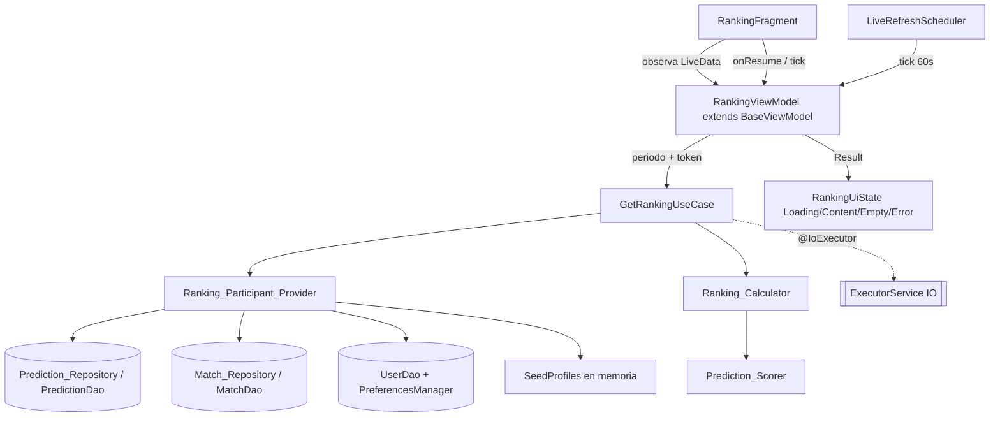

# Design Document — Pantalla de Ranking (ranking-screen)

## Overview

Esta funcionalidad materializa la pantalla `RankingFragment` de GolIA (Android nativo, Java, Clean Architecture + MVVM + Hilt + Room, sin backend remoto activo). Hoy es un placeholder; el diseño reproduce el mock: encabezado "Ranking Global" con nota "local/demo", podio de tres puestos, selector de periodo (Semanal / Mensual / Total) y lista de posiciones con puntos, porcentaje de acierto y racha.

El ranking se construye sobre participantes locales: el `Current_User` real (con sus pronósticos en Room) más un conjunto determinista de `Seed_Profiles` en memoria. Los puntos se recalculan siempre con el componente de dominio ya existente `Prediction_Scorer` (marcador exacto, 0..19), tanto para los partidos `FINISHED` (consolidado) como para los `LIVE` (provisional), sin depender del `points_earned` persistido.

El diseño se ancla a la arquitectura real verificada: reutiliza `domain.common.Result<T>` + `Callback<T>`, el `@IoExecutor` (`ExecutorModule`), `presentation.viewmodel.BaseViewModel`, el patrón de estado sellado de `PartidosViewModel` (`UiState` como `LiveData`), el `LiveRefreshScheduler` para el ciclo en vivo (mismo que usa Partidos), el `PredictionDao` (`getPredictionsByUser`), el `MatchDao` (`getMatchById`/`getAllMatches`), `PreferencesManager` para la sesión, `UserDao.getById` para nombre/avatar y `util.DisplayName` para el nombre a mostrar.

### Mapeo a los 9 requisitos

| Área de diseño | Requisitos |
|---|---|
| Estructura, carga y motor único de puntos | R1 |
| Participantes (usuario real + seed) | R2 |
| Podio y desempate | R3 |
| Selector de periodo | R4 |
| Lista y métricas (%, racha, formato) | R5 |
| Puntos en vivo (A1) | R6 |
| Estados, concurrencia y navegación | R7 |
| Rendimiento y consistencia | R8 |
| Verificación / pruebas | R9 |

### Decisiones de diseño y su justificación

- **Motor de puntos único en memoria**: `Ranking_Calculator` (dominio puro) usa `Prediction_Scorer` para recalcular consolidado y live; no lee `points_earned`. Evita la divergencia con el motor viejo de cuotas.
- **`Ranking_Participant` como abstracción unificada**: tanto el usuario real como cada `Seed_Profile` se normalizan a una lista de `ScoredPrediction` (marcador pronosticado + marcador real/en vivo + estado + `finalizedAt`/`timestamp`), de modo que el cálculo de puntos/%/racha/periodo es idéntico para ambos.
- **Estado sellado `RankingUiState`** (Loading / Content / Empty / Error), como en `PartidosViewModel`, expuesto por `LiveData` desde `RankingViewModel` (extiende `BaseViewModel`).
- **Recálculo en vivo** vía `onResume` + `LiveRefreshScheduler` (el mismo intervalo compartido de 60 s que Partidos), sin peticiones propias del ranking.
- **Anti-solapamiento**: cada recálculo lleva un token de generación; solo el resultado del token vigente se publica ("último gana").

---

## Architecture

`RankingFragment` observa `LiveData<RankingUiState>` de `RankingViewModel`. El ViewModel invoca `GetRankingUseCase`, que ejecuta en `@IoExecutor` y devuelve `Result`. El use case arma los participantes (usuario real desde repositorios + seed en memoria), delega el cómputo puro a `Ranking_Calculator` (que usa `Prediction_Scorer`) y devuelve la lista de `Ranking_Entry` ya ordenada.

Notas de flujo:
- **Carga (R1):** `RankingViewModel.load(period)` valida sesión; si no hay sesión emite navegación a login. Si hay, emite `Loading` y ejecuta `GetRankingUseCase` con el periodo y un token de generación.
- **Participantes (R2):** `Ranking_Participant_Provider` construye la lista: el `Current_User` (pronósticos reales + `Match` resueltos de caché) y los `Seed_Profiles` (constantes en memoria). Cada participante se expresa como `List<ScoredPrediction>`.
- **Cálculo (R3–R6):** `Ranking_Calculator` filtra por periodo, calcula puntos consolidados (partidos `FINISHED`) y `Live_Points` (partidos `LIVE`), `Win_Percentage` y `Streak` global, ordena con el desempate vinculante y marca la entrada del usuario y el distintivo "en vivo".
- **En vivo (R6):** al recalcular (onResume o tick del `LiveRefreshScheduler`), los `Live_Points` se recomputan con el marcador en vivo de la caché; el ranking no dispara peticiones a la API.
---

## Components and Interfaces

### Presentation

#### `RankingFragment` (R1, R3, R5)
Reemplaza el placeholder; deja de extender `BasePlaceholderFragment` y pasa a `Fragment` con `@AndroidEntryPoint` inflando un `fragment_ranking.xml` completo según el mock:
- Encabezado "Ranking Global" + icono de trofeo, y un subtítulo fijo localizado con la nota "local/demo" (R2.4).
- Tarjeta de podio (`FrameLayout`/`ConstraintLayout`) con tres bloques: 2.º (izq), 1.º (centro, elevado y destacado), 3.º (der); cada bloque con avatar, nombre, puntos y número de posición.
- Grupo de `Chip`/botones de periodo (Semanal / Mensual / Total), Semanal por defecto.
- `RecyclerView` con `RankingAdapter` para la lista de posiciones (medalla/número, avatar, nombre, "% acierto · Racha: N", puntos "3,420 pts", distintivo "en vivo").
- `ProgressBar` para carga y una vista de estado vacío.

Responsabilidades: observar `LiveData<RankingUiState>`; en `onResume` pedir recálculo; suscribirse al `LiveRefreshScheduler` mientras esté visible para refrescar los puntos en vivo; resaltar la entrada del `Current_User`. No accede a repositorios ni BD.

#### `RankingViewModel extends BaseViewModel` (R1, R4, R6, R7)
`@HiltViewModel` con `@Inject` recibiendo `GetRankingUseCase`, `PreferencesManager` y `LiveRefreshScheduler`.

Estado:
- `LiveData<RankingUiState>` (sellado: `Loading`, `Content(podium, list, currentUserPosition, hasLive)`, `Empty`, `Error(message)`).
- `Ranking_Period selectedPeriod` retenido en el ViewModel (sobrevive rotación, R7.7).
- `long generationToken` para anti-solapamiento (R7.6).

Lógica:
- `load()` / `selectPeriod(period)`: valida sesión (`isLoggedIn`); si no, evento de navegación a login. Si sí, incrementa `generationToken`, emite `Loading` y llama `GetRankingUseCase.execute(period, userId, token, callback)`. En el callback, si el token no es el vigente, descarta el resultado; si lo es, publica `Content`/`Empty`/`Error` con `postValue`.
- `onScreenResumed()` y el tick del `LiveRefreshScheduler`: recalculan con el `selectedPeriod` actual (mismo camino, nuevo token) para refrescar `Live_Points` sin peticiones a la API.
- `onCleared`/`onPause`: detiene la suscripción al scheduler.

### Domain

#### `Ranking_Period` (enum)
`SEMANAL(7 días)`, `MENSUAL(30 días)`, `TOTAL` (sin límite). Expone el `fromMillis` (límite inferior de la ventana contra `now`) o `0` para TOTAL.

#### `GetRankingUseCase` (R1, R7)
`@Inject` con `Ranking_Participant_Provider`, `Ranking_Calculator` y `@IoExecutor`. `execute(period, userId, token, Callback<Result<RankingResult>>)` despacha al executor: obtiene los participantes, delega el cómputo a `Ranking_Calculator` y devuelve un `RankingResult` (lista ordenada de `Ranking_Entry` + posición del usuario + flag `hasLive`). Errores técnicos -> `Result.Error`.

#### `Ranking_Participant` y `ScoredPrediction` (R2, R8)
`Ranking_Participant`: `id`, `displayName`, `avatarRef` (ruta/recurso), `isCurrentUser`, y `List<ScoredPrediction>`.
`ScoredPrediction` (unifica real y seed): `predictedHome`, `predictedAway`, `actualHome` (nullable), `actualAway` (nullable), `status` (`MatchStatus`), `timestamp` (`finalizedAt` para real; `timestamp` del `Seed_Result`). Es la entrada única del `Ranking_Calculator`.

#### `Ranking_Participant_Provider` (R2, R4.5, R8.3)
Construye la lista de participantes:
- **Usuario real**: `PreferencesManager.getUserId()`; nombre vía `DisplayName.resolve` (username/nombre) y avatar desde `UserDao.getById`; pronósticos vía `PredictionDao.getPredictionsByUser`; por cada pronóstico resuelve su `Match` (`MatchDao.getMatchById`) para obtener marcador y estado — si el `Match` no está en caché, el pronóstico se descarta (R4.5). Mapea a `ScoredPrediction`.
- **Seed**: `SeedProfiles.all()` (constantes en memoria) ya expresadas como `Ranking_Participant` con sus `ScoredPrediction` (marcador pronosticado, marcador real, estado `FINISHED`/`LIVE`, timestamp).

#### `Ranking_Calculator` (dominio puro, testeable en JVM) (R3, R4, R5, R6, R9)
Funciones puras sobre `List<Ranking_Participant>` y un `Ranking_Period` con `now` inyectable (para tests):
- `pointsForPeriod(participant, period, now)`: suma consolidado (`ScoredPrediction` con `status == FINISHED` y `timestamp` dentro del periodo, puntuados con `Prediction_Scorer.score`) + `Live_Points` (`status == LIVE` con marcador no nulo; `0` si nulo). Conjuntos disjuntos por estado (R6.1).
- `winPercentage(participant, period, now)`: `Math.round(aciertos / resueltos * 100)` sobre los `FINISHED` del periodo; `0` si no hay resueltos.
- `streak(participant)`: GLOBAL; ordena los `FINISHED` por `timestamp` desc y cuenta consecutivos con `score >= 1` desde el más reciente.
- `hasLive(participant)`: true si tiene algún `ScoredPrediction` `LIVE` con marcador que aporte `Live_Points`.
- `rank(participants, period, now)`: calcula puntos/%/racha por participante, ordena por puntos desc y aplica el desempate vinculante: (a) `winPercentage` desc; (b) `displayName` asc case-insensitive; (c) `id` asc. Asigna posiciones 1..N y arma el `RankingResult`.

#### `Prediction_Scorer` (existente, reutilizado) (R1.3, R6)
`domain.model.Prediction_Scorer.score(predH, predA, actH, actA)` (0..19) e `isCorrect(score)` (`>= 1`). Única regla de puntuación.

#### `DisplayName` (existente, reutilizado) (R2.7, R8.3)
`util.DisplayName.resolve(username, fullName)` para el nombre del usuario real.

### Data / fuentes

#### `SeedProfiles` (R2)
Objeto de dominio con constantes deterministas (p. ej. CarlosGol, PronosticoPro, BetMaster99 y algunos más) para reproducir el mock. Cada perfil define nombre, referencia de avatar (drawable local) y una lista fija de `Seed_Result` (marcador pronosticado, marcador real, estado, timestamp relativo a `now` para caer en Semanal/Mensual/Total). Sin acceso a Room ni red.

#### Reutilización de DAOs/repos existentes
- `PredictionDao.getPredictionsByUser(userId)` (lectura acotada, R8.1).
- `MatchDao.getMatchById(id)` para resolver marcador/estado de cada pronóstico real.
- `UserDao.getById(id)` para el avatar/datos del usuario real.
- No se añaden migraciones ni columnas: el ranking solo lee.

### DI (Hilt)
- `GetRankingUseCase`, `Ranking_Calculator`, `Ranking_Participant_Provider` y `Prediction_Scorer` se construyen por `@Inject` constructor.
- `LiveRefreshScheduler` ya se provee (`InfrastructureModule`); se inyecta en `RankingViewModel`.
- `RankingViewModel` es `@HiltViewModel`.

---

## Data Models

### Modelos de dominio (nuevos)
| Modelo | Campos |
|---|---|
| `Ranking_Period` | enum SEMANAL/MENSUAL/TOTAL, con `windowStartMillis(now)` |
| `ScoredPrediction` | predictedHome, predictedAway, actualHome?, actualAway?, status, timestamp |
| `Ranking_Participant` | id, displayName, avatarRef, isCurrentUser, List<ScoredPrediction> |
| `Ranking_Entry` | position, displayName, avatarRef, points, winPercentage, streak, isCurrentUser, hasLive |
| `RankingResult` | List<Ranking_Entry> ordenada, currentUserPosition, hasLiveAny |

### Modelos de presentación
| Modelo | Campos |
|---|---|
| `RankingUiState` | sellado: Loading / Content(podium:List<Ranking_Entry> top3, list:List<Ranking_Entry>, currentUserPosition, hasLive) / Empty / Error(message) |
| `PeriodTab` | SEMANAL/MENSUAL/TOTAL con etiqueta localizada |

### Seed (constantes de dominio)
| Modelo | Campos |
|---|---|
| `Seed_Result` | predictedHome, predictedAway, actualHome, actualAway, status, timestampOffsetDays |
| `SeedProfile` | name, avatarDrawable, List<Seed_Result> |
---

## Correctness Properties

Se implementarán con PBT en JVM (jqwik o junit-quickcheck), con al menos 100 iteraciones por propiedad, más ejemplos de borde. Todas operan sobre `Ranking_Calculator` con `now` inyectable.

### Property 1: El total del periodo es la suma disjunta de consolidado y live
*Para toda* lista de `ScoredPrediction` de un participante, `pointsForPeriod` es igual a la suma de los puntos de los `FINISHED` dentro del periodo más los `Live_Points` de los `LIVE`, sin que ningún pronóstico contribuya a ambos conjuntos.
**Validates: Requirements 6.1, 6.4**

### Property 2: Live sin marcador aporta cero y no falla
*Para todo* `ScoredPrediction` con `status == LIVE` y `actualHome` o `actualAway` nulo, su aporte de `Live_Points` es 0 y el cálculo no lanza excepción.
**Validates: Requirements 6.3**

### Property 3: Win_Percentage está en 0..100 y es 0 sin resueltos
*Para toda* lista y periodo, `winPercentage` está en `0..100`; y es exactamente 0 cuando no hay pronósticos `FINISHED` en el periodo.
**Validates: Requirements 5.2, 4.6**

### Property 4: La racha es global, no negativa y se corta con el primer fallo
*Para toda* lista de `FINISHED` ordenable por `timestamp`, `streak` cuenta exactamente los aciertos (`score >= 1`) consecutivos desde el más reciente y se detiene en el primer 0; su valor no depende del `Ranking_Period` seleccionado.
**Validates: Requirements 5.3**

### Property 5: El orden y el desempate son deterministas y totales
*Para toda* lista de participantes, `rank` produce un orden total y estable: por puntos desc, luego `winPercentage` desc, luego nombre asc case-insensitive, luego `id` asc; dos ejecuciones con los mismos datos producen las mismas posiciones.
**Validates: Requirements 3.4, 5.5, 8.2**

### Property 6: El filtro de periodo respeta la ventana temporal
*Para todo* `timestamp` y `now`, un `ScoredPrediction` cuenta para SEMANAL si y solo si su `timestamp` está dentro de los últimos 7 días respecto de `now` (30 para MENSUAL), y siempre para TOTAL.
**Validates: Requirements 4.2, 4.4**

### Property 7: Un pronóstico sin Match en caché no participa
*Para todo* pronóstico real cuyo `Match` no se resolvió (marcador/estado ausente), `Ranking_Calculator` no lo incluye en puntos, porcentaje ni racha.
**Validates: Requirements 4.5**

---

## Error Handling

- Sesión ausente: `RankingViewModel` emite un evento de navegación a login (no muestra ranking) (R1.7).
- Error técnico de lectura/cálculo: `Result.Error` -> `RankingUiState.Error(message)` con mensaje localizado; sin datos parciales (R1.8, R7.3).
- Estado vacío: cuando ningún participante tiene puntos en el periodo, `RankingUiState.Empty` con texto informativo (R7.4).
- El avatar del usuario o de un seed que no exista se degrada a un placeholder por defecto, sin romper la lista.

## Concurrency Strategy

- `GetRankingUseCase` corre en el `@IoExecutor`; `RankingViewModel` publica con `postValue`.
- **Anti-solapamiento (último gana)**: cada disparo (cambio de periodo, `onResume`, tick del scheduler) incrementa `generationToken`; el callback ignora resultados cuyo token no sea el vigente (R7.6).
- El `LiveRefreshScheduler` (intervalo compartido de 60 s, ya existente) alimenta el recálculo en vivo solo mientras la pantalla está visible; el ranking no realiza peticiones a la API (R6.7).

## Testing Strategy

Mapea al Requisito 9:
- **JVM puro (unit + PBT)** de `Ranking_Calculator`: puntos disjuntos (Prop 1), live nulo (Prop 2), win% y redondeo (Prop 3), racha global (Prop 4), orden/desempate (Prop 5), filtro de periodo (Prop 6) y exclusión por match ausente (Prop 7). `now` inyectable para determinismo.
- **Ejemplos de borde**: 0 pronósticos, empates totales, un único participante con datos, live 0-0.
- **`SeedProfiles`**: test de que son deterministas (misma salida en dos evaluaciones) y de que producen al menos 3 participantes.
- (Opcional) Test instrumentado ligero de `Ranking_Participant_Provider` con Room en memoria: resuelve pronósticos + matches y descarta el pronóstico sin match.

## Requirements Traceability

| Requisito | Componentes de diseño |
|---|---|
| R1 Estructura/carga/motor único | `RankingFragment`, `RankingViewModel`, `GetRankingUseCase`, `Ranking_Calculator` + `Prediction_Scorer` (sin `points_earned`) |
| R2 Participantes real + seed | `Ranking_Participant_Provider`, `SeedProfiles`, `DisplayName`, nota "local/demo", entrada resaltada |
| R3 Podio/desempate | `RankingFragment` (podio), `Ranking_Calculator.rank` (desempate vinculante) |
| R4 Periodo | `Ranking_Period`, filtro por `timestamp`/`finalizedAt`, exclusión por match ausente |
| R5 Lista/métricas | `RankingAdapter`, `winPercentage`/`streak`/formato de puntos, orden con desempate |
| R6 En vivo (A1) | `Ranking_Calculator` (consolidado vs live disjuntos, live nulo=0), distintivo "en vivo", `LiveRefreshScheduler` |
| R7 Estados/concurrencia | `RankingUiState` sellado, `generationToken` (último gana), retención de periodo en rotación, `@IoExecutor` |
| R8 Rendimiento/consistencia | `getPredictionsByUser` acotado, cálculo determinista, `DisplayName` + avatar |
| R9 Verificación | Tests JVM/PBT de `Ranking_Calculator`, determinismo de `SeedProfiles`, provider con Room en memoria |