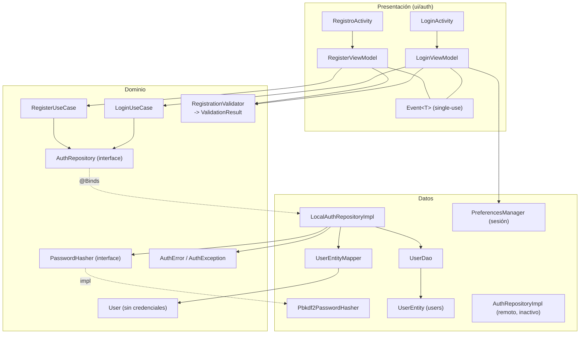
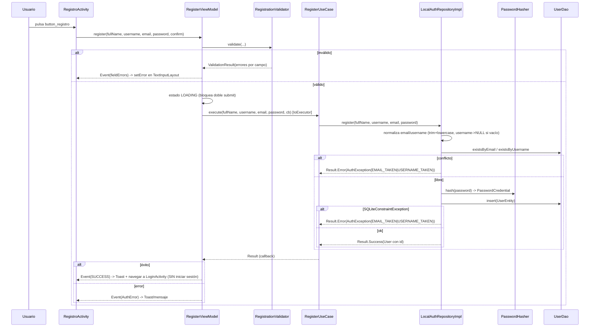
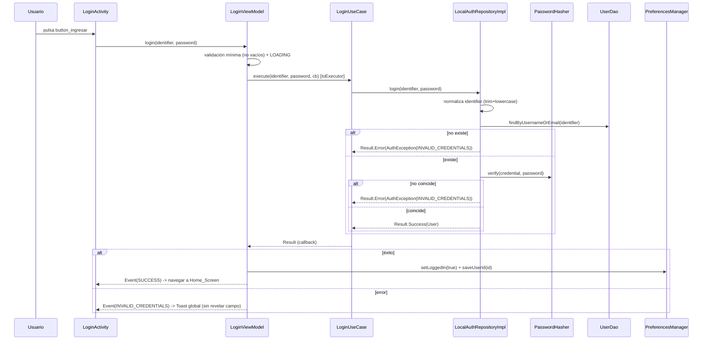

# Documento de Diseño: Registro e Inicio de Sesión Local (`user-registration-local`)

## Overview

Esta funcionalidad implementa el registro y el inicio de sesión de la app GolIA contra la base de datos local (Room/SQLite), sin backend remoto. El diseño **se integra con la base de código existente** (Clean Architecture + MVVM + Hilt + Room, Java) reutilizando el `Result`, el `Callback`, los use cases `LoginUseCase`/`RegisterUseCase`, la interfaz `AuthRepository`, el patrón de entities/DAOs de Room, los módulos Hilt y las Activities/ViewModels ya presentes.

Decisiones estructurales clave:

- **Nueva implementación local del repositorio** (`LocalAuthRepositoryImpl`) que persiste en Room mediante un nuevo `UserDao`/`UserEntity`. La implementación remota actual (`AuthRepositoryImpl`, basada en Retrofit) **se conserva** para el futuro, pero **no se usa** para auth en el MVP. El `@Binds` de `RepositoryModule` se cambia para inyectar la implementación local.
- **La contraseña nunca vive en el modelo de dominio `User`**. El hash/salt y sus parámetros viven solo en `UserEntity` (capa de datos). El mapper `UserEntity -> User` no expone credenciales.
- **`Password_Hasher`** es una interfaz de dominio con implementación PBKDF2 en la capa de datos, provista por Hilt.
- **Validación centralizada** en un componente de dominio (`RegistrationValidator`) que devuelve un `ValidationResult` tipado, reutilizable por los ViewModels (R14).
- **Contrato tipado de errores** (`AuthError` + `AuthException`) que viaja dentro de `Result.Error` y que la UI traduce a strings de recursos (R15).
- **Eventos de un solo consumo** en los ViewModels mediante un wrapper `Event<T>` (R13).
- La **sesión se marca iniciada SOLO en login**, nunca en registro (R11.1), usando `PreferencesManager`.

### Mapa de archivos (NUEVOS vs. MODIFICADOS)

**NUEVOS**

| Archivo | Capa |
|---|---|
| `domain/security/PasswordHasher.java` (interfaz) | dominio |
| `domain/security/PasswordCredential.java` | dominio |
| `domain/validation/RegistrationValidator.java` | dominio |
| `domain/validation/ValidationResult.java` | dominio |
| `domain/validation/ValidationError.java` (enum) | dominio |
| `domain/error/AuthError.java` (enum) | dominio |
| `domain/error/AuthException.java` | dominio |
| `data/security/Pbkdf2PasswordHasher.java` | datos |
| `data/local/entity/UserEntity.java` | datos |
| `data/local/dao/UserDao.java` | datos |
| `data/mapper/UserEntityMapper.java` | datos |
| `data/repository/LocalAuthRepositoryImpl.java` | datos |
| `di/SecurityModule.java` | DI |
| `ui/common/Event.java` | presentación |
| `res/color`/entrada `error_red` en `colors.xml` | recursos |

**MODIFICADOS**

| Archivo | Cambio |
|---|---|
| `domain/model/User.java` | añadir `fullName` |
| `domain/repository/AuthRepository.java` | nuevas firmas locales `register(fullName, username, email, password)` y `login(identifier, password)` |
| `domain/usecase/auth/RegisterUseCase.java` | firma `execute(fullName, username, email, password, ...)` |
| `domain/usecase/auth/LoginUseCase.java` | firma `execute(identifier, password, ...)` |
| `data/repository/AuthRepositoryImpl.java` | adaptar a las nuevas firmas (queda como impl remota inactiva) |
| `data/mapper/UserMapper.java` | mapear `fullName` |
| `data/local/database/GolIADatabase.java` | añadir `UserEntity` y `userDao()`, subir `version` a 2 |
| `di/DatabaseModule.java` | proveer `UserDao` |
| `di/RepositoryModule.java` | `@Binds` a `LocalAuthRepositoryImpl` |
| `ui/auth/RegisterViewModel.java` | `fullName`, validación centralizada, `RegisterUseCase` real, `Event<T>`, mapeo `AuthError` |
| `ui/auth/LoginViewModel.java` | identificador username-o-email, `Event<T>`, guardar sesión, mapeo `AuthError` |
| `RegistroActivity.java` | wiring de `editText_nombre`, errores por `TextInputLayout`, navegar a `LoginActivity` en éxito, `button2` atrás |
| `LoginActivity.java` | Toast global de credenciales, navegar a Home, guardar sesión; `OnClickListener` en `textView6` para el placeholder de recuperación de contraseña (R16) |
| `activity_registro.xml` / `activity_login.xml` | asteriscos obligatorios, "(opcional)", leyenda |
| `strings.xml` | mensajes de validación y errores tipados; nuevo string `recuperar_password_no_disponible` (R16) |

## Architecture

El flujo respeta la regla de dependencias de Clean Architecture: presentación → dominio ← datos. Los ViewModels dependen de use cases; los use cases dependen de la interfaz `AuthRepository`; la implementación local vive en datos y depende de `UserDao` y `PasswordHasher`.



### Secuencia de Registro



### Secuencia de Login



## Components and Interfaces

### Dominio

#### `User` (MODIFICADO)

Se añade `fullName` como primer atributo. El modelo **no** contiene credenciales.

```java
public class User {
    private final String id;
    private final String fullName;   // NUEVO
    private final String username;   // puede ser null
    private final String email;
    private final String country;
    private final String avatarUrl;
    private final int totalPoints;
    private final int predictionsMade;
    private final int predictionsCorrect;
    private final String createdAt;

    public User(String id, String fullName, String username, String email,
                String country, String avatarUrl, int totalPoints,
                int predictionsMade, int predictionsCorrect, String createdAt) { ... }

    public String getFullName() { return fullName; } // NUEVO getter
    // ... resto de getters existentes
}
```

> Impacto: `UserMapper.toDomain/toDto` (remoto) y `UserEntityMapper` (local) deben pasar `fullName`. El DTO remoto puede pasar `null`/vacío mientras no exista el campo en la API.

#### `AuthError` (NUEVO) — R15

```java
package com.diyebure.golia.domain.error;

public enum AuthError {
    USERNAME_TAKEN,
    EMAIL_TAKEN,
    INVALID_CREDENTIALS,
    PERSISTENCE_ERROR,
    VALIDATION_ERROR
}
```

#### `AuthException` (NUEVO) — transporta el `AuthError` dentro de `Result.Error`

`Result.Error` ya envuelve una `Exception` (ver `Result.java`). Se define una excepción de dominio que porta el tipo tipado, de modo que **no** hay que cambiar la firma de `Result`.

```java
package com.diyebure.golia.domain.error;

public class AuthException extends Exception {
    private final AuthError error;

    public AuthException(AuthError error) {
        super(error.name());
        this.error = error;
    }
    public AuthException(AuthError error, Throwable cause) {
        super(error.name(), cause);
        this.error = error;
    }
    public AuthError getAuthError() { return error; }
}
```

La UI extrae el error así: `if (ex instanceof AuthException) mapToString(((AuthException) ex).getAuthError())`.

#### `PasswordCredential` (NUEVO) — formato autodescriptivo — R6.2

Objeto de valor inmutable que agrupa los cuatro parámetros de la credencial. Vive en dominio para que `PasswordHasher` sea independiente de Room.

```java
package com.diyebure.golia.domain.security;

public final class PasswordCredential {
    private final String algorithm;    // p.ej. "PBKDF2WithHmacSHA256"
    private final int iterations;       // p.ej. 120000
    private final String saltBase64;    // 16 bytes -> Base64
    private final String hashBase64;    // 256 bits -> Base64

    public PasswordCredential(String algorithm, int iterations,
                              String saltBase64, String hashBase64) { ... }
    // getters
}
```

#### `PasswordHasher` (NUEVO, interfaz de dominio) — R6

```java
package com.diyebure.golia.domain.security;

public interface PasswordHasher {
    /** Deriva una credencial nueva (salt aleatorio) para la contraseña dada. */
    PasswordCredential hash(String plainPassword);

    /** Recalcula el hash con los parámetros de la credencial y compara en
     *  tiempo constante. No revela por qué falla. */
    boolean verify(PasswordCredential credential, String plainPassword);
}
```

#### `ValidationError`, `ValidationResult`, `RegistrationValidator` (NUEVOS) — R14

```java
package com.diyebure.golia.domain.validation;

public enum ValidationError {
    FULL_NAME_REQUIRED, FULL_NAME_TOO_SHORT, FULL_NAME_TOO_LONG,
    USERNAME_TOO_SHORT, USERNAME_TOO_LONG, USERNAME_FORMAT,
    EMAIL_REQUIRED, EMAIL_INVALID,
    PASSWORD_REQUIRED, PASSWORD_TOO_SHORT, PASSWORD_NO_UPPER,
    PASSWORD_NO_LOWER, PASSWORD_NO_DIGIT,
    CONFIRM_REQUIRED, CONFIRM_MISMATCH
}
```

```java
package com.diyebure.golia.domain.validation;

import java.util.Map;

/** Resultado tipado por CAMPO. La clave es el campo lógico; el valor, el
 *  primer error detectado en ese campo (o ausencia si es válido). */
public final class ValidationResult {
    public enum Field { FULL_NAME, USERNAME, EMAIL, PASSWORD, CONFIRM_PASSWORD }

    private final Map<Field, ValidationError> errors; // vacío == válido

    public boolean isValid() { return errors.isEmpty(); }
    public ValidationError errorFor(Field f) { return errors.get(f); }
    public Map<Field, ValidationError> getErrors() { return errors; }
    // constructor / builder interno
}
```

```java
package com.diyebure.golia.domain.validation;

import javax.inject.Inject;

/** Reglas de validación centralizadas y reutilizables (R14). No depende de
 *  Android salvo por Patterns.EMAIL_ADDRESS, que se aísla tras un método
 *  protegido para poder testear en JVM (o inyectar un predicado de email). */
public class RegistrationValidator {

    @Inject
    public RegistrationValidator() {}

    /** Valida todos los campos del formulario de registro. */
    public ValidationResult validateRegistration(String fullName, String username,
                                                  String email, String password,
                                                  String confirmPassword) { ... }

    // Métodos por campo (reutilizables):
    public ValidationError validateFullName(String fullName) { ... }
    public ValidationError validateUsername(String username) { ... } // null si vacío/válido
    public ValidationError validateEmail(String email) { ... }
    public ValidationError validatePassword(String password) { ... }
    public ValidationError validateConfirm(String password, String confirm) { ... }
}
```

**Reglas exactas** (cierran R1–R5):

- `fullName`: tras `trim`, obligatorio; longitud `[3, 50]`.
- `username`: **opcional**. Se hace `trim`; si empieza por `@` se retira ese primer carácter; si el resultado queda vacío ⇒ **válido** (no proporcionado). Si no está vacío, debe cumplir `^[A-Za-z0-9_.]{3,30}$` (sin espacios internos ni caracteres fuera del conjunto). El patrón global aceptado en la UI es `^@?[A-Za-z0-9_.]{3,30}$`, evaluado sin el `@`.
- `email`: obligatorio; debe cumplir `android.util.Patterns.EMAIL_ADDRESS`.
- `password`: obligatorio; longitud `>= 8`; al menos una mayúscula (`.*[A-Z].*`), una minúscula (`.*[a-z].*`) y un dígito (`.*[0-9].*`).
- `confirmPassword`: obligatorio; debe ser igual carácter por carácter a `password`.

> Nota sobre `Patterns.EMAIL_ADDRESS`: es API de Android. Para testear en JVM pura, `RegistrationValidator` expone la comprobación de email en un método `protected boolean isEmailPattern(String)` que en producción delega en `Patterns.EMAIL_ADDRESS` y en tests se sobreescribe, o se inyecta un `Predicate<String>` de email. Se recomienda el método `protected` por simplicidad.

#### `AuthRepository` (MODIFICADO) — R8.6

Se **redefine** la semántica de `register`/`login` hacia el flujo local. Firmas nuevas:

```java
public interface AuthRepository {
    // NUEVAS firmas locales:
    Result<User> login(String identifier, String password);           // username o email
    Result<User> register(String fullName, String username,           // username nullable
                          String email, String password);

    // Se mantienen (usados por sesión / futuro):
    Result<Void> logout();
    Result<User> refreshToken();
    boolean isLoggedIn();
    Result<User> getCurrentUser();
    void saveAuthTokens(String accessToken, String refreshToken, long expiresIn);
    void clearSession();
}
```

**Decisión y conciliación con lo remoto:** en lugar de crear una segunda interfaz, se **reutiliza `AuthRepository`** cambiando las firmas de `login`/`register` (se elimina `country` del contrato de registro y se añade `fullName`; `login` pasa a recibir un identificador). La implementación remota existente (`AuthRepositoryImpl`) se adapta a estas firmas pero **deja de estar bindeada** en `RepositoryModule` (el `@Binds` apunta a `LocalAuthRepositoryImpl`). Así el dominio no cambia de forma para soportar dos mundos y el remoto queda listo para reactivarse cambiando una sola línea del módulo. Impacto directo: `RegisterUseCase`/`LoginUseCase` ajustan sus firmas (ver más abajo).

#### Use Cases (MODIFICADOS) — R7 (orquestación en `@IoExecutor`)

```java
// RegisterUseCase
public void execute(String fullName, String username, String email,
                    String password, Callback<User> callback) {
    executor.execute(() -> {
        Result<User> result = authRepository.register(fullName, username, email, password);
        callback.onResult(result);
    });
}
```

```java
// LoginUseCase
public void execute(String identifier, String password, Callback<User> callback) {
    executor.execute(() -> {
        Result<User> result = authRepository.login(identifier, password);
        callback.onResult(result);
    });
}
```

Se mantiene el patrón existente: inyectan `AuthRepository` + `@IoExecutor ExecutorService`, ejecutan en background y devuelven por `Callback`.

### Datos

#### `LocalAuthRepositoryImpl` (NUEVO) — R6, R7, R8, R9

```java
package com.diyebure.golia.data.repository;

@Singleton
public class LocalAuthRepositoryImpl implements AuthRepository {

    private final UserDao userDao;
    private final PasswordHasher passwordHasher;

    @Inject
    public LocalAuthRepositoryImpl(UserDao userDao, PasswordHasher passwordHasher) { ... }

    @Override
    public Result<User> register(String fullName, String username,
                                 String email, String password) {
        try {
            String normEmail = normalize(email);                 // trim + toLowerCase
            String normUsername = normalizeUsernameOrNull(username); // '@' inicial fuera, "" -> null
            // Chequeo previo de unicidad
            if (normUsername != null && userDao.existsByUsername(normUsername))
                return error(AuthError.USERNAME_TAKEN);
            if (userDao.existsByEmail(normEmail))
                return error(AuthError.EMAIL_TAKEN);

            PasswordCredential cred = passwordHasher.hash(password);
            UserEntity entity = UserEntity.newUser(
                    UUID.randomUUID().toString(), fullName.trim(),
                    normUsername, normEmail, cred, System.currentTimeMillis());

            userDao.insert(entity); // salvaguarda: puede lanzar SQLiteConstraintException
            return new Result.Success<>(UserEntityMapper.toDomain(entity));

        } catch (SQLiteConstraintException e) {
            // Otro hilo insertó el mismo email/username entre el check y el insert
            return resolveConstraint(username, email, e);
        } catch (Exception e) {
            return new Result.Error(new AuthException(AuthError.PERSISTENCE_ERROR, e));
        }
    }

    @Override
    public Result<User> login(String identifier, String password) {
        try {
            UserEntity entity = userDao.findByUsernameOrEmail(normalize(identifier));
            if (entity == null)
                return error(AuthError.INVALID_CREDENTIALS);
            if (!passwordHasher.verify(entity.toCredential(), password))
                return error(AuthError.INVALID_CREDENTIALS);
            return new Result.Success<>(UserEntityMapper.toDomain(entity));
        } catch (Exception e) {
            return new Result.Error(new AuthException(AuthError.PERSISTENCE_ERROR, e));
        }
    }
    // logout/refreshToken/getCurrentUser/isLoggedIn/saveAuthTokens/clearSession:
    // implementación mínima local (isLoggedIn/session delegadas a PreferencesManager
    // desde el ViewModel; ver sección Sesión).
}
```

- `normalize(x)` = `x == null ? null : x.trim().toLowerCase(Locale.ROOT)`.
- `normalizeUsernameOrNull(x)`: `trim`, quita `@` inicial, `toLowerCase`; si queda vacío ⇒ `null`.
- `resolveConstraint(...)`: re-chequea `existsByUsername`/`existsByEmail` para decidir entre `USERNAME_TAKEN` y `EMAIL_TAKEN`; si no puede discriminar, `PERSISTENCE_ERROR`. En todos los casos **no** persiste datos parciales (el `insert` falló, es atómico).

#### `Pbkdf2PasswordHasher` (NUEVO) — R6

```java
package com.diyebure.golia.data.security;

@Singleton
public class Pbkdf2PasswordHasher implements PasswordHasher {

    private static final String ALGORITHM = "PBKDF2WithHmacSHA256";
    private static final int ITERATIONS = 120_000;
    private static final int KEY_LENGTH_BITS = 256;
    private static final int SALT_BYTES = 16;

    private final SecureRandom secureRandom = new SecureRandom();

    @Inject public Pbkdf2PasswordHasher() {}

    @Override
    public PasswordCredential hash(String plainPassword) {
        byte[] salt = new byte[SALT_BYTES];
        secureRandom.nextBytes(salt);
        byte[] hash = pbkdf2(plainPassword.toCharArray(), salt, ITERATIONS, KEY_LENGTH_BITS);
        return new PasswordCredential(ALGORITHM, ITERATIONS,
                base64(salt), base64(hash));
    }

    @Override
    public boolean verify(PasswordCredential credential, String plainPassword) {
        byte[] salt = unbase64(credential.getSaltBase64());
        byte[] expected = unbase64(credential.getHashBase64());
        byte[] actual = pbkdf2(plainPassword.toCharArray(), salt,
                credential.getIterations(), expected.length * 8);
        return MessageDigest.isEqual(expected, actual); // tiempo constante (R6.4)
    }

    private byte[] pbkdf2(char[] pwd, byte[] salt, int iter, int bits) {
        try {
            PBEKeySpec spec = new PBEKeySpec(pwd, salt, iter, bits);
            SecretKeyFactory f = SecretKeyFactory.getInstance(ALGORITHM);
            return f.generateSecret(spec).getEncoded();
        } catch (GeneralSecurityException e) {
            throw new IllegalStateException("PBKDF2 no disponible", e);
        }
    }
    // base64 / unbase64 con android.util.Base64 (NO_WRAP)
}
```

**Formato de credencial: 4 columnas.** Se recomienda persistir los cuatro parámetros en **columnas separadas** de Room (`password_algorithm`, `password_iterations`, `password_salt`, `password_hash`) en vez de un único string codificado. Motivos: claridad en el esquema, tipos correctos (`iterations` como entero), y facilidad de consulta/inspección. `verify` deriva la longitud de clave de los bytes del hash almacenado, por lo que futuros cambios de parámetros siguen verificando credenciales antiguas.

## Data Models

### Tabla `users` — `UserEntity` (NUEVO)

Sigue el patrón de las entities existentes (`@Entity`, `@PrimaryKey @NonNull String id`, `@ColumnInfo`, constructor vacío + completo, getters/setters, `toDomainModel`/`fromDomainModel`).

```java
package com.diyebure.golia.data.local.entity;

@Entity(
    tableName = "users",
    indices = {
        @Index(value = "email", unique = true),
        @Index(value = "username", unique = true)
    }
)
public class UserEntity {

    @PrimaryKey @NonNull
    @ColumnInfo(name = "id")
    private String id;                     // UUID v4

    @ColumnInfo(name = "full_name")
    private String fullName;

    @ColumnInfo(name = "username")
    private String username;               // NULLABLE (NULL cuando no se proporciona)

    @NonNull
    @ColumnInfo(name = "email")
    private String email;

    @ColumnInfo(name = "password_algorithm")
    private String passwordAlgorithm;

    @ColumnInfo(name = "password_iterations")
    private int passwordIterations;

    @ColumnInfo(name = "password_salt")     // Base64
    private String passwordSalt;

    @ColumnInfo(name = "password_hash")     // Base64
    private String passwordHash;

    @ColumnInfo(name = "created_at")
    private long createdAt;                  // epoch UTC millis

    public UserEntity() {}
    public UserEntity(String id, String fullName, String username, String email,
                      String passwordAlgorithm, int passwordIterations,
                      String passwordSalt, String passwordHash, long createdAt) { ... }

    // helper de fábrica
    public static UserEntity newUser(String id, String fullName, String username,
                                     String email, PasswordCredential c, long createdAt) { ... }

    public PasswordCredential toCredential() {
        return new PasswordCredential(passwordAlgorithm, passwordIterations,
                passwordSalt, passwordHash);
    }

    /** No expone credenciales. avatarUrl/country/estadísticas -> valores por defecto. */
    public User toDomainModel() {
        return new User(id, fullName, username, email,
                null, null, 0, 0, 0, String.valueOf(createdAt));
    }
    // getters/setters
}
```

**Uniqueness y NULL (R7.4, R8.3).** En SQLite un índice `UNIQUE` **permite múltiples filas con `NULL`** en la columna indexada (los `NULL` no se consideran iguales entre sí). Por eso `@Index(value = "username", unique = true)` da exactamente el comportamiento pedido: unicidad del `username` **solo entre valores no nulos**, y varios usuarios sin username (NULL) coexisten sin violar la restricción. `email` es `@NonNull` y único. Ambos se guardan **ya normalizados** (minúsculas), de modo que la unicidad es efectivamente case-insensitive respecto a la entrada del usuario.

### `UserDao` (NUEVO)

```java
package com.diyebure.golia.data.local.dao;

@Dao
public interface UserDao {

    @Insert(onConflict = OnConflictStrategy.ABORT) // aborta ante conflicto de UNIQUE
    void insert(UserEntity user);

    @Query("SELECT * FROM users WHERE email = :email LIMIT 1")
    UserEntity findByEmail(String email);

    @Query("SELECT * FROM users WHERE username = :username LIMIT 1")
    UserEntity findByUsername(String username);

    @Query("SELECT * FROM users WHERE username = :identifier OR email = :identifier LIMIT 1")
    UserEntity findByUsernameOrEmail(String identifier);

    @Query("SELECT EXISTS(SELECT 1 FROM users WHERE email = :email)")
    boolean existsByEmail(String email);

    @Query("SELECT EXISTS(SELECT 1 FROM users WHERE username = :username)")
    boolean existsByUsername(String username);

    @Query("SELECT * FROM users WHERE id = :id LIMIT 1")
    UserEntity getById(String id);
}
```

> `OnConflictStrategy.ABORT` hace que un `insert` que viole el UNIQUE lance `SQLiteConstraintException`, que `LocalAuthRepositoryImpl` captura como salvaguarda de la comprobación previa (R7.5).

### `UserEntityMapper` (NUEVO)

```java
package com.diyebure.golia.data.mapper;

public final class UserEntityMapper {
    private UserEntityMapper() {}
    public static User toDomain(UserEntity e) { return e == null ? null : e.toDomainModel(); }
    // No hay toEntity con credencial pública: la entidad se crea vía UserEntity.newUser
    // dentro del repositorio para no filtrar el hashing fuera de la capa de datos.
}
```

### `GolIADatabase` (MODIFICADO)

```java
@Database(
    entities = { MatchEntity.class, TeamEntity.class, CompetitionEntity.class,
                 PredictionEntity.class, UserEntity.class }, // + UserEntity
    version = 2,                                             // 1 -> 2
    exportSchema = false
)
public abstract class GolIADatabase extends RoomDatabase {
    // ...
    public abstract UserDao userDao(); // NUEVO
}
```

> Como `DatabaseModule` ya usa `.fallbackToDestructiveMigration()`, subir a `version = 2` recrea el esquema sin migración manual (aceptable en MVP; en producción se añadiría una `Migration`).
<!-- STOP: antes de Correctness Properties se ejecuta la herramienta prework -->

## Correctness Properties

*Una propiedad es una característica o comportamiento que debe cumplirse en todas las ejecuciones válidas del sistema: es una afirmación formal sobre lo que el sistema debe hacer. Las propiedades son el puente entre la especificación legible por humanos y las garantías de correctitud verificables por máquina.*

Tras la prework se aplicó una **reflexión de propiedades** para eliminar redundancias: las reglas por rango de cada campo (nombre, contraseña, confirmación) se consolidan en propiedades bicondicionales ("válido si y solo si..."); las reglas de hash positiva/negativa se separan por su valor de verdad; y las reglas de unicidad/normalización de email y username se agrupan por su naturaleza case-insensitive. Los criterios que dependen de `Patterns.EMAIL_ADDRESS`, del renderizado de UI o de requisitos arquitectónicos se cubren con tests de ejemplo/edge o revisión de diseño (ver Testing Strategy), no como propiedades.

### Property 1: Validación del nombre completo por longitud

*Para todo* string de nombre, el validador lo considera válido **si y solo si** su longitud tras `trim` está en el rango `[3, 50]`; en caso contrario devuelve el error tipado correspondiente (obligatorio si queda vacío, demasiado corto si `<3`, demasiado largo si `>50`).

**Validates: Requirements 1.1, 1.2, 1.3, 1.4**

### Property 2: Validación del nombre de usuario opcional

*Para todo* string de username, tras `trim` y tras retirar un `@` inicial: si queda vacío el validador lo acepta como no proporcionado; si contiene algún carácter fuera de `[A-Za-z0-9_.]` (o espacios internos) devuelve error de formato; en otro caso es válido **si y solo si** su longitud efectiva está en `[3, 30]`.

**Validates: Requirements 2.1, 2.2, 2.3, 2.4**

### Property 3: Validación de la contraseña por complejidad

*Para toda* contraseña, el validador la considera válida **si y solo si** tiene longitud `>= 8` y contiene al menos una letra mayúscula, al menos una minúscula y al menos un dígito; en caso contrario devuelve el error tipado específico de la primera condición incumplida.

**Validates: Requirements 4.1, 4.2, 4.3, 4.4, 4.5, 4.6**

### Property 4: Validación de la confirmación de contraseña

*Para todo* par (contraseña, confirmación), la confirmación es válida **si y solo si** no está vacía y coincide carácter por carácter con la contraseña.

**Validates: Requirements 5.1, 5.2, 5.3**

### Property 5: Contenido y seguridad de la credencial generada

*Para toda* contraseña, la credencial producida por `hash` contiene algoritmo, iteraciones, salt (Base64) y hash (Base64); el salt decodifica a 16 bytes, el hash a 32 bytes, y ningún campo de la credencial contiene la contraseña en texto plano.

**Validates: Requirements 6.1, 6.2**

### Property 6: Round-trip de verificación de contraseña (positivo)

*Para toda* contraseña `p`, `verify(hash(p), p)` es verdadero (la verificación recalcula el hash con los parámetros almacenados y usa comparación en tiempo constante).

**Validates: Requirements 6.3, 6.4, 6.5**

### Property 7: Rechazo de contraseña incorrecta (negativo)

*Para todo* par de contraseñas distintas `p != p'`, `verify(hash(p), p')` es falso.

**Validates: Requirements 6.6**

### Property 8: Normalización idempotente y case-insensitive

*Para todo* string de entrada, `normalize` produce un valor en minúsculas y sin espacios extremos, y `normalize(normalize(x)) == normalize(x)` (idempotencia). El mismo valor normalizado se usa para validar unicidad, persistir y buscar en login.

**Validates: Requirements 7.1, 9.1**

### Property 9: Unicidad case-insensitive de email

*Para todo* email registrado, un segundo intento de registro con ese email en cualquier capitalización o con espacios extremos es rechazado con `EMAIL_TAKEN` y no crea una fila adicional.

**Validates: Requirements 7.3, 7.5**

### Property 10: Unicidad case-insensitive de username no nulo y coexistencia de NULL

*Para todo* username no nulo registrado, un segundo registro con ese username en cualquier capitalización es rechazado con `USERNAME_TAKEN`; y *para todo* conjunto de registros sin username, todos coexisten (múltiples `NULL` permitidos) sin violar unicidad.

**Validates: Requirements 7.2, 7.4, 8.3, 2.1**

### Property 11: Round-trip de persistencia del registro

*Para todo* conjunto de datos de registro válidos, tras un registro exitoso existe **exactamente una** fila cuyo `id` es el devuelto en el `Result.Success`, con `email`/`username` normalizados, `full_name` conservado y `created_at > 0`.

**Validates: Requirements 8.1, 8.2, 8.4**

### Property 12: Round-trip registro → login

*Para todo* conjunto de datos de registro válidos, tras registrar, un login con la contraseña correcta usando **el email o el username** (en cualquier capitalización) devuelve `Result.Success` con el mismo usuario (mismo `id`/`email`).

**Validates: Requirements 9.2, 9.5**

### Property 13: Credenciales inválidas en login

*Para todo* identificador que no corresponde a ningún usuario, y *para todo* usuario existente con una contraseña incorrecta, el login devuelve el mismo error `INVALID_CREDENTIALS` (sin distinguir si falló el identificador o la contraseña).

**Validates: Requirements 9.3, 9.4**

### Property 14: Consumo único de eventos

*Para todo* contenido de evento, `Event.getContentIfNotHandled()` devuelve el contenido en la primera llamada y `null` en todas las llamadas posteriores.

**Validates: Requirements 13.1, 13.2**

## Error Handling

**Estrategia general.** Toda operación de dominio devuelve `Result`. Los errores esperados se modelan con `AuthException(AuthError)` dentro de `Result.Error`; los inesperados se envuelven como `AuthError.PERSISTENCE_ERROR`. El flujo nunca propaga excepciones al hilo principal: los use cases capturan en el `@IoExecutor` y entregan `Result` por `Callback`.

| Situación | Dónde | AuthError | Comportamiento |
|---|---|---|---|
| Validación de formulario falla | `RegisterViewModel` (vía `RegistrationValidator`) | `VALIDATION_ERROR` (lógico) | No se llama al use case; se emiten errores por campo a los `TextInputLayout`. |
| Username ya existe | `LocalAuthRepositoryImpl.register` | `USERNAME_TAKEN` | No persiste; `Result.Error`. |
| Email ya existe | `LocalAuthRepositoryImpl.register` | `EMAIL_TAKEN` | No persiste; `Result.Error`. |
| Conflicto UNIQUE en `insert` (carrera) | `register` (catch `SQLiteConstraintException`) | `USERNAME_TAKEN`/`EMAIL_TAKEN` | Salvaguarda del check previo; re-discrimina el campo; sin datos parciales. |
| Fallo de escritura en Room | `register` (catch genérico) | `PERSISTENCE_ERROR` | `Result.Error`; sin datos parciales (insert atómico). |
| Identificador inexistente | `LocalAuthRepositoryImpl.login` | `INVALID_CREDENTIALS` | Mensaje global, no por campo. |
| Contraseña incorrecta | `login` (`verify` == false) | `INVALID_CREDENTIALS` | Idéntico al anterior: no revela qué falló. |

**Mapeo AuthError → recurso de string (R15.2).** La UI traduce el enum a mensajes localizados sin acoplar el dominio a textos:

```java
@StringRes
static int messageFor(AuthError error) {
    switch (error) {
        case USERNAME_TAKEN:     return R.string.error_username_taken;
        case EMAIL_TAKEN:        return R.string.error_email_taken;
        case INVALID_CREDENTIALS:return R.string.error_invalid_credentials;
        case PERSISTENCE_ERROR:  return R.string.error_persistence;
        case VALIDATION_ERROR:   return R.string.error_validation;
        default:                 return R.string.error_generic;
    }
}
```

Los `ValidationError` por campo se mapean análogamente a strings (p.ej. `FULL_NAME_TOO_SHORT -> R.string.fullname_too_short`) y se muestran en el `TextInputLayout` del campo correspondiente. Se añadirán estas claves a `strings.xml`.

## Testing Strategy

**Enfoque dual.** Tests unitarios/ejemplo para casos concretos, integración y edge; tests basados en propiedades (PBT) para las 14 propiedades universales anteriores.

### Librería PBT y configuración

- Librería: **jqwik** (property-based testing para JUnit 5 en JVM). Se añade como `testImplementation` en `app/build.gradle`. No se implementa PBT desde cero.
- Cada test de propiedad ejecuta **mínimo 100 iteraciones** (`@Property(tries = 100)` o superior).
- Cada test se etiqueta con un comentario que referencia la propiedad de diseño, con el formato:
  `// Feature: user-registration-local, Property {n}: {texto de la propiedad}`.
- Cada propiedad de diseño se implementa con **un único** test de propiedad.

### Qué se testea y cómo

| Componente | Tipo | Detalle / qué mockear |
|---|---|---|
| `RegistrationValidator` | PBT (Prop. 1–4) | JVM pura. El chequeo de email se aísla (método `protected` sobreescrito en test o `Predicate<String>` inyectado) para no depender de `Patterns`. Generadores: blancos, longitudes de frontera, caracteres inválidos para username. |
| `Pbkdf2PasswordHasher` | PBT (Prop. 5–7) + ejemplo (6.1) | Round-trip positivo/negativo y forma de la credencial. Test de ejemplo aparte comprueba iteraciones (120000), 16 B de salt, 32 B de hash. `android.util.Base64` se sustituye por `java.util.Base64` bajo un pequeño puerto, o se ejecuta como test instrumentado; se recomienda abstraer Base64 tras un helper para testear en JVM. |
| `normalize` / `LocalAuthRepositoryImpl` | PBT (Prop. 8–13) | **Room in-memory** (`Room.inMemoryDatabaseBuilder(...).allowMainThreadQueries()`) para el `UserDao` real. Hasher real o falso determinista. Generadores producen datos de registro válidos aleatorios. |
| `Event<T>` | PBT (Prop. 14) | JVM pura; consumo único idempotente. |
| Doble submit (R10.1/10.4) | Ejemplo | `RegisterViewModel`/`LoginViewModel` con **executor síncrono/directo** (reemplaza `@IoExecutor`) y use case falso; invocar dos veces durante `LOADING` y verificar una sola ejecución. |
| No auto-login en registro (R11.1) | Ejemplo | Con `PreferencesManager` mock: tras `register` exitoso, `setLoggedIn` **no** se invoca; tras `login` exitoso **sí** (`setLoggedIn(true)` + `saveUserId`). |
| Persistencia parcial en error (R8.5) | Edge | `UserDao` mock cuyo `insert` lanza excepción -> `Result.Error(PERSISTENCE_ERROR)`; con Room real, verificar conteo de filas sin cambios. |
| Email `Patterns` (R3.2/3.3) | Ejemplo | Casos representativos válidos/inválidos (evita re-implementar el patrón de Android). |
| Mapeo `AuthError`→string (R15.2) | Ejemplo | Test exhaustivo por valor del enum -> recurso distinto y no nulo. |
| Layouts, contraste, Toast/progress (R10.2/10.3/10.5, R12, R11.2/11.3/11.4) | Instrumentado/manual | Verificación visual y con Espresso donde aplique. |

### Fake/mocks recomendados

- `Callback`/use cases: falsos con executor directo para determinismo en ViewModels.
- `PasswordHasher`: se puede usar el real (rápido con iteraciones reducidas en test) o un falso determinista para las propiedades del repositorio que no verifican fuerza criptográfica.
- `UserDao`: real vía Room in-memory para propiedades de persistencia/unicidad; mock solo para simular fallos de escritura (R8.5).

## Sesión

- La sesión se marca **solo tras un login exitoso**, nunca en el registro (R11.1). `LoginViewModel`, al recibir `Result.Success`, invoca `PreferencesManager.setLoggedIn(true)` y `PreferencesManager.saveUserId(user.getId())` antes de emitir el evento de navegación a `Home_Screen`.
- El registro exitoso **no** toca `PreferencesManager`: emite un evento de éxito, muestra `Toast` y navega a `LoginActivity`.
- Arranque de la app (fuera de alcance, se menciona): una futura pantalla Splash puede consultar `PreferencesManager.isLoggedIn()` / `getUserId()` para decidir entre `Home_Screen` y `LoginActivity`. Para el MVP local conviene que `AuthRepository.isLoggedIn()` delegue en `PreferencesManager.isLoggedIn()` (sin dependencia de expiración de token), aunque esa decisión de arranque no forma parte de esta feature.

## Cambios en Dependency Injection

### `DatabaseModule` (MODIFICADO)

```java
@Provides @Singleton
public UserDao provideUserDao(GolIADatabase database) {
    return database.userDao();
}
```

### `RepositoryModule` (MODIFICADO)

```java
// Antes: bind a AuthRepositoryImpl (remoto). Ahora:
@Binds @Singleton
public abstract AuthRepository bindAuthRepository(LocalAuthRepositoryImpl impl);
```

> `AuthRepositoryImpl` (remoto) permanece en el código pero deja de estar bindeado. Reactivarlo es cambiar esta única línea.

### `SecurityModule` (NUEVO)

`Pbkdf2PasswordHasher` y `RegistrationValidator` tienen `@Inject` en su constructor, por lo que Hilt sabe construirlos; solo hace falta bindear la interfaz del hasher:

```java
@Module
@InstallIn(SingletonComponent.class)
public abstract class SecurityModule {
    @Binds @Singleton
    public abstract PasswordHasher bindPasswordHasher(Pbkdf2PasswordHasher impl);
}
```

`RegistrationValidator` no necesita binding (clase concreta con `@Inject`); se inyecta directamente en los ViewModels.

## Capa de UI (comportamiento)

### `RegistroActivity` (MODIFICADO) — R10, R11, R12

- Cablear `editText_nombre` y su `textInputLayout_nombre` (además de los ya presentes).
- Al pulsar `button_registro`: pasar los 5 valores al `RegisterViewModel.register(...)`. El ViewModel valida vía `RegistrationValidator` y publica errores **por campo**; la Activity hace `setError(...)` en el `TextInputLayout` correspondiente usando el string mapeado desde `ValidationError`.
- Éxito: ocultar `progressBar_registro`, `Toast` de éxito (`R.string.registration_success`) y **navegar a `LoginActivity`** (no a `MainActivity`; corrige el `navigateToMain` actual) sin iniciar sesión.
- Error tipado: ocultar progress, re-habilitar botón y mostrar el mensaje mapeado desde `AuthError`.
- `linearLayout_yacuenta` (`textView_iniciar_sesion`): navegar a `LoginActivity`.
- `button2`: `onBackPressedDispatcher` / `finish()` para regresar a la pantalla anterior.
- Estados observados vía `Event<T>` para no re-disparar navegación/mensajes en rotación (R13).

### `LoginActivity` (MODIFICADO) — R10, R11

- `input_correo` actúa como **identificador** (email o username). Se pasa a `LoginViewModel.login(identifier, password)`.
- Éxito: guardar sesión (lo hace el ViewModel) y navegar a `Home_Screen`.
- Error `INVALID_CREDENTIALS`: `Toast` global (no `setError` por campo) para no revelar qué falló.
- Eventos vía `Event<T>`.

#### Marcador de posición: recuperación de contraseña (R16)

- **Elemento:** el enlace "¿Olvidaste la contraseña?" es el `TextView` con id `textView6` en `activity_login.xml` (texto del recurso `recuperar_pasword`).
- **Comportamiento:** `LoginActivity` registra un `OnClickListener` sobre `textView6` que muestra un `Toast` con el string `recuperar_password_no_disponible` = "La recuperación de contraseña no está disponible en esta versión".
- **Alcance:** es una funcionalidad **puramente de UI** (placeholder). No hay `ViewModel`, use case, repositorio ni cambios de dominio asociados; no toca `Login_System` ni la base de datos, y no dispara ningún flujo de recuperación (ni por correo ni por ningún otro medio).
- **Justificación:** el MVP es 100% local (Room/SQLite), sin backend ni servicio de correo, por lo que una recuperación real de contraseña no es posible. El placeholder deja el punto de entrada listo para una implementación futura (por ejemplo, cuando exista un backend).

### Indicadores visuales de obligatoriedad (R12)

- **Color:** añadir a `colors.xml` `<color name="error_red">#FF6B6B</color>` (rojo claro con contraste AA suficiente sobre el fondo oscuro `blue_dark #0A0E1A`; ratio ≈ 5.9:1, supera el mínimo AA de 4.5:1 para texto normal).
- **Asterisco y "(opcional)":** en las etiquetas de Nombre, Correo, Contraseña y Confirmar añadir `*` en rojo; en la etiqueta de Usuario añadir `(opcional)`.
- **Enfoque recomendado (simple y accesible):** usar `HtmlCompat.fromHtml("Nombre completo <font color='#FF6B6B'>*</font>", ...)` (o `SpannableString` con `ForegroundColorSpan`) sobre el `TextView`/`hint` de cada etiqueta, en lugar de añadir un `TextView` extra por campo. Es menos intrusivo en los layouts existentes y mantiene la etiqueta como un único elemento accesible para lectores de pantalla; el asterisco se anuncia como parte de la etiqueta.
- **Leyenda:** un `TextView` al inicio/fin del formulario con el texto "* Campos obligatorios" en `error_red`.

### `Event<T>` (NUEVO) — R13

Wrapper de un solo consumo (patrón estándar de Google para eventos con LiveData):

```java
package com.diyebure.golia.ui.common;

public class Event<T> {
    private final T content;
    private boolean handled = false;

    public Event(T content) { this.content = content; }

    /** Devuelve el contenido solo la primera vez; null después. */
    public T getContentIfNotHandled() {
        if (handled) return null;
        handled = true;
        return content;
    }
    public T peekContent() { return content; }
}
```

Los ViewModels exponen `LiveData<Event<NavTarget>>` y `LiveData<Event<AuthError>>` (o `Event<Map<Field,ValidationError>>` para errores de formulario). El estado de carga (`LOADING`) se mantiene como `LiveData` normal para que sobreviva a la rotación (R13.3), mientras que navegación y mensajes se emiten como `Event` para no repetirse (R13.2). Como el `ViewModel` sobrevive a los cambios de configuración, el estado del formulario y de carga se retiene por diseño.
